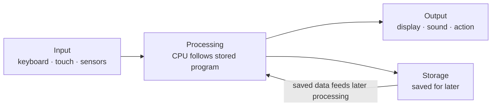

# L01 — What Is a Computer?

> **Module 1** · Stage 1 · 2 hours

## Learning objectives

By the end of this lecture, you will be able to:

1. **Define** the term *computer* precisely, in one sentence, with examples of what is and is not a computer. (CLO-1)
2. **Distinguish** hardware, software, data, and users in any computing scenario. (CLO-1)
3. **Identify** the ICT components in everyday activities (messaging, banking, studying) and describe what each contributes. (CLO-1)
4. **Locate** the course's modules, labs, and assessments on this website and state the semester's rhythm. (CLO-1)

## Key terms

computer · hardware · software · data · information · user · ICT · program

## 1.0 Before we start — prerequisites and motivation

**You need from earlier lectures:** nothing — this is the course's first lecture, and it assumes no prior computing study. If you can describe how you sent a message today, you are ready.

**Why this matters:** this lecture installs the course's fundamental analytical habit: when you meet any technology, ask *where is the computer, what is the input, what is being processed, what is the output?* That single habit is the tool you will apply for sixteen weeks — and the definition you learn today decides, for the rest of the course, what counts as a computer at all.

## 1.1 What counts as a computer?

A **computer** is a programmable electronic device that accepts data (**input**), processes it according to stored instructions (**processing**), produces results (**output**), and can save them (**storage**). Every word in that definition earns its place:

- *Programmable* — the machine does different jobs when given different instructions. A pocket calculator is powerful, but it is built for one job; it is a special-purpose device rather than a general-purpose computer.
- *Electronic* — modern computers represent data with fast-switching electronic states (we make this concrete in Module 4).
- *Stored instructions* — the program lives inside the machine's memory, not in how the wires are arranged. This is the idea that changed everything (see L02, L05).

**Quick self-test:** is a digital wristwatch a computer? It has input (buttons), processing (a chip), output (display), and storage (settings). It is a small **embedded computer** — a computer inside another product. Is a mechanical alarm clock? No processing of *data* occurs — it models time mechanically. The boundary is exactly the sort of thing exam questions love.

## 1.2 Hardware, software, data, users

Every computing scenario decomposes into four parts:

| Part | What it is | Examples in "sending a message" |
|---|---|---|
| **Hardware** | Physical components you can touch | Phone, touch screen, radio chip, battery |
| **Software** | Instructions that tell hardware what to do | Messaging app, operating system |
| **Data** | The information being processed | Your message text, contact list, timestamps |
| **Users** | People in the loop who direct and interpret | Sender and receiver |

Data becomes **information** when it is processed into something meaningful: "34.2" is data; "your account balance is 34.2 units" is information. The distinction drives Module 7's database work.

## 1.3 Where is the computer? ICT in daily life

**ICT** (information and communication technology) is the umbrella term for computing and communication technologies. In one ordinary morning — alarm, messages, bus card, classroom projector, online quiz — you touch dozens of computers, most of them hidden inside other devices. A useful habit for this course: whenever you interact with technology, ask *where is the computer, what is the input, what is being processed, what is the output?* That habit is literally the analytical tool this course trains.

## 1.4 The course map and how to use this website

- **32 lectures in 8 modules** — see the [Schedule](../schedule.md); each lecture page here follows the same structure you are reading now.
- **One lab per module** — start with [Lab 1](../labs/lab-01-digital-basics-orientation.md) this week.
- **Assessment rhythm** — weekly quizzes (best 10 of 14), labs, midterm after L16, integrated project, final exam: see [Assessment](../assessment.md).
- **Stuck?** Start with [Help](../help.md).

## Lecture activity

In-class: "Find the computer" — in pairs, list five devices in the room or your bag, decide for each whether it contains a computer, and justify with the definition above. (No handout; results feed the L02 discussion.)

## Visual explanation

*Figure: the input–process–output–storage cycle that defines a computer. The storage arrow returning to processing is what makes results reusable — and what separates computing from mere calculation.*

## Common misconceptions

1. **"A computer is a laptop or desktop."** Those are just the most visible forms. Phones, cars, bank cards, and medical devices contain computers; size and shape are irrelevant to the definition.
2. **"Hardware and software are alternatives."** They are complementary layers: hardware without software is inert; software without hardware cannot exist. Module 3 maps this landscape fully.
3. **"Data and information are the same."** Data are raw symbols; information is processed data with meaning. Databases (Module 7) exist to perform exactly this transformation reliably.

## Check your understanding

1. State the four-part definition of a computer and identify which part *smart speakers* satisfy through the microphone.
2. Classify each as hardware, software, data, or user: (a) a photo editor app, (b) the photo being edited, (c) the CPU, (d) the photographer.
3. Why is a mechanical clock not a computer, while a smartwatch is? Answer using the definition's key words.
4. Give one example each of input, processing, output, and storage in a supermarket checkout.
5. Where on this website do you find which topics each quiz covers?

## Lab link

This week's lab: [Lab 1 — Digital Basics and System Orientation](../labs/lab-01-digital-basics-orientation.md). It assumes nothing and gets your machine course-ready.

## References & further reading

1. Brookshear, J. G., & Brylow, D. (2019). *Computer Science: An Overview* (13th ed.). Pearson. — Chapter 1, §0–1.1 (definition and history overview).
2. Sinha, P. K., & Sinha, P. (2010). *Computer Fundamentals* (6th ed.). BPB Publications. — Chapter 1.
3. Code.org. (2017). *How Computers Work* video series [Video]. Code.org. — Episode 1: "What Makes a Computer, a Computer?"

## Summary

- A **computer** is a programmable device that accepts **input**, **processes** it under stored instructions, produces **output**, and can **store** results.
- Every computing scenario decomposes into **hardware, software, data, and users**; data becomes **information** when processing gives it meaning.
- Computers are everywhere — most are **embedded** inside other devices; **ICT** is the umbrella term for computing plus communication technologies.
- The course map: 8 modules, 32 lectures, weekly rhythm on the [Schedule](../schedule.md); help lives on [Help](../help.md).

## Homework

1. **Definition drill:** find three devices at home; decide for each whether it contains a computer, and write one sentence of justification using the definition's key words. (10 min)
2. **Four-part hunt:** pick one app you used today and name its input, processing, output, and storage explicitly. (10 min)
3. **Set up for the semester:** create your course folder structure and bring your laptop to Lab 1 — it gets your machine course-ready. *(Prep for Lab 1.)*

## Looking ahead

Next lecture (L02) asks a deceptively simple question: *where did this machine come from?* The answer — 200 years of devices that progressively automated calculation, storage, and communication — explains why computers look and behave the way they do.
