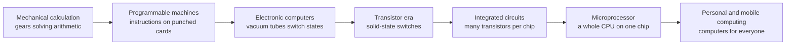

# L02 — A Brief History of Computing

> **Module 1** · Stage 1 · 2 hours

## Learning objectives

By the end of this lecture, you will be able to:

1. **Place** the major milestones of computing (mechanical calculation, programmable looms, early electronic computers, transistors, integrated circuits, microprocessors, personal and mobile computing) in correct chronological order. (CLO-1)
2. **Explain** how each generation's technology change enabled the next class of machines. (CLO-1)
3. **Relate** today's devices to the concepts introduced at each historical stage (e.g., stored program, batch processing, time-sharing). (CLO-1)

## Key terms

generation (of computers) · transistor · integrated circuit · microprocessor · stored program · mainframe · minicomputer · microcomputer

## 2.0 Before we start — prerequisites and motivation

**You need from earlier lectures:** L01's four-part definition — history is the story of how each part got *automated*: calculation first, then storage, then communication, then the miniaturization of all three. No prior history knowledge is assumed.

**Why this matters:** the machinery you will study all semester — the stored-program design (L05), the CPU cycle (L06), memory hierarchies (L07) — was each a *revolutionary answer* to a previous generation's limit. History is why the architecture looks the way it does; and the causal chain you build today is the skeleton every later hardware lecture hangs on.

## 2.1 Before electronics: automating calculation

Humans automated calculation long before electricity served it. The **abacus** (used for millennia across Asia and the Middle East) is a calculation aid operated by a person. In 1801, Joseph-Marie **Jacquard's loom** wove patterns from punched cards — the first widely used machine *programmed* by stored hole patterns, and a direct ancestor of later card-based computing [1]. Charles **Babbage** designed the Difference Engine (announced 1822) to compute mathematical tables and the **Analytical Engine** (design from the 1830s) with a mill (processor-like) and store (memory-like) — a mechanical general-purpose computer never built in his lifetime [2]. **Ada Lovelace's** notes on the Analytical Engine (1843) include what is recognised as the first published computer program and an insight beyond Babbage's own: such a machine could manipulate *symbols*, not just numbers [2].

## 2.2 The electronic generations

The standard "generations" framework summarises the hardware leaps [1], [3]:

| Generation | Roughly | Key technology | Consequence |
|---|---|---|---|
| 1st | 1940s–1950s | Vacuum tubes | Room-sized machines: **ENIAC** (1945, first general-purpose electronic computer), UNIVAC (first commercial) |
| 2nd | 1950s–1960s | **Transistors** | Smaller, cooler, more reliable; mainframes enter business use |
| 3rd | 1960s–1970s | **Integrated circuits** | Many transistors on one chip; **IBM System/360** family concept; minicomputers |
| 4th | 1970s– | **Microprocessors** (Intel 4004, 1971) | Whole CPU on one chip; microcomputers → PCs (Apple II 1977, IBM PC 1981) |
| — | 1990s– | Mass internet, mobile, multi-core, SSDs | Smartphones put a networked computer in every pocket |

Two ideas matter more than any date: the **stored program** concept (the 1945 von Neumann/EDVAC report proposed keeping the program in memory like data — formalized in L05) and **miniaturization** (each generation packed more switching elements into less space, which Moore's law later quantified — see L06 and CS-01).

## 2.3 From room to pocket

Sizes tell the story: ENIAC weighed about 27 tonnes and used ~18,000 tubes [3]; a 1970s microcomputer sat on a desk; today's phone is millions of times faster than ENIAC at a fraction of a gram of silicon. The pattern — *more capability per unit of size, power, and cost* — explains why computing disappeared into objects rather than remaining a visible "computer industry" phenomenon.

## Lecture activity

[A1 — History Timeline Jigsaw](../activities/activity-1-history-timeline-jigsaw.md): teams assemble a dated timeline of the devices above, then justify the *causal* links between technologies (why transistors enabled integrated circuits, and so on).

## Visual explanation

*Figure: the causal chain of computing generations. Each stage's technology limit motivates the next stage's invention — read it as questions and answers, not as a museum row.*

## Common misconceptions

1. **"Computers began with electronic machines."** Programmability and stored instructions predate electronics by more than a century (Jacquard 1801, Babbage 1830s–40s); electronics changed the speed and scale, not the concept.
2. **"Computer generations are exact, agreed periods."** They are a teaching framework for hardware transitions, with fuzzy boundaries; different textbooks draw the edges slightly differently.
3. **"The microprocessor started computing."** By 1971, computing was already decades old and big business; the microprocessor made it *personal*.

## Check your understanding

1. Arrange in chronological order: transistor, vacuum tube, integrated circuit, microprocessor.
2. What did Jacquard's loom contribute to computing, and what later technology reused its idea?
3. Why is the stored-program idea more significant than any single machine?
4. Name one way Ada Lovelace's contribution went beyond Babbage's design.
5. Which generation's technology first made personal computers practical, and why?

## Lab link

Continue [Lab 1 — Digital Basics and System Orientation](../labs/lab-01-digital-basics-orientation.md) (due end of Week 2).

## References & further reading

1. Brookshear, J. G., & Brylow, D. (2019). *Computer Science: An Overview* (13th ed.). Pearson. — Chapter 1, §1.1–1.2.
2. O'Regan, G. (2012). *A Brief History of Computing*. Springer. — Chapters 2–3 (Babbage, Lovelace).
3. IEEE Computer Society. (n.d.). *ENIAC* and related entries, IEEE Computer Society Timeline of Computing History. https://www.computer.org/timeline — retrieved 2026; stable institutional source.

## Summary

- Computing history is a **causal chain**: mechanical calculation → programmable machines → electronic generations (vacuum tubes → transistors → integrated circuits → microprocessors) → personal and mobile computing.
- The **stored-program** concept — instructions held in memory like data — is the pivot that made modern software possible.
- Each generation's technology change (speed, size, cost) enabled the next *class* of machines and users.

## Homework

1. **Timeline rebuild:** from memory, write the six stages of the chain above with one distinguishing technology each; check against the figure and note what you missed. (15 min)
2. **Causal sentences:** write three "X enabled Y because…" sentences linking adjacent stages — the same justification the A1 jigsaw grades. (15 min)
3. **One device's ancestry:** pick a device in your bag and trace which two historical stages it visibly inherits from. *(Advanced extension: explain in three sentences why the loom's punched cards count as *programming*.)*

## Looking ahead

History gave us *kinds* of computers — room-sized to chip-sized, general-purpose to embedded. Next lecture (L03) turns that history into a practical taxonomy you will use to reason about hardware choices for the rest of the course.
