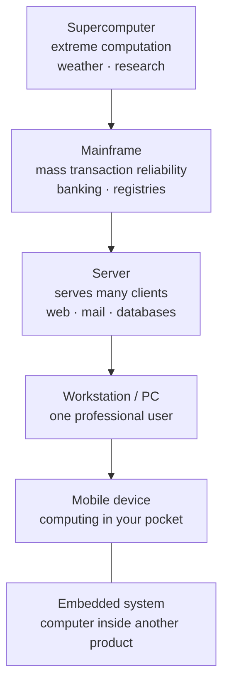

# L03 — Types of Computers and Their Applications

> **Module 1** · Stage 1 · 2 hours

## Learning objectives

By the end of this lecture, you will be able to:

1. **Classify** computers by scale and capability: supercomputer, mainframe, server, personal computer, mobile device, embedded system. (CLO-1)
2. **Match** each class to real application domains and justify the match by throughput, reliability, and cost requirements. (CLO-1)
3. **Distinguish** general-purpose from special-purpose computers and classify ambiguous devices. (CLO-1)

## Key terms

supercomputer · mainframe · server · workstation · personal computer · mobile device · embedded system · general-purpose · special-purpose

## 3.0 Before we start — prerequisites and motivation

**You need from earlier lectures:** L01's definition and the hardware/software/data/user decomposition — classification asks *which capabilities* a definition-satisfying computer has, and *where* it sits among its peers. L02's generation story supplies the size/cost context.

**Why this matters:** the classification is the course's first map of the computing landscape — every later lecture names a machine type and expects you to know its trade-offs. It is also a daily-life lens: after today you can read news about supercomputers, data centres, or embedded chips and know exactly what class of machine — and what engineering priorities — is behind the headline.

## 3.1 A classification by scale and purpose

The same von Neumann principles run at every scale; what differs is how much computation, storage, and reliability a job needs.

| Class | Defining job | Typical applications |
|---|---|---|
| **Supercomputer** | Maximum floating-point throughput on big scientific problems | Weather and climate simulation, molecular modelling, national research labs |
| **Mainframe** | Massive, reliable transaction processing | Banking settlement, airline reservations, government records; runs for decades, hot-swappable parts |
| **Server** | Serves many network clients simultaneously | Web, email, database, file servers in data centres |
| **Workstation** | High-end interactive professional work | CAD, video editing, scientific visualization |
| **Personal computer** | General-purpose single-user work | Documents, programming, coursework |
| **Mobile device** | Portable general-purpose computing | Smartphones, tablets |
| **Embedded system** | One dedicated function inside a product | Car controllers, washing machines, hearing aids, IoT sensors |

Boundary cases are instructive: a phone is a mobile *general-purpose* computer; a smartwatch is more embedded; a point-of-sale terminal is embedded but networked. Classification follows *function and constraint*, not marketing names.

## 3.2 How the classes relate

Server, mainframe, and supercomputer differ in *shape* of load: mainframes optimise many small reliable transactions, supercomputers optimise few enormous calculations, servers optimise concurrent network service. This lecture's one diagram — the scale axis from embedded to supercomputer, crossed by the special/general-purpose axis — is worth reproducing from memory; Module 6 will place *data centres* and *the cloud* on the server end of it.

## 3.3 Where you meet each class

Your morning already crossed five classes: alarm (embedded), phone (mobile), university LMS (server), classroom PC (personal), and the weather forecast you checked (supercomputer). Data-science students will later rent server-class machines *by the hour* via the cloud (L24) instead of buying them — the classification persists, only the ownership model changes.

## Lecture activity

In-class, no handout: "Classify the room" — small groups list every computing device they have touched today, assign each to a class, and defend the two hardest cases.

## Visual explanation

*Figure: the computer classes as a scale-and-purpose ladder. Position on the ladder reflects trade-offs — throughput, reliability, cost per unit — not prestige; the embedded class exists at every physical size.*

## Common misconceptions

1. **"Servers are a different kind of machine."** A server is a *role*; almost any computer can run server software. What makes "a server" is serving many clients reliably — hence rack-mounted hardware built for uptime.
2. **"Embedded systems are toys."** Embedded computers run cars, medical devices, and power grids. Their constraints (real-time response, extreme reliability, tiny power budget) make them among the most demanding designs in computing.
3. **"Supercomputers are just big PCs."** They are thousands of processors cooperating on one problem; the programming models (parallelism) differ fundamentally — a first taste of L06's multi-core discussion.

## Check your understanding

1. A hospital needs a machine to run decades, processing millions of small records daily. Which class fits, and why not a supercomputer?
2. Why is a smartwatch closer to an embedded system than a phone is?
3. Give one example each of a general-purpose and a special-purpose computer that you touched this week.
4. What distinguishes mainframe workloads from supercomputer workloads?
5. Which class will host the web app you build if you rent from a cloud provider (L24)?

## Lab link

Start [Lab 2 — Hardware Inventory and Benchmarking](../labs/lab-02-hardware-inventory-benchmarking.md) after L05 (assigned L06, due end of Week 4); meanwhile continue [Lab 1](../labs/lab-01-digital-basics-orientation.md) if outstanding.

## References & further reading

1. Brookshear, J. G., & Brylow, D. (2019). *Computer Science: An Overview* (13th ed.). Pearson. — Chapter 1, §1.2 (categories of computers).
2. Sinha, P. K., & Sinha, P. (2010). *Computer Fundamentals* (6th ed.). BPB Publications. — Chapter 1 (classification of computers).
3. U.S. Bureau of Labor Statistics. (2025). *Occupational Outlook Handbook: Computer and Information Technology Occupations*. https://www.bls.gov/ooh/computer-and-information-technology/ — application domains and career context.

## Summary

- Computers classify by **scale and purpose**: supercomputer, mainframe, server, workstation/PC, mobile device, embedded system — each class matches domains by throughput, reliability, and cost.
- **General-purpose** machines run arbitrary programs; **special-purpose** machines are built for one job — many devices are special-purpose products around general-purpose cores.
- Ambiguous devices classify by *evidence*: what is programmable, what is fixed, and who the machine serves.

## Homework

1. **Classify your day:** list eight computers you touched today, assign each to a class, and defend the two hardest cases in a sentence each. (15 min)
2. **Domain match:** for each class, name one local organization that runs it and *why* that class fits (throughput/reliability/cost). (10 min)
3. **Boundary case:** argue in three sentences whether a smart TV is embedded or general-purpose, using the definition as evidence. *(Advanced extension: explain why the same physical chip design can appear in three different classes — what differs around it?)*

## Looking ahead

Computers exist in society, not in a vacuum. Next lecture (L04) examines what computing does to work, education, and equality — and what ICT career paths look like for you.
