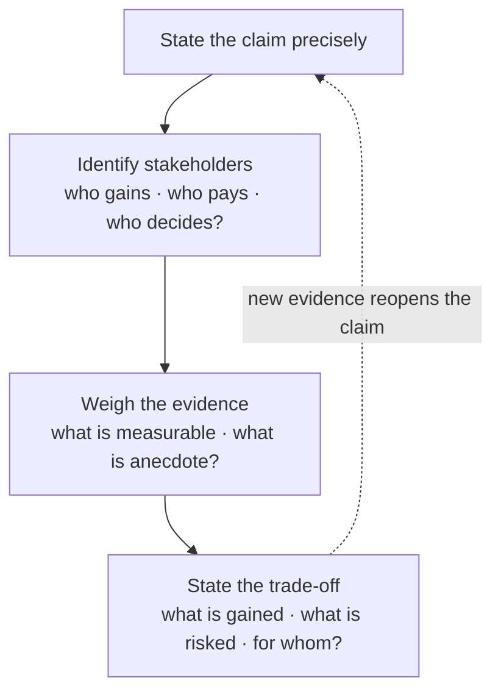

# L04 — Computers, Society, and You

> **Module 1** · Stage 1 · 2 hours

## Learning objectives

By the end of this lecture, you will be able to:

1. **Describe** major ways computing has reshaped work, education, healthcare, and communication, with one concrete example each. (CLO-1)
2. **Explain** the digital divide and give examples of its dimensions (access, skills, outcomes). (CLO-10)
3. **Identify** the main ICT career families and the course pathways that lead to them. (CLO-1)
4. **Discuss** ethical questions arising from automation and data collection using structured reasoning rather than slogans. (CLO-10)

## Key terms

digital divide · automation · ICT career pathway · professional ethics · lifelong learning

## 4.0 Before we start — prerequisites and motivation

**You need from earlier lectures:** L01–L03's technical vocabulary — society-level claims need machine-level precision to be arguable. No other prerequisites; this lecture closes Module 1 by turning the toolkit outward.

**Why this matters:** this is where the course's ethical spine begins. The four-step reasoning method (claim → stakeholders → evidence → trade-off) is the structured argument tool you will reuse in Modules 7 and 8 and in the project's social-implications section. The career map also starts here: Module 6 and Module 7 will show you which lectures feed which profession.

## 4.1 Computing reshapes society

Four domains show the pattern *technology → new practice → new problems*:

- **Work:** automation replaced routine tasks while creating new ones (support, data analysis, system administration). Economists describe this as task reallocation rather than simple job destruction, but transitions are real and unevenly distributed [1].
- **Education:** course websites (like this one), video, and instant feedback expanded access; they also demand self-regulation — the study rhythm from [Help](../help.md).
- **Healthcare:** electronic records, imaging, and telemedicine improved scale and consistency while raising privacy stakes (preview of L30).
- **Communication:** near-free global messaging reshaped social life and public discourse; information overload and misinformation became first-class problems (L23 addresses evaluation skills).

## 4.2 The digital divide

The **digital divide** is the gap between those who can effectively use digital technologies and those who cannot. It has three layers worth separating in discussion: **access** (devices, connectivity), **skills** (digital literacy), and **outcomes** (who benefits economically). Policy responses — public access points, school programmes, affordability schemes — target different layers; the skills layer is where this course itself acts [1], [2].

## 4.3 ICT careers and your pathway

| Family | What they do | Foundation from this course |
|---|---|---|
| Software development | Build applications and systems | Logic (M5), computational thinking (L31) |
| Data science / analytics | Extract insight from data | Data representation (M4), databases (L25), data lifecycle (L26) |
| Networking / operations | Run networks and services | Modules 6, 3 |
| Security | Protect systems and people | L29–L30 |
| UX, support, training | Make technology usable | Productivity tools (L19–L20), communication |

Your degree's later courses specialise these families; this course supplies the shared vocabulary. Career data and outlooks are published in the U.S. BLS *Occupational Outlook Handbook* [3] — a stable, citable source for salary/outlook claims in assignments.

## 4.4 Thinking about ethical questions

This course's rule for ethics discussions: **identify stakeholders → name the concrete harms/benefits → propose a norm or rule → test it on a hard case.** We apply the method here to workplace monitoring and algorithmic screening previews, then fully in L28 (AI), L29–L30 (security and privacy).

## Lecture activity

In-class, no handout: structured debate — "This university should require all coursework to be submitted digitally, with no paper option." Apply the four-step method; one team argues for, one against, one judges the *reasoning quality*, not the position.

## Visual explanation

*Figure: the four-step method for structured ethical reasoning. The loop matters: a trade-off statement is a position open to revision by evidence — not a slogan to defend.*

## Common misconceptions

1. **"Technology automatically improves society."** Effects depend on access, incentives, and governance. The same platform can widen and narrow divides in different contexts — analysis, not optimism, is the professional stance.
2. **"The digital divide is only about internet access."** Skills and outcome gaps persist even where access exists; a connected household without digital literacy still loses opportunities.
3. **"Ethics is personal opinion with no method."** Professionals use structured frameworks (stakeholders, harms, rules, cases). The method above is a starter version of exactly that.

## Check your understanding

1. Name one task computer automation *created* and one it *diminished*, and explain the difference using "task reallocation."
2. Give an example of each divide layer: access, skills, outcomes.
3. Which two modules of this course most directly support a data-science career, and why?
4. Apply the four-step ethics method to: "an employer monitors employees' work computers." Stakeholders? One rule you might propose?
5. Why is the BLS handbook a better source for career claims than a news article?

## Lab link

[Lab 1 — Digital Basics and System Orientation](../labs/lab-01-digital-basics-orientation.md) is due end of this week.

## References & further reading

1. Brookshear, J. G., & Brylow, D. (2019). *Computer Science: An Overview* (13th ed.). Pearson. — Chapter 1, §1.3; Chapter 11 (social issues) as available in edition.
2. van Dijk, J. A. G. M. (2020). *The Digital Divide*. Polity Press. — Three-layer framework (access, skills, outcomes).
3. U.S. Bureau of Labor Statistics. (2025). *Occupational Outlook Handbook*. https://www.bls.gov/ooh/ — retrieved 2026.

## Summary

- Computing reshapes work, education, healthcare, and communication — with concrete, task-level examples that beat general claims.
- The **digital divide** has three dimensions: **access** (devices, bandwidth), **skills** (effective use), and **outcomes** (who benefits) — a closure programme must name which it targets.
- ICT careers cluster into families (development, data, networks, security, support, embedded) that this course's modules feed directly.
- The **four-step method** turns ethical questions into structured positions: claim, stakeholders, evidence, trade-off.

## Homework

1. **Method practice:** apply the four steps to one automation claim you hear in the news this week; write the four steps in four sentences. (15 min)
2. **Divide mapping:** for your home community, name one access barrier, one skills barrier, and one outcome gap — each in one sentence. (10 min)
3. **Career probe:** find one real job posting in a family that interests you; list which course modules its requirements map to. *(Advanced extension: interview-style — ask one professional in a family you like which skill they wish they'd learned first; bring the answer to the next module.)*

## Looking ahead

Module 2 begins: we open the case and study *how* machines execute programs — starting with the architectural idea that made software possible at all.
