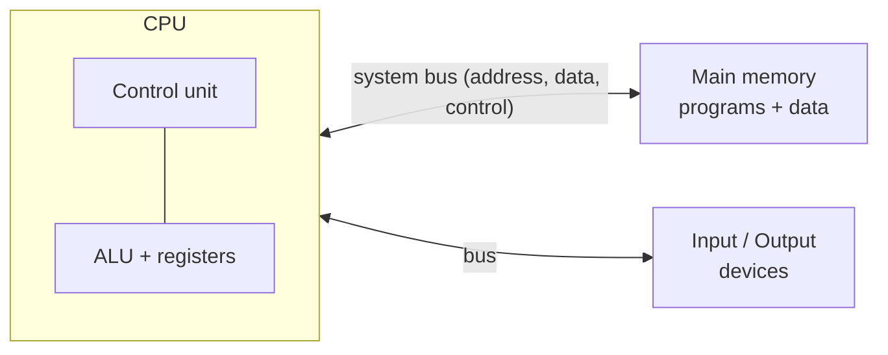
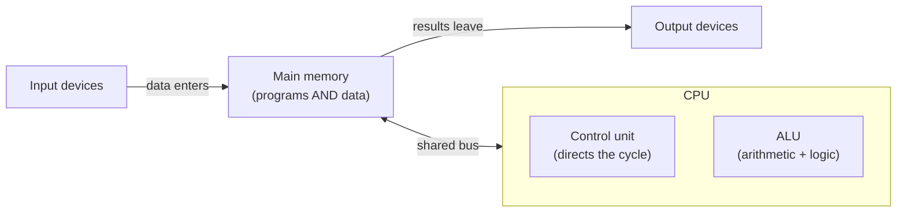

# L05 — The von Neumann Architecture

> **Module 2** · Stage 1 · 2 hours

## Learning objectives

By the end of this lecture, you will be able to:

1. **Describe** the stored-program computer model: CPU, memory, I/O, and buses. (CLO-2)
2. **Explain** why storing programs in the same memory as data was revolutionary. (CLO-2)
3. **Diagram** the von Neumann organization from memory, labeling each component's role. (CLO-2)

## Key terms

stored program · CPU · memory · input/output · bus · von Neumann bottleneck

## 5.0 Before we start — prerequisites and motivation

**You need from earlier lectures:** the four-part definition of a computer (L01); the stored-program idea and generation story (L02); the general- vs special-purpose distinction (L03). Nothing else — this lecture is where hardware proper begins.

**Why this matters:** every machine you will ever program is a von Neumann machine in the small. The model explains *why* L01's "processing" step has a physical location, why your code and your photos sit in the same memory, and why L06's cycle, L07's hierarchy, and every future programming course behave as they do. When a future course says "the program is in memory," you will know exactly which boxes move.

## 5.1 The big idea: instructions are data

In 1945, John von Neumann's draft report on the EDVAC proposed a computer whose *program lives in the same memory as its data* [1]. Before this, reprogramming machines meant rewiring them (as with ENIAC). The stored-program idea means a computer can load, run, modify, and switch programs like files — the property that makes software an industry possible. Nearly every general-purpose computer since — your phone included — follows this organization, so "computer architecture" in this course means the von Neumann model unless stated otherwise.

## 5.2 The components

- **CPU (central processing unit):** the **control unit** fetches and decodes instructions; the **ALU** (arithmetic logic unit) executes arithmetic and comparisons; small, fast **registers** hold values in active use. Detailed next lecture.
- **Main memory:** a bank of numbered cells (**addresses**) holding both instructions and data while a program runs; volatile (Module 4 shows how bits encode them).
- **I/O devices:** keyboard, screen, network — the machine's senses and limbs.
- **Buses:** shared wires carrying **addresses** (where), **data** (what), and **control** (when). Because one bus serves CPU and memory, instructions and data cannot both move at full speed at every instant — the **von Neumann bottleneck**; caches (L07) are one answer.

## 5.3 Executing a program — the cycle preview

The CPU repeatedly: **fetch** the next instruction from memory → **decode** what it means → **execute** it → repeat. Everything computational you have ever used reduces to this loop running billions of times per second (next lecture details it; Module 5 reveals how the ALU is built from logic gates).

## 5.4 Variations, honestly

Real chips depart from the pure model: separate instruction/data caches (Harvard-flavoured details inside a von Neumann machine), GPUs with thousands of simple cores, microcontrollers with flash for programs. The model remains the *teaching spine* — variations are optimisations of its parts, not replacements of it. *(Teaching simplification: "Harvard architecture" here means only that some designs separate instruction and data paths; full treatment belongs to computer-organization courses.)*

## Lecture activity

In-class, no handout: "Human CPU" — one student plays the control unit, one the ALU, one memory (holding numbered index cards with instructions); the class walks a three-instruction program (add two numbers, store, output) through the cycle, physically passing cards along the "bus."

## Visual explanation

*Figure: the stored-program computer. One shared bus carries both instructions and data between memory and the CPU — the source of the von Neumann bottleneck.*

The diagram's most important feature is what it *omits*: no arrow runs directly from input to CPU. Everything flows through memory — because instructions are data.

## Common misconceptions

1. **"Memory and storage are the same."** Memory (RAM) is fast, small, volatile working space; storage (disk/SSD) is slower, larger, permanent (L07–L08 separate them precisely).
2. **"The CPU runs the whole program at once."** It executes one instruction *at a time* per core, extraordinarily fast; apparent simultaneity comes from speed and scheduling (L10).
3. **"von Neumann invented the computer."** The 1945 report synthesized and published an architecture that Eckert, Mauchl, and colleagues at the Moore School were already building toward [1]; credit is shared and historical naming is contested.

## Check your understanding

1. State the stored-program idea in one sentence and name the pre-1945 practice it replaced.
2. Draw the architecture from memory: CPU (CU, ALU, registers), memory, I/O, and label the three bus types.
3. Why does one shared bus create a bottleneck? What hardware (preview) hides it?
4. Which component decides *what the next instruction is*, and which performs *arithmetic*?
5. Classify each as memory or storage: (a) running browser's tabs, (b) your photo library on the SSD.

## Lab link

This module's lab begins after L06: [Lab 2 — Hardware Inventory and Benchmarking](../labs/lab-02-hardware-inventory-benchmarking.md) — assigned L06, due end of Week 4.

## References & further reading

1. von Neumann, J. (1945). *First Draft of a Report on the EDVAC*. Moore School of Electrical Engineering, University of Pennsylvania. — Contract No. W-670-ORD-4926; the historical source document.
2. Brookshear, J. G., & Brylow, D. (2019). *Computer Science: An Overview* (13th ed.). Pearson. — Chapter 5, §5.1.
3. Tanenbaum, A. S., & Austin, T. (2013). *Structured Computer Organization* (6th ed.). Pearson. — Chapter 2.

## Summary

- A computer executes a **stored program**: instructions live in the same memory as data, loaded like anything else.
- Five organs: **control unit** (directs), **ALU** (computes), **memory** (holds both programs and data), **input**, **output** — joined by **buses**.
- Storing programs as data made software possible: reload, edit, swap programs without touching hardware.
- The shared CPU–memory bus is the **von Neumann bottleneck** — the constraint L07's hierarchy manages.

## Homework

1. **Redraw from memory:** reproduce the five-organ diagram from a blank page, then check it against the figure above and list what you missed. (10 min)
2. **Spot the model:** name one device in your home that is *not* strictly von Neumann in the small (hint: microcontrollers with separate program/data memory exist) and write two sentences on why the distinction is invisible to users. *(Advanced extension.)*
3. Bring L06's preview question: after the ALU computes, which box does the result visit next?

## Looking ahead

Next lecture (L06) zooms into the CPU: what happens inside fetch–decode–execute, what clock speed and cores really measure, and why Moore's law shaped your phone.
