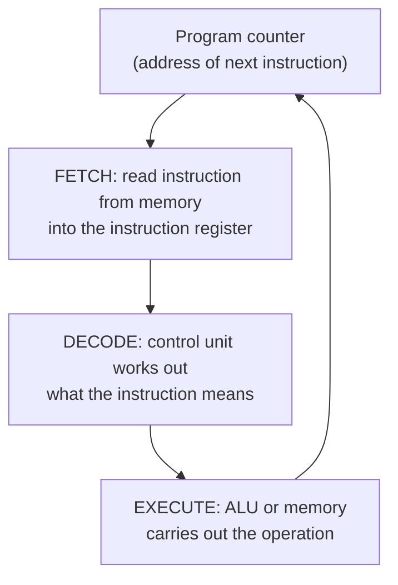

# L06 — The CPU: How Instructions Execute

> **Module 2** · Stage 1 · 2 hours

## Learning objectives

By the end of this lecture, you will be able to:

1. **Trace** the fetch–decode–execute cycle for simple instructions, naming the registers involved. (CLO-2)
2. **Interpret** CPU specifications (clock speed, cores, cache sizes) as predictions of behaviour. (CLO-2)
3. **Explain** Moore's law historically and its current limits. (CLO-2)

## Key terms

instruction cycle · program counter · instruction register · clock speed · core · Moore's law

## 6.0 Before we start — prerequisites and motivation

**You need from earlier lectures:** the von Neumann organs, especially the control unit, ALU, and memory (L05); the four-part definition (L01). No arithmetic beyond place values (L13 goes deeper).

**Why this matters:** this cycle is the loop your code lives in. Every program you will ever write — from a spreadsheet formula to a neural network — decomposes into these three phases repeated billions of times per second. It also explains what computer advertisements actually mean: after this lecture, "3.2 GHz, 8 cores, 12 MB cache" becomes a set of *behavioural predictions*, not noise.

## 6.1 The cycle in detail

The CPU lives by a loop [1], [2]:

1. **Fetch:** the **program counter** (PC) holds the address of the next instruction; the control unit reads it from memory into the **instruction register** (IR); the PC advances.
2. **Decode:** control circuitry interprets the instruction's *opcode* (what to do) and *operands* (whom to do it to).
3. **Execute:** the ALU computes, a value loads/stores, or a jump changes the PC.

Multiply 7 × 6: fetch `LOAD 7` (PC→IR), decode "load," execute (register holds 7); fetch `MULTIPLY 6`, execute (ALU produces 42); fetch `STORE result`. Real CPUs execute *billions* of such cycles per second — the measure called **clock speed** (3 GHz ≈ 3 billion cycles/second, with many instructions taking multiple cycles; simplification flagged).

## 6.2 Reading a CPU spec honestly

| Spec | What it measures | Caveat |
|---|---|---|
| Clock speed (GHz) | Cycles per second | Not comparable across different architectures; work per cycle differs |
| Cores | Independent execution units | Software must *use* the cores; single tasks don't automatically speed up |
| Cache (L1/L2/L3) | Fast on-chip memory near the core | Often matters more than headline GHz for real programs |
| TDP / power | Heat/energy budget | Phones and laptops are constrained by battery, not capability |

Two 3-GHz chips can differ hugely in work-per-cycle; marketing cites clock speed because it is simple, not because it is sufficient. Lab 2 makes you benchmark instead of trusting numbers.

## 6.3 Moore's law — trend, not law

Gordon Moore (1965, revised 1975) observed that the number of transistors per chip grew such that density roughly **doubled about every two years** [3]. For decades this forecast tracked reality and drove the industry's planning. It is an empirical trend, not physics: transistor shrinking is now slowing against atomic-scale limits, and the industry compensates with multi-core designs and specialisation. Case study [CS-01](../case-studies/case-study-01-moores-law-smartphone.md) traces this story through the phone in your pocket.

## Lecture activity

In-class, no handout: cycle simulation on paper — pairs write a 5-instruction program (load two numbers, add, store, output) as fake opcodes, then exchange sheets and physically walk each other's program through the three phases, tracking PC and registers in a table.

## Visual explanation

*Figure: the fetch–decode–execute cycle. The program counter closes the loop: after execute, it points at the next instruction (or a jump target).*

## Common misconceptions

1. **"GHz alone determines speed."** Work per cycle, cache behaviour, memory speed, and software parallelism matter as much or more; compare benchmarks, not just clocks.
2. **"More cores always means faster."** Only programs split into parallel pieces benefit; a word processor gains little from 16 cores, a video render gains a lot.
3. **"Moore's law is a physical law."** It was an empirical observation about industry scaling that held for decades and is now slowing; treating it as guaranteed led to real forecasting errors.

## Check your understanding

1. Name the three phases of the instruction cycle and the register that points to the next instruction.
2. A game runs poorly on a 4-core CPU but well on an 8-core one. What property of the game explains this?
3. Why is comparing GHz across different CPU families unreliable?
4. State Moore's observation with its doubling period, and explain why it is not a "law" of nature.
5. In the add-7-and-6 example, which phase does the ALU participate in?

## Lab link

[Lab 2 — Hardware Inventory and Benchmarking](../labs/lab-02-hardware-inventory-benchmarking.md): assigned today, due end of Week 4 — you will inventory *your* machine and benchmark rather than trust specs.

## References & further reading

1. Brookshear, J. G., & Brylow, D. (2019). *Computer Science: An Overview* (13th ed.). Pearson. — Chapter 5, §5.2 (machine cycle).
2. Tanenbaum, A. S., & Austin, T. (2013). *Structured Computer Organization* (6th ed.). Pearson. — Chapter 2, instruction interpretation.
3. Moore, G. E. (1965). Cramming more components onto integrated circuits. *Electronics*, 38(8). — Reprinted, Proceedings of the IEEE, 86(1), 1998.

## Summary

- The CPU executes every instruction in three phases: **fetch** (PC → IR), **decode** (control unit), **execute** (ALU/memory), then repeat.
- The **program counter** always knows what runs next; jumps simply overwrite it.
- **Clock speed** counts cycles per second; **cores** run independent cycles in parallel; **cache** keeps the queue fed — all three matter more than any single number.
- **Moore's law** was a decades-long economic trend of doubling transistor density, now visibly slowing — an observation, not a law of physics.

## Homework

1. **Trace it cold:** write a five-instruction program (load two numbers, add, store, output) in a table with columns for PC, IR, and effect; walk all five instructions through the cycle. (15 min)
2. **Decode an ad:** find one real laptop or phone CPU specification online and write three sentences predicting its behaviour using cores, clock, and cache — then one sentence on what the spec *cannot* tell you. (15 min)
3. *(Advanced extension)* Read the abstract of Moore's original 1965 paper via the lecture reference and list one prediction that held and one that did not.

## Looking ahead

The CPU is fast; memory is the choke point. Next lecture (L07) explains the hierarchy that makes fast-but-small and big-but-slow memory *feel* both fast and big.
