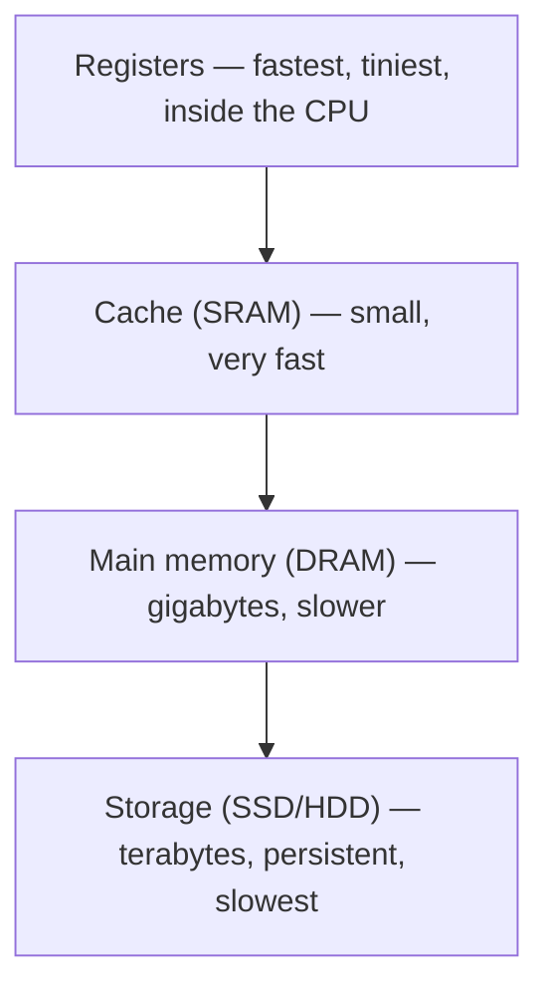

# L07 — Memory and the Hierarchy

> **Module 2** · Stage 1 · 2 hours

## Learning objectives

By the end of this lecture, you will be able to:

1. **Order** the memory hierarchy (registers, cache, main memory, storage) by speed, capacity, cost, and volatility. (CLO-2)
2. **Explain** why the hierarchy works: locality of reference. (CLO-2)
3. **Describe** RAM types (SRAM/DRAM), ROM, and virtual memory at an intuitive level. (CLO-2)

## Key terms

RAM · ROM · SRAM · DRAM · cache · volatile · virtual memory · locality of reference

## 7.0 Before we start — prerequisites and motivation

**You need from earlier lectures:** the von Neumann organs and the shared-bus bottleneck (L05); the cycle's memory-wait pain point (L06). From this module on, keep *volatile* and *persistent* strictly separate.

**Why this matters:** the hierarchy is engineering's answer to an impossible demand — everything fast, huge, and cheap at once. Understanding it explains why adding RAM fixes some slowdowns and not others, why your program's *access pattern* matters as much as its algorithm, and it is the gateway concept for caches in databases (L25), CDNs (L22), and GPU memory hierarchies in data science.

## 7.1 The four-way trade-off

No single memory technology is fast, big, cheap, and permanent — so computers use a hierarchy, each level trading size/permanence for speed:

| Level | Typical size (2020s PC) | Speed (access time, order) | Volatile? | Role |
|---|---|---|---|---|
| Registers | hundreds of bytes | <1 ns | yes | Values in active use |
| Cache (L1–L3, SRAM) | KBs–tens of MB | 1–20 ns | yes | Recently/frequently used data near the core |
| Main memory (DRAM) | 8–64 GB | ~100 ns | yes | Running programs and their data |
| Storage (SSD/HDD) | hundreds of GB–TBs | ~100 µs (SSD)–ms (HDD) | no | Programs and files at rest |

The gap between DRAM and SSD/HDD speed is why "your computer swapping" feels catastrophic: when RAM overflows, the OS moves overflow to storage (**virtual memory**), and the 100× speed cliff dominates behaviour [1], [2].

## 7.2 Why it works: locality

Programs repeatedly touch the *same* small working sets: the same variables in loops (**temporal locality** — recently used things get reused) and neighbouring array elements (**spatial locality** — nearby things get used together). The cache keeps such hot data near the CPU; hit rates above 90% are routine. This one insight justifies every level of the table above — remove locality and the hierarchy collapses.

## 7.3 RAM, ROM, and friends

- **DRAM** (main memory): one transistor + capacitor per bit; dense, cheap, must be refreshed — "refreshing" is why it's called *dynamic*.
- **SRAM** (cache): six transistors per bit, faster, bigger cell — hence expensive, hence small.
- **ROM / firmware:** non-volatile chips holding start-up code (BIOS/UEFI); "read-only" historically, flash-updatable in practice — a vocabulary trap worth knowing. *(Teaching simplification: modern "ROM" is usually reprogrammable flash; the name persists.)*

## Lecture activity

In-class, no handout: "hierarchy sorting cards" — teams receive cards (register, L1, L2, DRAM, SSD, HDD, cloud storage) with speed/size/cost hints and must order them and defend the ordering against a second team's arrangement.

## Visual explanation

*Figure: the memory hierarchy as a ladder. Each rung up: faster, smaller, costlier per gigabyte, more volatile; locality of reference is what makes the ladder pay off.*

## Common misconceptions

1. **"RAM size is all that matters."** 16 GB of slow DDR with a tiny cache loses to well-balanced systems; hierarchy position matters, not a single level.
2. **"Cache is a kind of RAM you can buy more of."** Cache is integrated with the CPU die and fixed at purchase; you cannot "add cache" like adding DRAM.
3. **"Virtual memory is extra RAM."** It is disk space used as overflow — it prevents crashes, but every spill to disk costs ~100× a RAM access; more real RAM is the actual fix.

## Check your understanding

1. Order by speed: SSD, registers, DRAM, L2 cache — fastest first.
2. Which two properties make SRAM suitable for cache but unsuitable for main memory?
3. Define temporal and spatial locality with one example each from this course's own workflow.
4. Why does opening 40 browser tabs eventually slow a machine with "enough" RAM? (Two mechanisms.)
5. What does volatile mean, and why is volatility *desirable* in main memory's design?

## Lab link

[Lab 2 — Hardware Inventory and Benchmarking](../labs/lab-02-hardware-inventory-benchmarking.md) — inventory your RAM/cache/storage mix and benchmark; due end of Week 4.

## References & further reading

1. Brookshear, J. G., & Brylow, D. (2019). *Computer Science: An Overview* (13th ed.). Pearson. — Chapter 5, §5.2 (memory organization) and §5.4 as available.
2. Tanenbaum, A. S., & Austin, T. (2013). *Structured Computer Organization* (6th ed.). Pearson. — Chapter 2 (memory hierarchy).
3. White, R., & Downs, T. (2015). *How Computers Work* (10th ed.). Que. — Memory chapters (visual intuition).

## Summary

- Memory technology trades **speed, capacity, cost per bit, and volatility** — no technology wins all four; hence a hierarchy: registers → cache → main memory → storage.
- **Locality of reference** (temporal + spatial) is why small fast levels serve most accesses: programs cluster their memory use.
- **RAM** (SRAM for cache, DRAM for main memory) is volatile; **ROM** and storage are persistent; **virtual memory** lets the OS extend RAM onto storage when needed.

## Homework

1. **Sort and defend:** rank register, L1 cache, DRAM, SSD, cloud storage, tape archive by speed; then by cost per gigabyte; note where the two orderings differ and why. (10 min)
2. **Locality hunt:** pick any app you use daily and describe one temporal and one spatial locality you'd expect in its memory access. (10 min)
3. **RAM upgrade puzzle:** a laptop with 4 GB RAM feels slow with 30 browser tabs; upgrading to 16 GB helps. Explain using the hierarchy and virtual memory, then state *one* workload where the upgrade would barely help. *(Advanced extension.)*

## Looking ahead

Next lecture (L08) completes the hardware tour: storage technologies, the peripheral family, ports — and how to choose a machine from requirements instead of adverts.
