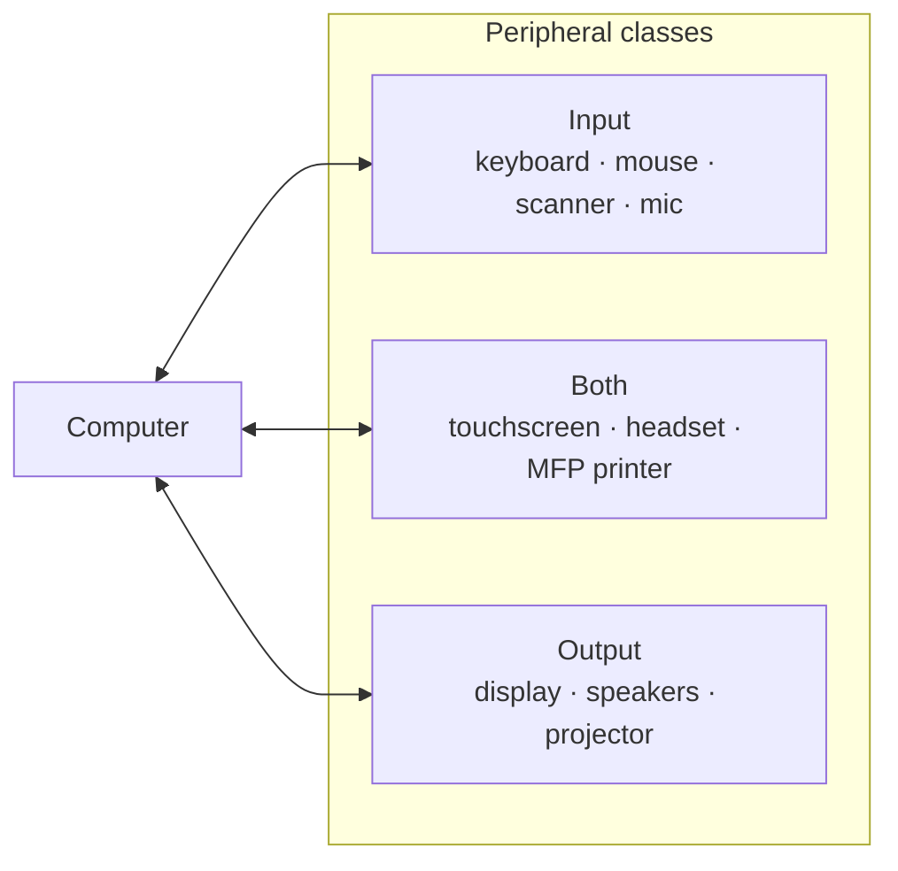

# L08 — Storage and Peripherals

> **Module 2** · Stage 1 · 2 hours

## Learning objectives

By the end of this lecture, you will be able to:

1. **Compare** storage technologies (HDD, SSD, optical, flash) on speed, durability, capacity, and cost. (CLO-2)
2. **Classify** peripherals as input, output, or both, and name their typical interfaces. (CLO-2)
3. **Recommend** a hardware configuration for a stated user requirement and budget, justifying each choice. (CLO-2)

## Key terms

HDD · SSD · optical disc · flash storage · RAID · input device · output device · port · driver

## 8.0 Before we start — prerequisites and motivation

**You need from earlier lectures:** the hierarchy and its volatility axis (L07); the cycle (L06) to explain why random access is slow on spinning disks; L01's four-part definition for the peripheral classification.

**Why this matters:** this lecture turns specification sheets into purchase decisions. Whether you later manage a lab, buy a data-science workstation, or spec a database server (L25), the skill is the same: requirements first, components second, justification always. It also completes the hardware picture the module set out to draw.

## 8.1 Storage technologies

| Technology | How it works | Speed | Strength | Weakness |
|---|---|---|---|---|
| **HDD** | Magnetic platters + moving read/write heads | ~ms access | Cheap per TB | Mechanical shock, slow random access |
| **SSD** | NAND flash, no moving parts | ~100 µs | Fast, silent, shockproof | Price per TB; finite write cycles (wear management is automatic) |
| **Flash (USB/SD)** | NAND flash in removable form | varies | Portable | Small size easy to lose — a security issue (L29) |
| **Optical (CD/DVD/Blu-ray)** | Laser reads pits/lands | slow | Cheap archival copies | Largely legacy; low capacity by modern standards |

Practical rules of thumb: boot drive → SSD; bulk archives → HDD or cloud; anything irreplaceable → **three copies, two media, one offsite** (the 3-2-1 backup rule, applied hands-on in L11's lab). **RAID** combines multiple drives for redundancy and/or speed — awareness only at this level: RAID is *not* a substitute for backups against deletion or ransomware (CS-04 makes the difference concrete).

## 8.2 Peripherals: input, output, and in-between

- **Input:** keyboard, mouse/touchpad, touch screen, scanner, microphone, camera, sensors.
- **Output:** display, printer, speakers, haptics.
- **Both:** touch screen, headset with mic, external drive, network card.

**Ports and connectors:** USB-A/C (universal; USB-C carries data, power, and video), HDMI/DisplayPort (video), 3.5 mm audio, Ethernet (wired LAN — L21). A **driver** is the small system software that lets the OS talk to a device — the OS chapters (L09–L10) place drivers in the software map.

## 8.3 Choosing hardware from requirements

Method for the recommendation task (and Lab 2's closing exercise): **(1)** list the workload (what software, what data sizes, what latency needs); **(2)** map workload → components (compiling/analysis → CPU cores + RAM; video editing → fast storage + GPU; long battery → low-power CPU); **(3)** set the budget order: RAM and storage quality first on a laptop, then CPU; **(4)** justify every line — "because the workload does X" is the required format.

## Lecture activity

In-class, no handout: requirements workshop — three scenario cards (field researcher, gamer, office assistant); teams produce a spec + justification, then swap and attack another team's justifications.

> **📋 Integrated project assigned today.** Tracks, requirements, and constraints: [project brief](../assessments/project/brief.md). Milestones run through the semester: proposal, design, working check, [showcase](../assessments/project/milestones.md) in L32.

## Visual explanation

*Figure: peripherals classified by data direction. The "both" class is where classification questions get interesting — touchscreens and multi-function printers do real work in both directions.*

## Common misconceptions

1. **"More storage always means faster."** Capacity and speed are separate axes; a 2 TB HDD boots slower than a 256 GB SSD.
2. **"RAID 1 means I don't need backups."** RAID guards against *drive failure*, not deletion, theft, ransomware, or fire. Backups (versions, offsite) and RAID solve different problems.
3. **"USB-C means fast."** The *connector shape* is not the *data standard*; USB-C ports differ widely in speed and features — check the spec, not the shape.

## Check your understanding

1. Rank HDD, SSD, and DRAM by access speed; state each one's typical access-time order of magnitude.
2. Why is 3-2-1 stronger than "copy my files to a USB stick"?
3. A videographer's laptop has fast CPU but constant stutter during 4-K editing. Which component is the likely bottleneck?
4. Classify: touch screen, external SSD, barcode reader — input, output, or both?
5. What software piece is missing when Windows can't use a newly plugged device?

## Lab link

[Lab 2 — Hardware Inventory and Benchmarking](../labs/lab-02-hardware-inventory-benchmarking.md) — due end of this week; include the §5 requirement-recommendation exercise.

## References & further reading

1. Brookshear, J. G., & Brylow, D. (2019). *Computer Science: An Overview* (13th ed.). Pearson. — Chapter 5, §5.3 (mass storage).
2. White, R., & Downs, T. (2015). *How Computers Work* (10th ed.). Que. — Storage and peripherals chapters.
3. Spafford, E. H. (2011). *Cyber Security Essentials*. Auerbach. — Backup and 3-2-1 practice context (see also L29).

## Summary

- **HDD** (magnetic, cheap per GB, mechanical) vs **SSD** (flash, fast, durable, dearer per GB) vs optical/flash-media/tape niches — each technology survives where its trade-off profile fits.
- Peripherals are **input**, **output**, or **both**; ports differ in shape *and* protocol generation, so a matching plug is not a matching speed.
- Hardware selection is a requirements activity: **user need → component choices → justification against the need**.

## Homework

1. **Spec two machines:** from a requirements-first approach, configure (on paper) a machine for a field researcher and one for a video editor; justify each line against the requirement. (20 min)
2. **Port audit:** list every port on your own device with its generation/speed if marked; flag one case where the shape matches but the speed does not. (10 min)
3. **Failure-modes paragraph:** SSDs and HDDs fail differently; write five sentences on what warning signs each gives and how the 3-2-1 rule (preview of L11) answers both. *(Advanced extension.)*

## Looking ahead

Hardware in hand; software next. Module 3 maps the software landscape — from operating systems down to firmware — starting with L09's question: *what kinds of software exist and who controls them?*
