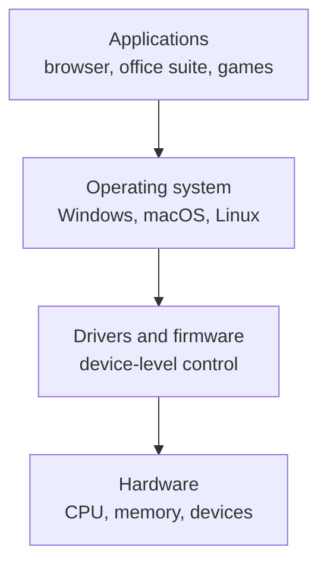
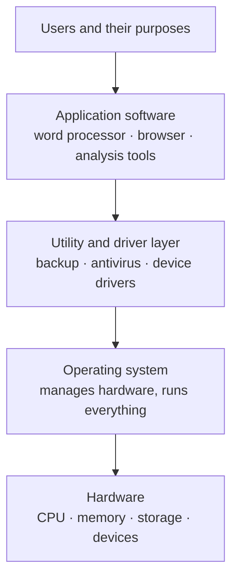

# L09 — The Software Landscape

> **Module 3** · Stage 2 · 2 hours

## Learning objectives

By the end of this lecture, you will be able to:

1. **Classify** software as system or application, placing operating systems, drivers, utilities, and firmware correctly. (CLO-3)
2. **Compare** licensing models (proprietary, free/open-source, freemium, trial) and their implications for users. (CLO-3)
3. **Describe** the relationship between applications, the OS, and hardware as a stack. (CLO-3)

## Key terms

system software · application software · operating system · driver · utility · firmware · license · open source

## 9.0 Before we start — prerequisites and motivation

**You need from earlier lectures:** the hardware/software/user distinction (L01); the four-part definition (L01); exposure to the OS as "the thing you boot into" — Module 2 gave you the hardware it runs on, and L10–L12 will unpack the OS itself. This lecture draws the map the rest of the module fills in.

**Why this matters:** the stack model is the most reused idea in this course: licensing decisions, the CLI-vs-GUI question, driver problems, and Module 6's network layers all reuse "layers with interfaces between them." For CS students it is the precursor of abstraction in programming; for DS students it explains why a Python release can break without any change in your code.

## 9.1 The software stack

Software organizes as layers, each serving the one above:

- **Application software** does the user's task: browsers, editors, spreadsheets, games.
- **System software** runs the computer: the **operating system** manages everything (L10); **drivers** translate general OS commands into specific device signals; **utilities** maintain the system (antivirus, backup, disk tools); **firmware** is software burned into hardware that boots and controls the device itself (your keyboard has firmware).

Edge cases clarify the boundary: a file manager is a utility (system-ish) though it feels like an app; a compiler builds applications but is itself a developer tool; firmware is software that behaves like hardware. Classification follows *function*: does it exist to run the machine, or to do a task for the user? [1]

## 9.2 Licensing models

| Model | You get | Examples | Watch for |
|---|---|---|---|
| **Proprietary/commercial** | Paid license, closed source | Windows, MS Office | Subscription drift, telemetry settings |
| **Free & open source (FOSS)** | Source code, free use/modification | Linux, LibreOffice, Firefox | "Free" = freedom and often no cost; support may be community-based |
| **Freemium** | Core free, features paid | Dropbox, many mobile apps | Feature walls, storage limits |
| **Trial/subscription** | Time-limited or rental | Adobe CC, MS 365 | Auto-renewal terms |

Licensing determines what you may legally *do* — copy, modify, redistribute — which matters ethically (L30) and practically (choosing tools for a project). FOSS licenses are themselves categories (e.g., GPL's strong copyleft vs permissive MIT-style terms); the detail belongs to later courses, the *concept* belongs here [2].

## 9.3 Where software comes from

Trusted channels only: official app stores, vendor sites, your university's software portal. Package managers (Microsoft Store, `apt`/`brew` on Linux/macOS) verify publisher signatures — the first, cheapest security control, revisited in L29.

## Lecture activity

In-class, no handout: software autopsy — pairs take one installed program from their own machine, trace its layer (application/utility/driver?) and license model, and present the classification with evidence (about pages, licenses shown).

## Visual explanation

*Figure: the software stack. Each layer serves the one above it and hides the complexity of the one below it — which is why a spreadsheet user need not know about drivers.*

## Common misconceptions

1. **"Open source means unsafe or unsupported."** Open code is publicly auditable and much of the internet's infrastructure is FOSS; quality depends on the project, not the license.
2. **"Apps run directly on hardware."** Applications run on the OS; only the OS (and drivers/firmware) touches hardware directly — that indirection is what makes one app work across many machines.
3. **"'Free software' means no cost."** The term's core meaning is freedom to run, study, modify, share; cost is secondary and varies.

## Check your understanding

1. Place in the stack diagram: Photoshop, Linux kernel, GPU driver, printer firmware.
2. Why does the same browser work on Windows and macOS, but a driver does not?
3. Classify the license: (a) Windows 11 education license, (b) LibreOffice, (c) a free mobile game with ads.
4. What is one practical advantage of installing software via a package manager rather than a random website?
5. Which category does an antivirus utility belong to, and why?

## Lab link

[Lab 3 — File System Scavenger Hunt](../labs/lab-03-file-system-scavenger-hunt.md) starts next lecture (L11); this week, continue outstanding Lab 2 tasks if any.

## References & further reading

1. Brookshear, J. G., & Brylow, D. (2019). *Computer Science: An Overview* (13th ed.). Pearson. — Chapter 8, §8.1–8.2.
2. Bourgeois, D. T. (2014). *Information Systems for Business and Beyond*. — Chapter 3 (Software), open textbook edition used in this course.

## Summary

- Software classifies as **system software** (OS, drivers, utilities, firmware) versus **application software**; the classification question is always "who does this layer serve?"
- The **stack**: hardware → OS → utilities/drivers → applications → users; each layer hides the one below.
- **Licensing models** (proprietary, free/open-source, freemium, trial) differ in source availability, modification rights, and cost — read the terms, not the price tag.

## Homework

1. **Autopsy at home:** classify three programs you installed yourself by layer *and* license; find where each states its license (About panel, website, or installer). (15 min)
2. **Stack trace:** choose one task you did today (sending a message) and list every software layer it touched. (10 min)
3. *(Advanced extension)* Pick one open-source tool used in data science and summarise its license in three sentences: what may you do with it, and what must you not?

## Looking ahead

The stack's middle layer deserves its own lecture. Next: what the operating system actually *does* all day — L10.
