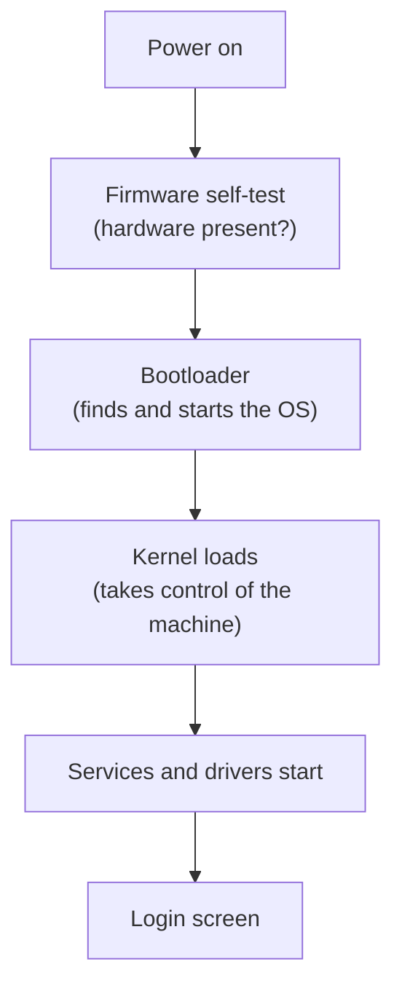

# L10 — Operating System Fundamentals

> **Module 3** · Stage 2 · 2 hours

## Learning objectives

By the end of this lecture, you will be able to:

1. **Describe** the OS's core responsibilities: process, memory, device, and file management, plus the user interface. (CLO-3)
2. **Explain** what happens during boot, from power-on to login screen. (CLO-3)
3. **Compare** CLI and GUI interfaces and choose the right one for given tasks. (CLO-3)
4. **Relate** the OS families (Windows, macOS, Linux, Android/iOS) to their design philosophies. (CLO-3)

## Key terms

kernel · boot · process · scheduling · multitasking · CLI · GUI · user space

## 10.0 Before we start — prerequisites and motivation

**You need from earlier lectures:** the stack and the OS's position in it (L09); von Neumann organs and the cycle (L05–L06) — the OS is a *program* that the CPU runs like any other, just with special powers. That is the surprising frame for this lecture.

**Why this matters:** the OS is the operating floor of everything else you will do. Command lines return in Lab 7 and every CS course after this one; memory management explains the slowdowns L07 promised; scheduling explains why 40 browser tabs cost more than one. And booting — the daily miracle nobody notices — is the best first example of a *layered system* working.

## 10.1 What the OS does

The **operating system** is the manager between applications and hardware [1]:

- **Process management:** a **process** is a running program. The OS gives each a share of CPU time (**scheduling**), so dozens of programs appear to run at once (**multitasking**) on maybe eight cores.
- **Memory management:** allocates RAM to processes, isolates them from each other (one crashing app cannot scribble over another's memory), and provides **virtual memory** (L07).
- **Device management:** via drivers (L09), routes data to/from every device; handles plug-in events.
- **File management:** turns raw disk bytes into files and folders — full lecture next (L11).
- **User interface:** the desktop/CLI through which humans drive it all.

The **kernel** is the OS's core that runs with full hardware privileges; everything else (window systems, services) runs around it.

## 10.2 Boot: from power to login

Power-on → CPU starts at a fixed address and runs **firmware** (BIOS/UEFI) → firmware self-tests hardware (**POST**) → finds the **boot loader** on the boot drive → boot loader loads the OS kernel → kernel starts drivers, services, and the login/screen-lock interface. Knowing this chain converts "my PC won't start" from panic into diagnosis: *which stage fails?* (L12 formalises the method.)

## 10.3 CLI and GUI

| | GUI | CLI |
|---|---|---|
| Model | Windows, icons, menus, pointer | Typed commands, text output |
| Strengths | Discoverable, low training | Precise, repeatable, scriptable, fast over many files |
| Weakness | Slow for bulk/repetitive work | Commands must be learned exactly |

Every OS ships both. GUI-first users should still learn ~10 core commands (`ls/dir`, `cd`, `cp/copy`, `mv/move`, `rm/del`, `mkdir`, plus redirect `>`); Lab 3 requires exactly this.

## 10.4 OS families

**Windows** (breadth of hardware and software, enterprise ubiquity), **macOS** (tight hardware integration, Unix-based userland), **Linux** (open source, dominates servers and embedded, many distributions), **Android/iOS** (mobile kernels with app-sandboxing security models). Virtual machines (L24 preview) let one machine host another OS safely — you will *use* a VM in Lab 7's cloud exercise, and OS-level ideas return there.

## Lecture activity

In-class, no handout: dual-interface race — teams complete the same five file operations via GUI and via CLI; measure time and errors; discuss which tasks each interface won and why.

## Visual explanation

*Figure: boot as a five-beat sequence. Each beat hands control to the next layer up — the same layering idea L09 drew, in time instead of space.*

## Common misconceptions

1. **"The desktop is the OS."** The desktop/window manager is one component; Windows, macOS, and Linux can run without any GUI at all — servers usually do.
2. **"Multitasking means parallel execution."** On few cores, the OS *interleaves* processes rapidly; true parallelism needs multiple cores (L06) — the illusion and the reality are both "multitasking."
3. **"A crashed app can damage the OS."** Memory isolation (user space vs kernel) protects the system; the app dies, the OS keeps scheduling. Not all crashes are equal.

## Check your understanding

1. List the five OS responsibilities and match each to one thing you did on a computer today.
2. Name the boot stages in order from power-on. At which stage do drivers load?
3. Give one task where the CLI beats the GUI and one where the reverse holds, with reasons.
4. What is a process, and how does it differ from a program?
5. Why do servers typically run without a GUI?

## Lab link

[Lab 3 — File System Scavenger Hunt](../labs/lab-03-file-system-scavenger-hunt.md) begins next lecture — it exercises the CLI commands previewed here.

## References & further reading

1. Brookshear, J. G., & Brylow, D. (2019). *Computer Science: An Overview* (13th ed.). Pearson. — Chapter 8, §8.2–8.3.
2. Tanenbaum, A. S., & Bos, H. (2015). *Modern Operating Systems* (4th ed.). Pearson. — Chapter 1 (instructor reference).

## Summary

- The **kernel** — the OS core — manages five things: **processes** (who runs), **memory** (who gets RAM), **devices** (translating hardware), **files**, and the **user interface**.
- **Boot** hands control up a chain: firmware self-test → bootloader → kernel → services → login.
- **CLI** wins on automation and precision; **GUI** wins on discoverability — professionals keep both.
- OS families differ in philosophy, not in the five jobs: every kernel does the same five things differently.

## Homework

1. **Command practice:** in any terminal (Windows PowerShell, macOS/Linux terminal), run a listing command and one navigation command; screenshot both and label which OS responsibility each touches. (10 min)
2. **Boot narration:** next cold start, write the five beats you *expect*, then tick them off as your machine passes them; note any beat you couldn't observe and why. (5 min + one restart)
3. *(Advanced extension)* Find and read one official page on your OS's startup process (vendor documentation only) and compare it against the five-beat model — where do they split beats differently?

## Looking ahead

Files are where your work lives. Next lecture (L11) covers file systems, paths, formats, and the backup discipline that will save you eventually.
