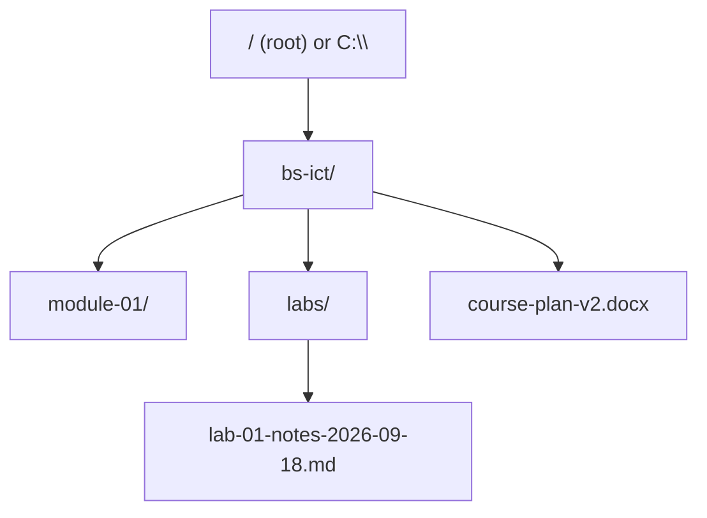

# L11 — File Systems and File Management

> **Module 3** · Stage 2 · 2 hours

## Learning objectives

By the end of this lecture, you will be able to:

1. **Explain** what a file system does and construct absolute and relative paths on Windows, macOS, and Linux. (CLO-3)
2. **Apply** professional file-naming conventions and folder structures to course and project work. (CLO-3)
3. **Implement** the 3-2-1 backup rule for your own data. (CLO-3)

## Key terms

file system · directory · path · absolute/relative path · file extension · metadata · backup · 3-2-1 rule

## 11.0 Before we start — prerequisites and motivation

**You need from earlier lectures:** the OS's five responsibilities, file management specifically (L10); storage vs memory volatility (L07) — backups only make sense once "the disk survives power-off" is clear. This is the module's most immediately useful lecture: today's skills are today's homework.

**Why this matters:** every course from now on will judge your file hygiene — submissions, project repos, datasets. Paths are the grammar of every command line (Lab 7) and every import statement you will ever write. And the 3-2-1 rule is the cheapest insurance you will ever buy against the most common digital catastrophe: silent loss.

## 11.1 Files, folders, and the tree

A **file** is a named sequence of bytes; a **directory/folder** is a named container of files and other directories; together they form a tree whose root is the drive (Windows `C:\`) or root (`/`) [1]. The **file system** (NTFS on Windows, APFS on macOS, ext4 on Linux) is the OS machinery that maps this tree onto storage blocks — L08's storage, organized.

A **path** addresses a file in the tree:

- Windows absolute: `C:\Users\ayesha\Documents\ict-labs\lab-03-notes.md`
- macOS/Linux absolute: `/Users/ayesha/Documents/ict-labs/lab-03-notes.md`
- **Relative** (from `~/Documents`): `ict-labs/lab-03-notes.md` — resolved from the *current directory*; `..` means "up one level."

Paths are the lingua franca of every later module — terminal work (Lab 3), web URLs (L23's structure borrows the tree metaphor), and project folder conventions.

## 11.2 Names, extensions, and metadata

**Extensions** (`.md`, `.png`, `.xlsx`) label *intended format*; double-clicking asks the OS to open the file with a matching app. Extensions are labels, not guarantees — renaming `report.txt` to `report.xlsx` does not make a spreadsheet. **Metadata** is data about the file (size, dates, camera GPS, author name) — visible in properties/dialog boxes; it has privacy consequences for shared files (L30 preview).

**Naming convention used in this course** (defined in the course repository's documentation standards, §B): lowercase, hyphens for spaces, dates as `YYYY-MM-DD` for correct sorting, e.g. `2026-09-18-ict-quiz-prep-notes.md`. Underscores vs hyphens matter little; *consistency* matters enormously.

## 11.3 Backup discipline: 3-2-1

**3 copies** of important data, on **2 different media**, with **1 offsite** (cloud counts) [2]. Ransomware (CS-04), theft, and drive death are *when*, not *if* — the rule makes data loss a bad hour instead of a bad semester. Practical map: primary on laptop SSD; second copy on external drive (automated, weekly); third in university storage or a cloud drive. Cloud sync services are *not* automatically backups — deleting locally can delete remotely; versioned or dedicated backup services behave better.

## Lecture activity

[Lab 3 — File System Scavenger Hunt](../labs/lab-03-file-system-scavenger-hunt.md) starts today: path construction, extension forensics, and a reorganization task applying the naming convention.

## Visual explanation

*Figure: a course folder as a tree. An absolute path spells the whole route from the root; a relative path starts from where you already stand — both address the same leaf.*

## Common misconceptions

1. **"Deleting a file erases its data immediately."** Typically only the index entry is freed; data often persists until overwritten — why "deleted" files can be recovered (a privacy fact, not an invitation).
2. **"Cloud sync equals backup."** Sync mirrors operations — including deletions and ransomware encryption — to the cloud. A backup keeps *versions in time*; read your provider's behaviour.
3. **"Extensions determine the file type."** They are conventions; the *content* determines type (L15–L16 show the bytes). Extensions tell the OS what to *try*.

## Check your understanding

1. Write the absolute path (your OS) to a file `cv.pdf` in a folder `applications` inside `Documents`.
2. Relative to `C:\Users\ayesha\Documents`, what does `..\Music\song.mp3` address?
3. Why sort correctly with `2026-09-18` but not `18-9-2026` or `Sept 18`?
4. Map your own data to 3-2-1: what are your three copies, two media, one offsite today?
5. What metadata should you strip before sharing a photo taken at home, and why?

## Lab link

[Lab 3 — File System Scavenger Hunt](../labs/lab-03-file-system-scavenger-hunt.md) — due end of Week 6; includes the backup-plan deliverable.

## References & further reading

1. Brookshear, J. G., & Brylow, D. (2019). *Computer Science: An Overview* (13th ed.). Pearson. — Chapter 8, §8.3 (file systems) as available in edition.
2. Backblaze. (n.d.). *The 3-2-1 backup strategy* [Vendor documentation]. https://www.backblaze.com/blog/the-3-2-1-backup-strategy/ — retrieved 2026; concept widely attributed to photography/data-preservation practice.

## Summary

- A **file system** turns storage blocks into a **tree** of directories and files; a **path** addresses a leaf — absolute from the root, relative from your current directory.
- **Conventions** (names, extensions, metadata) are how teams and future-you find things; extensions drive OS behaviour and deserve to stay visible.
- **3-2-1**: three copies, two different devices/media, one off-site — because loss is a *when*, not an *if*.

## Homework

1. **Rebuild one folder:** pick your messiest course folder and reorganize it to the naming convention; record before/after screenshots and the one rule you broke yourself. (20 min)
2. **Path drills:** write the absolute path of this lecture's page on *your* machine, then the same address as a relative path from your home directory. (5 min)
3. **Backup plan:** write your own 3-2-1 plan (three locations, two devices, one off-site) and name the gap you cannot yet close; we compare plans next week. (10 min)

## Looking ahead

Files go bad, machines go wrong. Next lecture (L12) builds the troubleshooting method — and the humility to ask for help properly.
