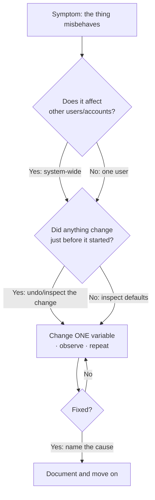

# L12 — Installing, Updating, and Troubleshooting

> **Module 3** · Stage 2 · 2 hours

## Learning objectives

By the end of this lecture, you will be able to:

1. **Apply** safe installation practice: trusted sources, permissions review, post-install verification. (CLO-3)
2. **Explain** why updates matter (security patches) and how to manage them deliberately rather than reactively. (CLO-3)
3. **Use** a structured troubleshooting method to diagnose common software problems. (CLO-3)
4. **Formulate** effective requests for help. (CLO-3)

## Key terms

installer · permissions · update/patch · patch Tuesday · troubleshooting · minimal reproducible example

## 12.0 Before we start — prerequisites and motivation

**You need from earlier lectures:** the software stack and licensing (L09); the OS's five responsibilities (L10) — installers write through the file system (L11) and drivers plug into device management. Troubleshooting is where Modules 1–3 meet reality.

**Why this matters:** this is the lecture students cite years later. Everyone installs software and every installed thing eventually misbehaves. The isolation method — change one variable, observe, repeat — is the scientific method in work clothes, and the help-request template is a professional skill that will get your questions answered in every course and job after this one.

## 12.1 Installing safely

Safe installation is a habit, not an antivirus product: **(1)** trusted channels only — official vendor sites, app stores, university software portal (L09); **(2)** read what you accept — bundled "offers" in installers and over-broad permissions in mobile apps; **(3)** prefer per-user or standard installs over "run as admin always"; **(4)** verify post-install — the app launches, the uninstaller exists. Mobile app permissions deserve special attention: a torch app requesting contacts is a red flag, a pattern A5 revisits for email.

## 12.2 Updates and patching

Updates do three jobs: fix **security vulnerabilities** (the majority of successful attacks exploit *known, patched* holes), fix bugs, and improve compatibility. Manage them deliberately: enable automatic security updates; restart when asked (patches often complete on reboot); update firmware/routers too — the forgotten devices are today's botnets. The discipline: *patch promptly, restart deliberately, never postpone security updates indefinitely* [1].

## 12.3 The troubleshooting method

The professional loop, applied to a computer that "won't open a website":

1. **Define the problem** precisely ("Chrome shows ERR_CONNECTION_REFUSED; other apps OK").
2. **Reproduce** it reliably; note when it started and what changed.
3. **Isolate** variables: another browser? another device on the same Wi-Fi? another network? reboot?
4. **Form a hypothesis** ("Wi-Fi adapter lost DNS — router suspect"), **test the cheapest fix first**.
5. **Escalate** with evidence if unresolved; **document** the fix for next time.

This generalises: task manager not responding → check resource spikes (L07's RAM cliff); app crashing on open → reinstall or reset settings; "no sound" → correct output device selected? The method — not memorised fixes — is the transferable skill.

## 12.4 Asking for help effectively

A good help request contains: goal, exact error text (verbatim, screenshot), what you tried, what happened, environment (OS/version). The "minimal reproducible example" mindset from programming works for all ICT problems: strip the problem to its smallest failing case before asking. [Help](../help.md#3-getting-help) codifies this.

## Lecture activity

In-class, no handout: troubleshooting relay — the instructor presents a broken scenario per round (can't print; Wi-Fi "connected, no internet"; app opens then vanishes); teams write the *isolation steps they'd run in order* and predict outcomes; the reveal checks their trees against the real cause.

## Visual explanation

*Figure: the troubleshooting loop. One variable at a time is the discipline; every loop pass is evidence, even the failed ones.*

## Common misconceptions

1. **"If it works, don't update."** Unpatched software accumulates known holes; stability updates also fix slow-burn bugs. The risk is in *unpatched* time, not in updating.
2. **"Restarting is not a real fix."** Restarting clears in-memory state, resets drivers, and re-runs boot-time repairs — it *is* the first isolation step, not superstition.
3. **"Troubleshooting is guessing."** Professionals run ordered, evidence-gathering steps; the difference between a guess and a hypothesis is that a hypothesis names the observation that will prove it wrong.

## Check your understanding

1. List the five troubleshooting steps in order for "an app won't open."
2. Why are security updates more urgent than feature updates? Give the mechanism, not just the rule.
3. An installer offers three bundled toolbars. What do you do and why?
4. Rewrite this weak help request professionally: "internet not working pls help asap".
5. Where do router and printer updates fit in your update routine?

## Lab link

[Lab 3 — File System Scavenger Hunt](../labs/lab-03-file-system-scavenger-hunt.md) is due end of Week 6; Module 3's quiz Q07 is cumulative — review L09–L12 before the next lecture.

## References & further reading

1. CISA. (n.d.). *Understanding patches and software updates* [Guidance]. Cybersecurity and Infrastructure Security Agency. https://www.cisa.gov/secure-our-world/keep-routine-updates — retrieved 2026.
2. Brookshear, J. G., & Brylow, D. (2019). *Computer Science: An Overview* (13th ed.). Pearson. — Chapter 8 (system administration themes).

## Summary

- Install safely: **trusted source → review permissions → verify after install**; the permission list is a claim about the app's behaviour.
- **Updates** mostly patch security holes; deliberate, scheduled patching beats reactive fear both ways.
- **Troubleshooting** is isolation: scope the fault, change one variable, observe, repeat — then document the cause.
- Asking for help is a skill: **context, expected, observed, exact message**.

## Homework

1. **Update audit:** check the OS and two applications on your own machine for pending updates; install one and note the version numbers before/after. (10 min)
2. **Method drill:** a friend's laptop shows Wi-Fi "connected, no internet." Write your first five isolation steps in order, each with the observation you'd expect if that step *passed*. (15 min)
3. *(Advanced extension)* Find one real software release-note page for a security patch (vendor documentation) and summarise: what vulnerability class did it close, and why does the class matter?

## Looking ahead

Module 4 changes perspective: from *running* computers to *representing* data inside them — starting with the number system everything reduces to: binary. L13.
