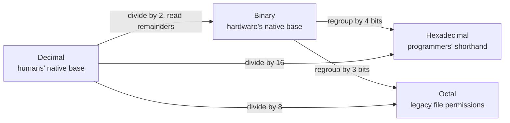

# L13 — Number Systems: Binary and Hexadecimal

> **Module 4** · Stage 2 · 2 hours

## Learning objectives

By the end of this lecture, you will be able to:

1. **Explain** positional notation and why computers use base 2. (CLO-4)
2. **Convert** numbers between decimal, binary, octal, and hexadecimal, showing method. (CLO-4)
3. **Read** hex dumps and colour codes using place values. (CLO-4)

## Key terms

positional notation · base/radix · binary · octal · hexadecimal · nibble · bit · byte

## 13.0 Before we start — prerequisites and motivation

**You need from earlier lectures:** L01's "electronic" and "two-state" remarks and the L02 transistor story explain *why* two states; nothing mathematical beyond primary-school place value. This module is the course's arithmetic heart — the labs and the midterm's numeric questions are built on today's fluency.

**Why this matters:** every hex colour code, IP address, memory address, and encoding table you will meet — here, in the project, and in every later CS/DS course — is base notation. Fluency here removes a whole class of confusion for the rest of your degree; and the method you practise (decompose by place values) is the same method used to read spreadsheets of any binary file.

## 13.1 Positional notation — one idea, many bases

A number's value is each digit times its base power. In decimal 253 means $2\times10^2 + 5\times10^1 + 3\times10^0$. Change the base, keep the idea:

$$1101_2 = 1\cdot2^3 + 1\cdot2^2 + 0\cdot2^1 + 1\cdot2^0 = 8+4+0+1 = 13_{10}$$

Computers use **binary** because the hardware is cheapest and most reliable with two states: voltage high/low, magnetic domains, light dark/bright (Module 5 builds these into logic gates). One **bit** is one binary digit; eight bits form a **byte**.

## 13.2 Conversions — the four routes

**Decimal → binary:** repeated division by 2, collecting remainders bottom-up. 45 → `101101`.
**Binary → decimal:** place values. `101101` = 32+8+4+1 = 45.
**Binary ↔ hexadecimal:** the workhorse. Hex digits 0–9, A–F map to 4-bit groups (**nibbles**): A=10 … F=15. Group binary in 4s from the right:

$$1011\,0110_2 = \text{B}6_{16}$$

Hex is a *human-friendly binary view*: memory dumps (`0x48 0x65 …`), colours (`#FF6600` = orange — each channel one byte), IPv6, and error codes all arrive as hex. **Octal** (groups of 3) appears in Unix file permissions — same trick, 3-bit groups.

## 13.3 Practice rhythm

Do conversions *by hand* this week; calculators come after fluency (Lab 4 includes a timed set). Milestones: 8-bit binary ↔ decimal in under a minute; binary ↔ hex instantly in nibble groups; powers of two (1, 2, 4, …, 1024) memorised — they anchor everything from RAM sizes to IP addressing.

## Lecture activity

[A2 — Number System Relay](../activities/activity-2-number-system-relay.md): teams race conversions with method points — sloppy-but-right answers earn less than clean method, mirroring exam marking.

## Visual explanation

*Figure: the four conversion routes. Binary is the hub: any base can reach any other through it, and the regrouping routes are why hex and octal feel "like reading binary with bigger eyes."*

## Common misconceptions

1. **"Binary is a different kind of number."** The values are the same; only notation differs. 13, 1101₂, and 0xD name one quantity.
2. **"Hex is what computers use."** Computers use binary; hex is for humans reading binary comfortably — one hex digit per 4 bits.
3. **"You must memorise conversion tables."** You must own *place values and grouping*; the tables follow from them and (being humans) we all recompute rather than recall.

## Check your understanding

1. Convert to decimal: `10011₂`, `77₈`, `1A₁₆`.
2. Convert 100 to binary and to hexadecimal — show every step.
3. Why does `#FF0000` name red? Give the byte values.
4. What is the largest value an unsigned 8-bit number can hold, and why?
5. Where did octal appear in this lecture, and why groups of 3?

## Lab link

[Lab 4 — Number Systems Workshop](../labs/lab-04-number-systems-workshop.md) — assigned today, due end of Week 8.

## References & further reading

1. Brookshear, J. G., & Brylow, D. (2019). *Computer Science: An Overview* (13th ed.). Pearson. — Chapter 3, §3.1 (binary representation foundations).
2. Patt, Y. N., & Patel, S. J. (2020). *Introduction to Computing Systems* (3rd ed.). McGraw-Hill. — Chapter 2 (number systems, instructor reference).

## Summary

- **Positional notation** is universal: each place is the base to a power; base 10 is one member of a family, not a law of nature.
- Computers use **base 2** because two reliable states beat ten fragile ones; **hex** (base 16) is programmers' shorthand for binary — one digit per 4 bits.
- Four conversion routes (decimal↔binary, binary↔hex/octal, decimal→any) share one skeleton: decompose by place values, or divide and read remainders.

## Homework

1. **Fluency set:** convert eight values across the three routes (two per route); show method, not just answers — the relay's marking rule applies to you. (20 min)
2. **Colour forensics:** decode #1A2B3C into its red/green/blue amounts (hex → decimal per channel) and state the resulting colour family. (10 min)
3. **Where you've seen bases:** find one real hex or octal value on your own system (permissions, colour picker, error code) and translate it to decimal. *(Advanced extension: explain why octal survives in Unix file permissions.)*

## Looking ahead

Negative numbers break naive binary. Next lecture (L14): how hardware represents signed integers — two's complement — and what overflow really means.
