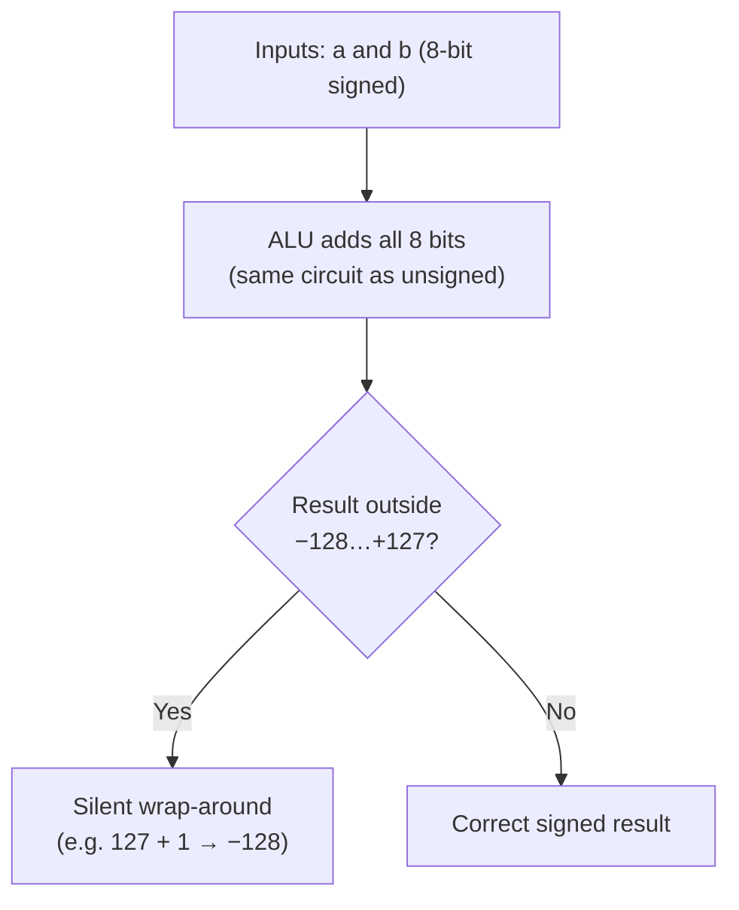

# L14 — Representing Numbers in Hardware

> **Module 4** · Stage 2 · 2 hours

## Learning objectives

By the end of this lecture, you will be able to:

1. **Contrast** unsigned and signed integer representation. (CLO-4)
2. **Encode** negative integers in two's complement and explain why hardware prefers it. (CLO-4)
3. **Predict** overflow for fixed-width integers and explain floating-point limits at an awareness level. (CLO-4)

## Key terms

unsigned integer · signed integer · two's complement · overflow · fixed-point · floating point · IEEE 754

## 14.0 Before we start — prerequisites and motivation

**You need from earlier lectures:** place-value fluency in binary (L13) — this lecture *is* that fluency applied to real hardware constraints; the L06 cycle explains *when* the ALU performs these additions.

**Why this matters:** every limit you've heard of — "32-bit integer overflow", the 2038 problem, the 0.1 + 0.2 ≠ 0.3 surprise — is today's material. CS students meet two's complement in every systems course; DS students meet floating-point surprises in every dataset. Precision limits are not trivia: they are the reason careful programmers ask "what's the width and type of this number?" before trusting it.

## 14.1 Unsigned integers

With $n$ bits and no sign, the range is $0$ to $2^n-1$: eight bits hold 0–255, sixteen hold 0–65,535. Counts, addresses, and colours live happily here (`#FF6600`'s 255 was unsigned).

## 14.2 Signed integers: two's complement

We need negatives. Historical schemes (sign bit, one's complement) created two zeros and awkward arithmetic. **Two's complement** wins because addition hardware needs *no changes* for negative numbers [1], [2]:

- To encode $-x$ in $n$ bits: write $x$, flip all bits, add 1.
- The top bit's place value becomes $-2^{n-1}$ instead of $+2^{n-1}$ — e.g., 8-bit `1000 0000` = −128, `1111 1111` = −1.

Check: $-1$ + $1$ = `1111 1111` + `0000 0001` = `1 0000 0000` → carry discarded → `0000 0000`. One zero, subtraction free, hardware happy. 8-bit signed range: −128…+127 — memorise this; exam questions live here.

## 14.3 Overflow

Fixed widths mean fixed limits. Add $127 + 1$ in 8-bit signed and the result "wraps" to $-128$: the carry past the top bit is lost — **overflow**. Famous consequence: the *Civilization* peaceful-Gandhi bug and the 2038 problem (32-bit signed seconds since 1970 overflow in January 2038) are exactly this mechanism, not folklore. Defense is software discipline: choose widths deliberately and check boundaries; hardware cannot warn you by itself.

## 14.4 Real numbers, honestly

Between integers lie fractions. **Fixed-point** scales by a fixed power of two — simple, predictable, used in money and signal processing. **Floating point** (IEEE 754) trades a sign, exponent, and mantissa for huge *range* at the price of *precision*: decimals like 0.1 have no exact binary form, so $0.1+0.2 \neq 0.3$ exactly — a real phenomenon students meet again in spreadsheet oddities and Python. *(Teaching simplification: full IEEE 754 layout belongs to later courses; the requirement here is the concept and the "don't test floats for equality" habit.)*

## Lecture activity

In-class, no handout: overflow casino — pairs compute a chain of 8-bit signed additions; the first pair to hit a wrapped result calls it; the class verifies against place values, then repeats with 4 bits for speed.

## Visual explanation

*Figure: signed addition and its limit. The adder does not know the numbers are "signed" — the two's-complement encoding makes the same circuit correct — but the *range* is finite, and leaving it wraps silently.*

## Common misconceptions

1. **"The sign is a separate minus bit."** In two's complement the bits *are* the signed value under the top-bit rule; there is no separate flag, which is why arithmetic just works.
2. **"Computers make arithmetic mistakes."** They make *representation* trade-offs; integer arithmetic is exact within range, and float behaviour follows IEEE 754 deterministically.
3. **"Overflow is ancient history."** 2038 is pending; a recent smart-meter generation shipped 16-bit kilowatt-hour counters with real wraparound — width choices are made *today*.

## Check your understanding

1. Encode −45 in 8-bit two's complement; show flip-and-add-one.
2. Decode `1011 0110` as unsigned and as 8-bit signed.
3. Compute 100 + 50 in 8-bit signed; explain the result's name and mechanism.
4. Why can't $0.1+0.2=0.3$ exactly in binary floating point?
5. Give one domain where fixed-point beats floating point and why.

## Lab link

[Lab 4 — Number Systems Workshop](../labs/lab-04-number-systems-workshop.md) — §3 covers two's complement and overflow drills; due end of Week 8. **Midterm follows L16.**

## References & further reading

1. Brookshear, J. G., & Brylow, D. (2019). *Computer Science: An Overview* (13th ed.). Pearson. — Chapter 3, §3.1 (two's complement).
2. Patt, Y. N., & Patel, S. J. (2020). *Introduction to Computing Systems* (3rd ed.). McGraw-Hill. — Chapter 2 (signed arithmetic, instructor reference).

## Summary

- **Unsigned** integers: all bits are magnitude; an 8-bit unsigned integer spans 0…255. **Signed** (two's complement): the leading bit's place value is negative; 8-bit spans −128…+127.
- Two's complement wins because **one adder serves both kinds** of numbers and subtraction becomes addition; the flip-and-add-one recipe is the human shortcut to the same result.
- **Overflow** wraps silently unless software checks; **floating point** (IEEE 754) trades exactness for enormous range — expect rounding surprises and know why.

## Homework

1. **Encode and verify:** write −42 in 8-bit two's complement by the flip-and-add-one method, then verify by adding +42 and checking you get 00000000. (10 min)
2. **Casino at home:** add the 8-bit signed pairs 100 + 50 and 64 + 64; predict wrap or not before computing. (10 min)
3. **The 2038 problem:** in two or three sentences, explain what a 32-bit signed seconds-since-1970 counter wrapping means for long-lived systems. *(Advanced extension: state the new limit year for 64-bit counters and justify with powers of two.)*

## Looking ahead

Numbers done; text next. L15 shows how every character you type becomes numbers — and what mojibake teaches about encodings.
