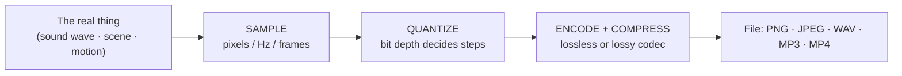

# L16 — Multimedia and Compression

> **Module 4** · Stage 2 · 2 hours

## Learning objectives

By the end of this lecture, you will be able to:

1. **Explain** how images, audio, and video are digitized (pixels, sampling, frames). (CLO-4)
2. **Compare** raster and vector graphics and choose formats by use case. (CLO-4)
3. **Distinguish** lossless from lossy compression and justify a choice for a stated need. (CLO-4)

## Key terms

pixel · resolution · raster · vector · sampling rate · bit depth · codec · lossless · lossy

## 16.0 Before we start — prerequisites and motivation

**You need from earlier lectures:** L13–L14's bit fluency (a pixel *is* three numbers; a sample *is* a number) and L15's pipeline thinking (media formats are encoding choices too). The midterm follows this lecture — these are its final topics.

**Why this matters:** every screenshot, export, and upload decision you make from now on is this lecture applied. CS students meet codecs again in graphics and networks; DS students live in visualisation quality-vs-size trade-offs and meet sampling again in every signal and survey. Digitization itself — turning the world into numbers — is the bridge from this module back to Module 7's data work.

## 16.1 Images: pixels and colour

A **raster** image is a grid of **pixels**, each storing colour values (24-bit colour: 8 bits each red, green, blue — L13's hex returns as `#RRGGBB`). **Resolution** is the pixel count; more pixels = more detail = more bytes. A **vector** image stores *drawing instructions* ("line from A to B, curve C") — infinitely scalable, ideal for logos and fonts; photos, being continuous tone, stay raster [1].

| Format | Type | Best for |
|---|---|---|
| PNG | raster, lossless | Screenshots, diagrams, transparency |
| JPEG | raster, lossy | Photographs |
| WebP | raster, both modes | Web images (modern) |
| SVG | vector | Logos, icons, illustrations |

## 16.2 Audio: sampling the wave

Microphones produce continuous voltage waves; digitization measures the wave a fixed number of times per second (**sampling rate**, Hz — 44.1 kHz for CD audio) with a fixed precision per sample (**bit depth**, e.g. 16-bit). Nyquist's criterion (sample at more than twice the highest frequency you care about) explains the standard numbers — human hearing tops out ~20 kHz, so >40 kHz sampling suffices. Stereo doubles the stream; multiply rate × depth × channels × seconds for raw size [1].

## 16.3 Video: images + audio + time

Video is a rapid sequence of frames (24–60 fps) plus audio. Raw 1080p video would be hundreds of GB per hour; codecs make it tractable by exploiting redundancy *between* frames (most pixels don't change between consecutive frames — store the differences).

## 16.4 Compression: the art of fewer bits

- **Lossless** rebuilds the original bit-for-bit — necessary for text, code, archives (ZIP), PNG. Huffman-style coding gives frequent symbols short codes — the intuition from your phone's T9/autocomplete.
- **Lossy** discards what humans perceive least — JPEG drops imperceptible colour detail; MP3/AAC drop masked sounds (a loud sound hides a quiet nearby one); video codecs skip unchanged regions. The engineering question is never "lossless or lossy" but *lossy at what quality for what use*.

*(Teaching simplification: real codecs combine dozens of techniques — transforms, quantization, motion vectors; the lecture conveys the categories, not the internals.)*

## Lecture activity

In-class, no handout: quality ladder — the same photo/audio/video saved at descending quality settings; class votes where quality becomes unacceptable per medium; results tabulated against file sizes to make "perceptual loss" concrete.

## Visual explanation

*Figure: the digitization pipeline — one shape, three media. Images sample space, audio samples time, video samples both; then compression chooses what bytes survive.*

## Common misconceptions

1. **"Lossy means bad."** Lossy at proper settings is imperceptible for photos/music and is what makes streaming possible; *wrong* settings (over-compressed JPEGs) are bad.
2. **"Rescaling a small raster image up restores detail."** Enlarging interpolates pixels — new blur, not recovered detail; vectors are the scalable ones.
3. **"Compressing files again saves more."** Compressed output is near-random to the next compressor; ZIPing a JPEG saves ~nothing.

## Check your understanding

1. Why do photos use JPEG while screenshots prefer PNG? Answer in terms of content type.
2. Compute raw size: 44.1 kHz × 16-bit × stereo × 60 s (bytes; simplify to one decimal of MB).
3. When must compression be lossless, legally or practically? Two examples.
4. What does the codec exploit between video frames, and what does that exploit assume?
5. Your logo needs to scale from favicon to banner. Raster or vector, and why?

## Lab link

[Lab 4 — Number Systems Workshop](../labs/lab-04-number-systems-workshop.md) is due this week. **Midterm examination next session — Modules 1–4.** The [project proposal milestone](../assessments/project/milestones.md) is due with the midterm window.

## References & further reading

1. Brookshear, J. G., & Brylow, D. (2019). *Computer Science: An Overview* (13th ed.). Pearson. — Chapter 3, §3.2–3.6 (graphics, audio, video, compression).
2. Nayebi, A. (n.d.). *Image file formats explained* [Reference article]. — Use lecture-approved alternatives if unavailable; format facts above cross-checked against MDN *Image file type and format guide*. https://developer.mozilla.org/en-US/docs/Web/Media/Formats/Image_types — retrieved 2026.

## Summary

- All media digitize by one pipeline: **sample → quantize → encode**; parameters (resolution, sampling rate, bit depth, frame rate) set the fidelity floor.
- **Raster** grids win for photographs; **vector** geometry wins for logos, diagrams, and anything that must scale.
- **Lossless** preserves every bit; **lossy** discards what perception misses for dramatic size wins — the codec and quality level are *use-case decisions*, not brand loyalty.

## Homework

1. **Format court:** for each of four artefacts — scanned certificate, project logo, dashboard screenshot, podcast episode — pick a format and write one sentence of justification per item. (15 min)
2. **Ladder at home:** export any image at three quality levels; record the three file sizes and the level where *you* first see artefacts. (10 min)
3. **Sampling linkage:** explain in three sentences why an audio CD's 44.1 kHz sampling and a camera's resolution are the *same* idea wearing different units. *(Advanced extension: why does raising audio sampling rate beyond perception's limit still help professionals? Hint: editing headroom.)*

## Looking ahead

Module 5: the mathematics that turns these bits into decisions — Boolean logic and the gates it builds. L17.
