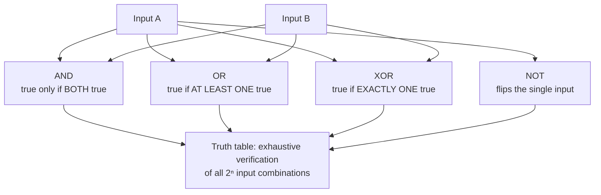

# L17 — Boolean Logic and Truth Tables

> **Module 5** · Stage 3 · 2 hours

## Learning objectives

By the end of this lecture, you will be able to:

1. **Evaluate** Boolean expressions with AND, OR, NOT, XOR under all input combinations. (CLO-5)
2. **Construct** truth tables for compound expressions. (CLO-5)
3. **Translate** everyday decision rules into Boolean expressions (and back). (CLO-5)

## Key terms

Boolean value · AND (conjunction) · OR (disjunction) · NOT (negation) · XOR · truth table · De Morgan's laws

## 17.0 Before we start — prerequisites and motivation

**You need from earlier lectures:** nothing directly — but the midterm (last lecture) closed Module 4, and this module pivots from *how machines store values* (Modules 1–4) to *how they decide and how we work*. If L13–L17's exam went roughly, this fresh start is by design.

**Why this matters:** Boolean logic is the course's smallest complete theory: two values, three operators, total verifiability. It runs spreadsheet filters (L19), database WHERE clauses (L25), search queries (L23), and — after L18 adds symbols — the CPU's own arithmetic. For DS students it is every filtered dataset; for CS students it is the first formalism they can prove things in. Master the 2ⁿ-row discipline today and five later lectures inherit it.

## 17.1 Two values, three operators

**Boolean logic** computes with exactly two values — true/false, 1/0 — the mathematics behind every decision a computer makes (and, as L18 shows, behind the hardware itself). George Boole formalised it in the 1850s; Claude Shannon's 1937 thesis connected it to switching circuits, creating digital logic [1].

| A | B | A AND B | A OR B | A XOR B | NOT A |
|---|---|---|---|---|---|
| 0 | 0 | 0 | 0 | 0 | 1 |
| 0 | 1 | 0 | 1 | 1 | 1 |
| 1 | 0 | 0 | 1 | 1 | 0 |
| 1 | 1 | 1 | 1 | 0 | 0 |

Natural-language anchors: AND = *both must hold*; OR = *at least one* (inclusive); XOR = *exactly one*; NOT = *flip*. A **truth table** lists every input combination with the output — for $n$ inputs, $2^n$ rows: the exhaustiveness *is* the proof of correctness for small circuits.

## 17.2 Building compound tables

Method for `(A AND B) OR (NOT C)`: one column per operand → per sub-expression → final column. Work *inside-out*, one operator per column; never skip columns in exams — the columns are the working shown. Two identities worth memorising with their everyday reading:

- **De Morgan:** `NOT (A AND B) = (NOT A) OR (NOT B)` — "it's not the case that both…" means "at least one isn't…"
- **De Morgan:** `NOT (A OR B) = (NOT A) AND (NOT B)` — "neither" means "both aren't."

## 17.3 Boolean logic where you already are

- Spreadsheet filter: `(grade >= 50) AND (attendance >= 0.75)` — you've written Boolean expressions already.
- Search: `laptops -used` (NOT), `"exact phrase" AND site:edu`.
- Login forms, permission dialogs, alarm logic — all compound truth tables in disguise.

## Lecture activity

[A3 — Truth-Table Design Sprint](../activities/activity-3-truth-table-design-sprint.md): teams design a Boolean expression for a realistic voting/eligibility rule, then defend its truth table against a rival team's attack cases.

## Visual explanation

*Figure: the four operators as decisions. The truth table is the completeness guarantee: every possible input combination gets a row, so nothing escapes testing.*

## Common misconceptions

1. **"OR means one or the other, not both."** Everyday English is ambiguous; logical OR is *inclusive* (both allowed). "Tea or coffee?" spoken vs `A OR B` computed differ exactly here.
2. **"XOR is just another OR."** XOR excludes the both-true row — the difference between "add cheese or olives" (either fine, both fine) and "either cheese or olives, not both."
3. **"Truth tables are trivial busywork."** For $n$ inputs they're the only *exhaustive* verification — the habit of checking all $2^n$ rows is what makes logic design trustworthy.

## Check your understanding

1. Build the truth table for `(A OR B) AND (NOT B)`.
2. Translate to Boolean: "admission requires a pass mark and no outstanding dues." Then write its negation without NOT around the whole expression (De Morgan).
3. How many rows for a 4-input table, and why?
4. Give a real filter you use (app or search) expressed with AND/OR/NOT.
5. Show that `A AND (A OR B)` always equals `A` (idempotence), by table.

## Lab link

[Lab 5 — Logic Circuit Simulator Lab](../labs/lab-05-logic-circuit-simulator.md) runs next lecture (L18): today's truth tables become tomorrow's circuits.

## References & further reading

1. Brookshear, J. G., & Brylow, D. (2019). *Computer Science: An Overview* (13th ed.). Pearson. — Chapter 4, §4.1–4.2 (Boolean operations and storage).
2. Shannon, C. E. (1938). A symbolic analysis of relay and switching circuits. *Transactions of the AIEE*, 57(12), 713–723.

## Summary
- Boolean values are **true/false only**; **AND**, **OR** (inclusive!), **NOT**, and **XOR** are the working operators.
- A **truth table** lists all 2ⁿ input combinations — complete verification by construction.
- **De Morgan's laws**: NOT distributes over AND/OR by flipping the operator — the everyday grammar of negation.
- Everyday "or" is often XOR; logical OR is inclusive — the distinction matters in every query you will write.

## Homework

1. **Table discipline:** build complete truth tables for (A AND B) OR (NOT A AND C) — 8 rows, method shown; then verify one row of your choice against the spreadsheet demo's AND/OR functions. (20 min)
2. **Policy to logic:** write this registration rule as a Boolean expression, then build its table: "admitted if (prerequisite passed AND fees paid) OR instructor permission." (15 min)
3. **De Morgan drill:** rewrite both laws with your own variables and verify one law per table. *(Advanced extension: show why (A XOR B) XOR B = A — the trick behind L18's adder.)*

## Looking ahead

Truth tables describe; *gates* compute. L18 wires the tables into physical circuits — ending with a half adder built by your own hands.
