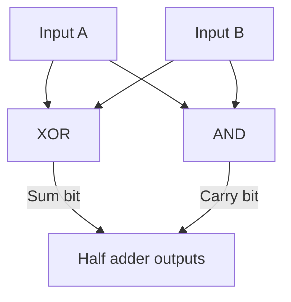

# L18 — Logic Gates and Simple Circuits

> **Module 5** · Stage 3 · 2 hours

## Learning objectives

By the end of this lecture, you will be able to:

1. **Predict** the output of combinational circuits built from AND, OR, NOT, XOR, NAND, NOR gates. (CLO-5)
2. **Explain** why NAND is called a universal gate. (CLO-5)
3. **Build** and verify a half adder from XOR + AND gates. (CLO-5)

## Key terms

logic gate · combinational circuit · universal gate · half adder · full adder · multiplexer

## 18.0 Before we start — prerequisites and motivation

**You need from earlier lectures:** the four operators and the 2ⁿ truth-table discipline (L17); two's complement's "one adder serves both" promise (L14) — today that promise is kept in silicon. Lab 5 runs immediately after this lecture; today's constructions are its answer key in spirit (not in handout).

**Why this matters:** this is where abstraction becomes physical. Every operator from yesterday costs nanoseconds of silicon, and their compositions — adders, multiplexers, the ALU from L05 — are the entire computational vocabulary of the machine. When a later course says "the ALU computes," you will know it is XORs and ANDs wired to yesterday's tables.

## 18.1 From algebra to silicon

A **logic gate** is Boolean algebra made physical: transistors arranged so voltage levels implement 1/0 and each operator. Gates compose into **combinational circuits** — outputs depend only on current inputs, no memory yet. The bridge from L17 is direct: *every* truth table has a circuit; *every* circuit has a truth table.

Standard symbols matter (and appear in Lab 5's simulator): AND (D-shape), OR (curved), NOT (triangle+bubble), XOR (double-curve), NAND/NOR (bubbles on AND/OR). Reading discipline: label every wire, evaluate left-to-right, mark intermediate values — the circuit version of L17's column-per-operator rule.

## 18.2 Universal gates

NAND (and NOR) can build AND, OR, and NOT by themselves — hence **universal**: entire processors can theoretically be manufactured from one gate type [1]. Real chips use a variety for efficiency, but universality explains why early logic families and textbooks fixate on NAND.

## 18.3 The half adder — where arithmetic begins

Adding two bits `A + B` yields a **sum** and a **carry**:

| A | B | Carry | Sum |
|---|---|---|---|
| 0 | 0 | 0 | 0 |
| 0 | 1 | 0 | 1 |
| 1 | 0 | 0 | 1 |
| 1 | 1 | 1 | 0 |

Sum = `A XOR B`; Carry = `A AND B`. Two gates. Chain two half adders plus an OR gate to fold in an incoming carry and you have a **full adder**; chain 64 full adders and you have the adder inside your CPU — the ALU from L05 and L06, now not mysterious [2]. *(Awareness only: multiplexers — data-routing gates — and clocks/memory belong to computer-organization courses.)*

## Lecture activity

[Lab 5 — Logic Circuit Simulator Lab](../labs/lab-05-logic-circuit-simulator.md): in the simulator, build XOR from NANDs, then the half adder, then verify against truth tables; the lab is the activity.

## Visual explanation

*Figure: the half adder. Two of yesterday's operators, wired side by side: XOR produces the sum bit, AND produces the carry — column addition in two gates.*

## Common misconceptions

1. **"Gates compute instantly with no delay."** Real gates have nanosecond propagation delays; at GHz speeds these sum to real constraints — why signal timing is a whole engineering field (awareness only here).
2. **"You need many gate types to build a computer."** Universality says otherwise; variety is optimisation, not necessity.
3. **"The half adder is a toy."** It is the atom of arithmetic hardware; full adders chain into the multiplier your games run on. Simple ≠ trivial.

## Check your understanding

1. For inputs `A=1, B=0, C=1`, evaluate `(A AND B) OR (NOT C AND A)` step by step as a circuit trace.
2. Why is NAND universal? Sketch NOT, AND, OR from NANDs.
3. Which two gates form a half adder, and which output does each produce?
4. How does a full adder differ from a half adder, in words?
5. A circuit's output for input row (1,1) disagrees with its truth-table design. Name the two most likely causes.

## Lab link

[Lab 5 — Logic Circuit Simulator Lab](../labs/lab-05-logic-circuit-simulator.md) — assigned today, due end of Week 10.

## References & further reading

1. Brookshear, J. G., & Brylow, D. (2019). *Computer Science: An Overview* (13th ed.). Pearson. — Chapter 4, §4.4–4.6 (gates, circuits, arithmetic).
2. Patt, Y. N., & Patel, S. J. (2020). *Introduction to Computing Systems* (3rd ed.). McGraw-Hill. — Chapter 3 (digital logic structures, instructor reference).

## Summary
- **Logic gates** embody the Boolean operators in hardware: AND, OR, NOT, XOR, NAND, NOR — the first two from L17, the rest variants.
- **NAND is universal**: every Boolean function can be built from NAND alone — one gate type suffices to manufacture anything.
- The **half adder** (XOR + AND) computes one-bit addition with sum and carry; **combinational** circuits output only what the current inputs dictate — no memory.

## Homework

1. **Predict then build:** write the truth table for the half adder *before* Lab 5; in the lab, build it from XOR + AND and verify every row. (15 min + lab time)
2. **Universal evidence:** draw NOT, AND, and OR built from NANDs only (the lecture's constructions, redrawn from memory). (15 min)
3. **Full adder thinking:** the half adder ignores an incoming carry. Describe in three sentences what a *full* adder must add, and which operator chain could compute its carry. *(Advanced extension: chain four full adders on paper to add two 4-bit numbers — the L14 promise, end-to-end.)*

## Looking ahead

Half the module so far was logic; the other half is craft. L19 moves to the tools you'll use professionally: documents and spreadsheets.
