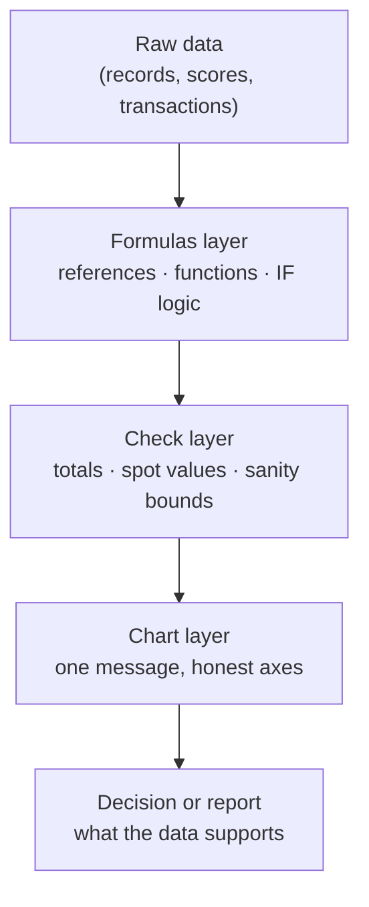

# L19 — Productivity Tools I: Documents and Spreadsheets

> **Module 5** · Stage 3 · 2 hours

## Learning objectives

By the end of this lecture, you will be able to:

1. **Produce** a structured document using styles, automatic tables of contents, and tracked changes. (CLO-6)
2. **Build** a spreadsheet with correct relative/absolute references and core functions (SUM, AVERAGE, IF, lookup). (CLO-6)
3. **Create** a chart that matches data to message honestly. (CLO-6)

## Key terms

style · table of contents · tracked changes · formula · cell reference · absolute reference · function · chart

## 19.0 Before we start — prerequisites and motivation

**You need from earlier lectures:** L17's operators return inside spreadsheet functions (AND/OR/NOT are literal spreadsheet functions); L11's naming conventions become file workflow here. No new theory — this lecture is applied tooling with yesterday's logic inside.

**Why this matters:** these are the tools your degree will be *written in*. Lab 6 launches today on a real grade-book; the project's documentation (L20's workflows, Module 7's data work) assumes this fluency. The reference-semantics discipline (relative vs absolute) is also your first taste of a programming-language concept — same idea returns in every language you learn.

## 19.1 Documents: structure beats formatting

The amateur habit is formatting text by hand (bold, size, spacing). The professional habit is **styles**: mark text as Heading 1/2, Body, Caption — and let the app generate the table of contents, consistent spacing, and accessible navigation (styles are how screen readers traverse documents — accessibility is not optional, see L20's standards). **Tracked changes** and comments make revision a conversation instead of a mess; version confusion is a workflow failure, fixed next lecture with version control.

## 19.2 Spreadsheets: formulas and references

A spreadsheet is a programmable calculator over a grid [1]:

- **Formulas** start with `=`: `=B2*B3`. **Relative references** shift when copied (`A1` → `B1`); **absolute references** pin (`$A$1`) — the single most exam-tested distinction. Copy `=A1*$B$1` one column right and you get `=B1*$B$1`: the first moved, the second pinned.
- **Core functions:** `SUM`, `AVERAGE`, `MIN/MAX`, `COUNT`, and the decision-maker `IF(condition, then, else)`, e.g. `=IF(B2>=50,"Pass","Fail")`. Lookup functions (`VLOOKUP`; `XLOOKUP` where available) join tables — Lab 6 exercises both.
- **Good practice:** one header row, one entity per row, no merged cells inside data ranges — these habits decide whether your later data work (L26) is tractable.

## 19.3 Charts: honest pictures

Match chart to message: **column/bar** for comparing categories, **line** for trends over time, **pie** only for parts-of-a-whole with few slices. Label axes; start bar axes at zero (truncated bars lie); cite the data range. A chart is an argument — this lecture makes you responsible for its honesty (the ethics returns in L26's visualization principles).

## Lecture activity

[Lab 6 — Spreadsheet Data Workshop](../labs/lab-06-spreadsheet-data-workshop.md) starts today: build the grade-book spreadsheet with references, IF logic, lookups, and a defensible chart.

## Visual explanation

*Figure: a spreadsheet is four layers, not a grid of numbers. The check layer is what separates confident work from hopeful work — and charts inherit whatever the layers beneath them got right or wrong.*

## Common misconceptions

1. **"Merged cells make prettier tables."** They break sorting, lookups, and pivot tables; merge only in titles *outside* data ranges.
2. **"Copy-paste of values is the same as copying formulas."** Formulas re-compute with *shifted* references — powerful when intended, a bug when not; `$` pins are the control.
3. **"A pie chart shows data best."** Humans compare angles poorly; 6+ slices become unreadable. Prefer bars for comparison tasks.

## Check your understanding

1. What changes in `=A1*$B$1` when copied two rows down and one column right?
2. Write the IF formula that returns "Low" under 40, "OK" from 40–69, "High" at 70+.
3. Why does a style-based document generate a correct TOC automatically?
4. Which chart for monthly rainfall over a year — and why not a pie?
5. Name two ways tracked changes improve group coursework.

## Lab link

[Lab 6 — Spreadsheet Data Workshop](../labs/lab-06-spreadsheet-data-workshop.md) — assigned today, due end of Week 11.

## References & further reading

1. Bourgeois, D. T. (2014). *Information Systems for Business and Beyond*. — Chapter 4 (Data and Databases, spreadsheet literacy sections).
2. Microsoft Support. (n.d.). *IF function* and *XLOOKUP function* documentation. https://support.microsoft.com/ — retrieved 2026.

## Summary
- **Styles are the document**: consistent structure enables automatic ToC, navigation, tracked changes, and accessibility — formatting is only the costume.
- Spreadsheet power is **references**: relative moves with the formula, absolute (`$`) stays pinned; core functions (SUM, AVERAGE, IF, lookup) compose into logic.
- **Charts are arguments**: pick the type that matches the message and keep the axes honest — the same data can tell different stories.

## Homework

1. **Grade-book ready:** complete Lab 6 through the IF-function stage; bring one formula that failed and what the error message taught you. (Lab time)
2. **Document rebuild:** take an old assignment and restyle it with heading styles + automatic ToC; note how long the restyle took after the styles were in place. (20 min)
3. **Chart honesty hunt:** find one published or social-media chart with a questionable axis or chart-type choice; write three sentences on what a better choice would be. *(Advanced extension: rebuild it better in your Lab 6 workbook, cite both versions.)*

## Looking ahead

Slides and shared workflows complete the productivity toolkit next (L20) — with accessibility and version discipline as first-class requirements.
