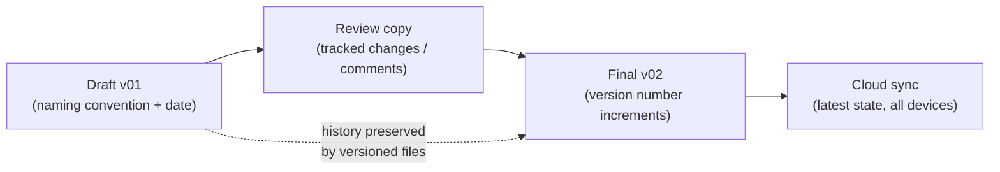

# L20 — Productivity Tools II: Presentations and Workflows

> **Module 5** · Stage 3 · 2 hours

## Learning objectives

By the end of this lecture, you will be able to:

1. **Design** a presentation following contrast, hierarchy, and one-message-per-slide principles. (CLO-6)
2. **Apply** accessibility standards to documents and slides. (CLO-6)
3. **Organize** a collaborative workflow with file versioning, cloud sync, and clear conventions. (CLO-6)

## Key terms

slide hierarchy · contrast · alt text · version control (file-level) · cloud sync · collaboration workflow

## 20.0 Before we start — prerequisites and motivation

**You need from earlier lectures:** L19's structure-beats-formatting principle extends from documents to slides; L11's conventions become the team workflow rules; L01's ICT-habit of asking "who is the user?" becomes accessibility. The integrated project is announced this lecture — today's skills are its deliverables.

**Why this matters:** the project showcase (L32) is judged on these principles, and every future report defence — capstone, thesis, job interview — uses this hour. Accessibility here is not decoration: it is the same discipline your course site's validators enforce, now applied by you.

## 20.1 Slides: support the speaker, not a script

Presentation slides exist to amplify a talk, not replace it. Working rules:

- **One message per slide** — if the title alone can't summarize it, split it.
- **Contrast and size:** text ≥ 24 pt body; strong figure–background contrast (this is WCAG thinking applied to slides).
- **Six-by-six as a ceiling, not a target:** at most ~6 bullet lines, ~6 words each — real slides often say less.
- **Images need alt text** in the file itself; exported PDFs keep it if produced correctly.
- Presenter notes hold the script; the audience sees the argument, not your paragraphs.

These same criteria grade your L32 project showcase — [rubric](../assessments/project/rubric.md) — so practicing here is direct exam investment.

## 20.2 Accessibility as a habit

Accessibility standards, applied where you work: heading styles (not fake bold headings), meaningful link text (never a bare URL or a vague label), alt text on every meaningful image, tables with header rows, sufficient colour contrast, and captioned media. The [documentation standards](../help.md#2-faq) this course site itself follows were validated automatically — you can hold your own documents to the same checklist. Screen-reader users, low-vision colleagues, and future-you retrieving an old file all benefit from the same discipline.

## 20.3 Workflows: files that don't collapse

Group work fails on coordination, not talent. The fixes:

- **File versioning:** date-suffixed (`report-v2026-09-18.md`) as a minimum habit; real version control (Git) is coming in your programming courses — the *concept* of history + diffs starts here.
- **Cloud sync with conventions:** shared folders (Drive/OneDrive) with agreed names; sync is not backup (L11) — keep the 3-2-1 rule for anything irreplaceable.
- **Collaboration etiquette:** one owner per section, comments for discussion, tracked changes for edits, a "current" folder and an "archive" folder — ambiguity in *where the current file is* causes more failures than any tool gap.
- **Templates and standards:** a team template (fonts, styles, file names) agreed on day one saves more time than any feature.

## Lecture activity

In-class, no handout: slide makeover — pairs receive a deliberately awful 8-slide deck (walls of text, colour-on-colour, no alt text) and rebuild two slides to standard, presenting the before/after deltas in 90 seconds.

## Visual explanation

*Figure: a team workflow that cannot silently lose work. Versioned files keep history; sync mirrors the latest state — the two layers answer different fears.*

## Common misconceptions

1. **"More slides = more information."** Dense decks communicate *less*; the audience reads ahead and stops listening. Splitting a slide is free.
2. **"Accessibility is extra work at the end."** Retro-fitting alt text and styles costs multiples of doing it inline; the habits above take seconds when native.
3. **"Cloud sync means we can't lose work."** Sync propagates mistakes (deletions, overwrites) as fast as saves; versioned history or explicit backups handle the rest.

## Check your understanding

1. Rewrite this slide title to carry one message: "Various considerations regarding multiple aspects of our project's different phases."
2. Give three accessibility checks your final slide deck must pass.
3. Why is `report-final-v2-NEW.md` a workflow failure, and what convention fixes it?
4. A teammate overwrites the shared budget file. Which practice would have saved you, and why isn't sync alone enough?
5. What belongs in presenter notes vs on the slide?

## Lab link

[Lab 6 — Spreadsheet Data Workshop](../labs/lab-06-spreadsheet-data-workshop.md) is due end of this week; Module 6 begins next lecture (L21) with [Lab 7](../labs/lab-07-networking-cloud-lab.md) following.

## References & further reading

1. Duarte, N. (2010). *Slide:ology: The Art and Science of Creating Great Presentations*. O'Reilly. — Design principles (contrast, hierarchy).
2. W3C. (2018). *Web Content Accessibility Guidelines (WCAG) 2.1*. https://www.w3.org/TR/WCAG21/ — contrast ratios and structure guidance applied here to documents/slides.

## Summary
- Slides follow three principles: **contrast**, **hierarchy**, **one message per slide** — the deck supports the speaker, it does not replace them.
- **Accessibility habits**: alt text on every meaningful image, real heading structure, sufficient contrast — for every audience, including broken images and screen readers.
- Team workflows need **versioned files** (history) *plus* **sync** (availability); conventions decide which file is the real one.

## Homework

1. **Makeover at home:** apply the three principles plus alt text to two slides of any deck you own (course or personal); screenshot before/after. (20 min)
2. **Team charter draft:** with your project partner(s), write your naming convention, versioning rule, and sync arrangement — one page, due with Milestone 1. (15 min)
3. **Accessibility self-audit:** run your deck or document through an accessibility checker and list every warning with its fix. *(Advanced extension: explain why the checker's contrast rules exist — connect to L16's perception thresholds.)*

## Looking ahead

Module 6: networks — the plumbing that carries all these files, messages, and streams. L21 starts local.
