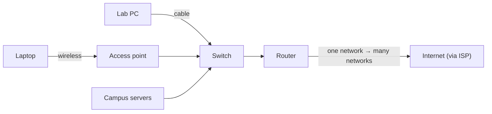

# L21 — Computer Networking Concepts

> **Module 6** · Stage 3 · 2 hours

## Learning objectives

By the end of this lecture, you will be able to:

1. **Classify** networks by scale: PAN, LAN, MAN, WAN. (CLO-7)
2. **Match** network hardware (switch, router, access point) to its role. (CLO-7)
3. **Distinguish** bandwidth from latency and wired from wireless trade-offs. (CLO-7)
4. **Explain** protocol layering at an intuitive level. (CLO-7)

## Key terms

network · PAN/LAN/MAN/WAN · topology · switch · router · access point · bandwidth · latency · protocol · Wi-Fi · Ethernet

## 21.0 Before we start — prerequisites and motivation

**You need from earlier lectures:** L01's four-part framing reappears at network scale (devices, data, protocols, people); L10's device management hints at why drivers matter for network cards; L12's isolation method becomes network troubleshooting in Lab 7. No networking background is assumed.

**Why this matters:** you already live inside a LAN whose shape you have never drawn. After today, campus Wi-Fi, the family router, and every "network issue" email become legible structures. This lecture is also Lab 7's theory base and Module 8's security geometry: you cannot secure a topology you cannot see.

## 21.1 Networks by scale

A **network** is computers connected to share data and services [1]:

| Type | Scale | Example |
|---|---|---|
| PAN (personal) | metres | Bluetooth headset ↔ phone |
| LAN (local) | building/campus | University lab, home Wi-Fi |
| MAN (metropolitan) | city | City government links |
| WAN (wide) | countries/world | The internet itself |

**Topologies** — bus, star, ring, mesh — describe connection shapes; star (everything through a central switch) dominates modern LANs because a single cable failure isolates only one node.

## 21.2 Hardware roles

- **Switch** (inside a LAN): forwards frames between local devices by hardware address — the lab's wall ports.
- **Router** (between networks): forwards packets between different networks by IP address; your home router is also the modem, switch, and access point.
- **Access point:** bridges Wi-Fi devices onto the wired LAN. **Wi-Fi** (IEEE 802.11 family) and **Ethernet** (IEEE 802.3) are the wireless/wired standards.

## 21.3 Bandwidth vs latency

**Bandwidth** is capacity (bits per second — how much); **latency** is delay (milliseconds — how soon). A wide highway can still have a long on-ramp: fibre has both high bandwidth *and* low latency; satellite links can have respectable bandwidth with punishing latency (distance to orbit). Gaming/video-calls are latency-sensitive; downloads are bandwidth-sensitive. Diagnosing "slow internet" starts by separating the two.

## 21.4 Why layers?

Communication stacks into layers — physical wiring → local delivery → end-to-end delivery → application meaning — so each layer can change without breaking others (Wi-Fi vs Ethernet below the same apps; HTTP over either). Full detail arrives next lecture with TCP/IP; today you need the *idea*: layered rules (**protocols**) let billions of heterogeneous devices cooperate.

## Lecture activity

In-class, no handout: campus network map — teams sketch the university LAN as a topology diagram (switches, router, access points, servers), then annotate what breaks if each single component fails.

## Visual explanation

*Figure: a campus LAN's skeleton. The switch keeps local traffic local; the router is the only door to the outside; the access point is where Wi-Fi ends and wired begins.*

## Common misconceptions

1. **"Wi-Fi speed equals internet speed."** Your wireless link is one segment; the bottleneck may be the ISP plan, distance, interference, or the server — measure end-to-end.
2. **"A switch and router are interchangeable."** Switches work *inside* one network by hardware addresses; routers move traffic *between* networks by IP. Home "routers" bundle both — hence the confusion.
3. **"5 GHz Wi-Fi is always better than 2.4 GHz."** Higher frequency means more speed at shorter range; through walls, 2.4 GHz often wins. Frequency choice is a trade-off, not an upgrade.

## Check your understanding

1. Classify: Bluetooth keyboard link, university Wi-Fi, undersea cable system.
2. Which device connects your LAN to your ISP, and which address type does it use to decide?
3. A video call stutters though downloads run fast. Bandwidth or latency problem — and why?
4. Why did star topology displace bus topology in offices?
5. Name the two LAN transmission standards and their IEEE families.

## Lab link

[Lab 7 — Networking and Cloud Lab](../labs/lab-07-networking-cloud-lab.md) — assigned today (inventories your own network, traces DNS, and provisions a small cloud VM), due end of Week 13.

## References & further reading

1. Brookshear, J. G., & Brylow, D. (2019). *Computer Science: An Overview* (13th ed.). Pearson. — Chapter 7, §7.1–7.2.
2. Cloudflare. (n.d.). *What is a LAN?* and related articles, Cloudflare Learning Center. https://www.cloudflare.com/learning/ — retrieved 2026.

## Summary
- Networks classify by scope — **PAN, LAN, MAN, WAN** — and take topologies (star is the common LAN shape); campus Wi-Fi is an access layer over a wired LAN.
- **Switches** deliver within a network; **routers** deliver between networks; access points bridge wireless to wired.
- **Bandwidth** (capacity) and **latency** (delay) are independent axes; **protocols** — agreed formats and exchange rules — make heterogeneous devices cooperate.

## Homework

1. **Map your own network:** sketch your home network as a topology diagram (every device → its box → the router → outside); label each link wired or wireless. (15 min)
2. **Failure analysis:** on your map, mark which single-box failure silences the whole home and which only one device. (10 min)
3. **Latency test:** ping the campus website and one international site from any terminal; compare average times and write two sentences on what the difference measures. *(Advanced extension: explain why the first ping is often slower than the rest.)*

## Looking ahead

Local networks connect to the largest network of all. L22: the internet's machinery — packets, IP, DNS, and the journey of a request.
