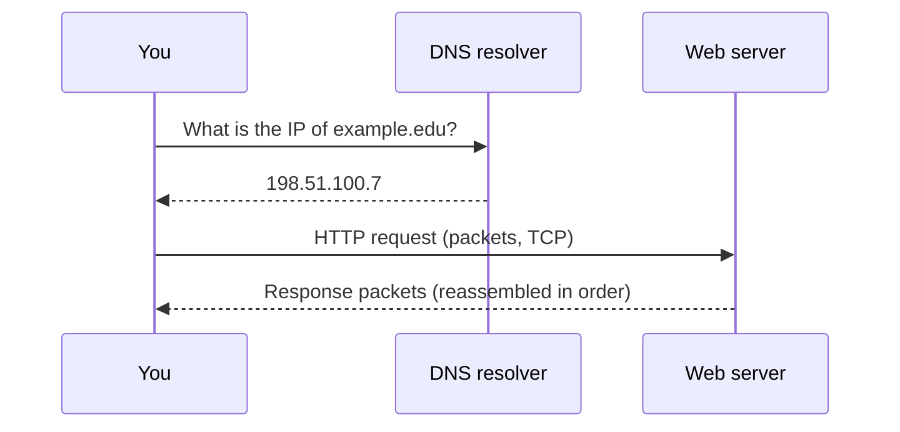

# L22 — The Internet: How It Works

> **Module 6** · Stage 3 · 2 hours

## Learning objectives

By the end of this lecture, you will be able to:

1. **Explain** packet switching and why it outperforms dedicated circuits for bursty data. (CLO-7)
2. **Describe** the roles of IP addresses, DNS, and TCP in delivering a request. (CLO-7)
3. **Trace** the end-to-end journey of a web request through the network stack. (CLO-7)

## Key terms

packet switching · packet · IP address · IPv4/IPv6 · DNS · resolver · TCP · ISP · hop

## 22.0 Before we start — prerequisites and motivation

**You need from earlier lectures:** yesterday's campus map (L21): the router, the ISP uplink, and the resolver number you saw in network settings. L12's isolation thinking returns at planetary scale. A4 (the role-play) runs today — read its page briefly before class if you can.

**Why this matters:** "the internet" becomes a *mechanism* today: no magic, no single computer — just packets, names, and cooperating networks. Every later course that touches the web, distributed systems, or data transfer stands on this hour. And resilience — the design decision that survived nuclear-era thinking — is why your video call survives a backhoe.

## 22.1 Packet switching — the internet's core idea

The internet sends data as **packets** — small chunks with headers — routed independently and reassembled at the destination [1]. Compare with a dedicated phone-style circuit: circuits idle expensively between bursts, while packet switching shares every link among all users. The design also survives failure: packets route around broken links (a born-survivor inheritance from ARPANET-era research in the late 1960s–70s).

## 22.2 Addressing and naming

- **IP address:** each device's location on the internet. IPv4's ~4.3 billion addresses ran out; **IPv6** (128-bit, written in hex — L13 pays off) succeeded it; both run side by side.
- **DNS:** humans use names; the internet uses numbers. The **domain name system** is a distributed directory that translates `example.edu` → `93.184.216.34` via resolvers, root servers, TLD servers, and the domain's authoritative server — cached at every step so repeat visits are near-instant [2].
- **ISP:** your internet service provider connects your LAN to the wider world and runs the first resolvers you use.

## 22.3 The journey of a request (the lecture's centrepiece)

`https://university.edu/courses` typed into a browser:

1. **DNS lookup:** resolver caches? → root → TLD (`.edu`) → authoritative server → IP returned.
2. **TCP connection:** your device and the server perform the three-way handshake — TCP provides reliable, ordered delivery; IP handles addressing/routing hop by hop (routers don't read your data, only addresses).
3. **TLS handshake** (the S in HTTPS — L23 details it).
4. **HTTP request/response:** browser asks for `/courses`; server returns the page.
5. **Render:** the browser assembles HTML/CSS/images — L23 continues from here.

Packets of one download take *different routes* and reassemble in order — TCP's sequence numbers make that magic routine. The lab traces this journey with real tools; the activity below acts it out with humans.

## Lecture activity

[A4 — Anatomy of a Web Request](../activities/activity-4-anatomy-of-a-web-request.md): students play resolver, root/TLD/authoritative servers, routers, and endpoints; a "packet" passes hand-to-hand while the class narrates each hop.

## Visual explanation

*Figure: the request journey in four lines. Name resolution first, then a TCP conversation of numbered packets — each crossing many routers (hops) on independently chosen paths.*

## Common misconceptions

1. **"The web and the internet are the same."** The internet is the network of networks (IP/TCP); the web is *one service* over it (HTTP/HTML). Email and games ride the same internet without the web.
2. **"DNS is one big phone book."** It is a distributed, cached hierarchy — millions of servers, no single point of the whole directory; that distribution is why it scales.
3. **"Data travels one fixed path."** Packets of the same file commonly take different routes; reordering is normal and handled at the destination.

## Check your understanding

1. Why does packet switching beat circuit switching for web traffic? Use "bursty" in your answer.
2. List the four server types consulted (in order) for an uncached DNS lookup.
3. What does TCP add on top of IP, in one sentence?
4. In the request journey, what happens between the TCP handshake and the HTTP request — and what does the S mean?
5. Why do repeat visits to the same site often skip the full DNS walk?

## Lab link

[Lab 7 — Networking and Cloud Lab](../labs/lab-07-networking-cloud-lab.md) — §2 traces DNS and routes on your own machine; due end of Week 13.

## References & further reading

1. Brookshear, J. G., & Brylow, D. (2019). *Computer Science: An Overview* (13th ed.). Pearson. — Chapter 7, §7.2–7.3.
2. Cloudflare. (n.d.). *What is DNS?* Cloudflare Learning Center. https://www.cloudflare.com/learning/dns/what-is-dns/ — retrieved 2026.

## Summary
- **Packet switching** splits messages into packets routed independently; shared links beat dedicated circuits for bursty traffic and reroute around failure.
- **IP** addresses machines; **DNS** answers "which IP is this name?"; **TCP** restores order and re-requests losses on top of IP's best-effort delivery.
- The end-to-end journey — name → IP → packets → hops → reassembly → response — is the course's most reusable trace.

## Homework

1. **Narrate your own request:** pick any site you visit daily and write its journey as eight numbered steps, starting from typing the name. (15 min)
2. **Resolver check:** find your device's configured DNS server (network settings); write one sentence on its role in your daily browsing. (5 min)
3. **Resilience story:** in five sentences, explain to a non-specialist why cutting one undersea cable does not sever a country from the internet. *(Advanced extension: explain what DOES hurt badly when one company's DNS or CDN fails — name a real incident class.)*

## Looking ahead

The request reached a server. L23 opens the envelope: HTTP, browsers, and how search engines decide what you see first.
