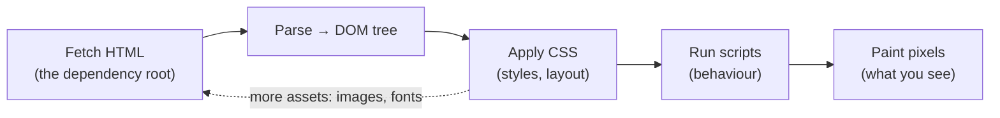

# L23 — The Web: HTTP, Browsers, and Search

> **Module 6** · Stage 3 · 2 hours

## Learning objectives

By the end of this lecture, you will be able to:

1. **Parse** a URL into protocol, domain, path, and query. (CLO-7)
2. **Explain** HTTP request/response and what HTTPS adds (TLS). (CLO-7)
3. **Describe** browser rendering and how search engines index and rank. (CLO-7)
4. **Apply** credibility criteria to web sources. (CLO-10)

## Key terms

URL · HTTP/HTTPS · TLS · browser · rendering · crawler · index · ranking

## 23.0 Before we start — prerequisites and motivation

**You need from earlier lectures:** yesterday's request journey (L22) — HTTP is the *conversation* that rides on those packets, and the browser is the endpoint you have used all your life without seeing its machinery. L21's protocol concept becomes concrete here.

**Why this matters:** this lecture converts you from web *user* to web *operator*. URL dissection is your first line of phishing defence (Module 8 applies it), the padlock-versus-trust distinction is everyday safety, and search's crawler→index→ranking pipeline is the same machinery you will meet as a data source — including its biases — in Module 7.

## 23.1 Anatomy of a URL

`https://www.university.edu/courses/ict?week=6`:

| Part | Meaning |
|---|---|
| `https` | Protocol — *how* to talk (secure HTTP) |
| `www.university.edu` | Domain — *which server* (DNS resolves it, L22) |
| `/courses/ict` | Path — *what resource* (a file-like address, L11's tree) |
| `?week=6` | Query — *parameters* for the resource |

## 23.2 HTTP(S): the conversation

**HTTP** is a request/response protocol: the browser requests (`GET /courses/ict`), the server responds (status code + content). Codes to know: `200` OK, `301/302` redirect, `404` not found, `500` server error. **HTTPS = HTTP inside TLS**: TLS negotiates encryption so the conversation is confidential (nobody on the Wi-Fi reads it) and authenticated (the certificate proves you're talking to the real domain) [1]. HTTP was the web's great simplification; HTTPS made it safe enough for banking — modern browsers flag plain-HTTP pages as "Not secure."

## 23.3 Browsers and rendering

The browser fetches HTML, then CSS, JavaScript, and images (each over more HTTP requests), builds the page model, lays out and paints the screen, and runs scripts — all in a sandbox so web code can't reach your files. Rendering engines of Chrome/Safari/Firefox differ slightly; standards keep them compatible. The **padlock/certificate** UI, the URL bar, and dev-tools network panels make L22's journey visible — Lab 7 uses them.

## 23.4 Search: crawling, indexing, ranking

Search engines: **crawlers** follow links and fetch pages; the **index** stores terms → pages; **ranking** orders results for a query using hundreds of signals (relevance, links, freshness, location) — a proprietary, evolving formula, not a directory of "the truth" [2]. Two consequences: results can be gamed (SEO spam), and personalisation can narrow what you see. Hence this course's credibility drill:

- **Who** publishes this (domain, author, contact)?
- **Evidence:** cited sources? consistent with independent pages?
- **Currency:** dated? maintained?
- **Purpose:** informing vs selling vs persuading?

Cross-check at least one independent source before repeating a factual claim — the habit L28 extends to AI output.

## Lecture activity

In-class, no handout: credibility gauntlet — three pages on the same claim (a university page, a vendor page, an anonymous blog); teams score each against the four criteria and defend rankings.

## Visual explanation

*Figure: rendering is a construction, not a download. The HTML arrives first and everything else is fetched, styled, executed, and painted around it — which is why a page can half-appear while its images lag.*

## Common misconceptions

1. **"HTTPS means the site is safe/trustworthy."** TLS guarantees the *connection* is private and the domain is real — not that the site is honest. Phishing sites have valid certificates (A5 shows live examples).
2. **"Search results are verified facts."** They are ranked matches to your words; ranking optimises engagement and relevance proxies, not truth — the source evaluation is still yours.
3. **"The browser stores the website."** It caches *copies* of resources; the page you see was assembled from network fetches moments ago (offline modes excepted).

## Check your understanding

1. Parse `https://results.example.edu/2026/spring?dept=cs` into its four parts.
2. What two guarantees does HTTPS add over HTTP, and what document proves the server's identity?
3. Status 404 vs 301 — what does each mean the server is telling you?
4. Name the three search-engine stages in order.
5. Apply the four credibility criteria to a Wikipedia article: what checks pass, and what caution remains?

## Lab link

[Lab 7 — Networking and Cloud Lab](../labs/lab-07-networking-cloud-lab.md) — §3 inspects real HTTP/TLS exchanges in browser dev tools; due end of Week 13. **Project milestone 2 (design) due L24.**

## References & further reading

1. Cloudflare. (n.d.). *What is TLS?* Cloudflare Learning Center. https://www.cloudflare.com/learning/ssl/transport-layer-security-tls/ — retrieved 2026.
2. MDN Web Docs. (n.d.). *How the Web works* and *An overview of HTTP*. https://developer.mozilla.org/ — retrieved 2026.

## Summary
- A **URL** decomposes into protocol, domain, path, query (and fragment); reading URLs is a *safety skill* before it is a technical one.
- **HTTP** is a request/response conversation; **HTTPS** adds TLS — the pipe to the named domain is encrypted and authenticated, nothing more.
- The browser **renders**: fetch HTML → parse to DOM → style → execute → paint. **Search engines** crawl, index, and rank — you query the index, not the live web.

## Homework

1. **URL autopsy:** dissect three URLs from your own browsing into the five parts; flag any you could not explain. (10 min)
2. **DevTools first look:** open any page's Network tab (browser developer tools), reload, and identify: the HTML document request, its status code, and two other asset types that followed. (15 min)
3. **Gauntlet solo:** apply the four credibility criteria to one source you cited in the last year; score it 0–2 per criterion and write the verdict sentence. *(Advanced extension: find one page where the padlock is present and credibility is doubtful — describe which criteria fail.)*

## Looking ahead

Web services now live in buildings you'll never visit. L24: cloud computing and virtualization — renting the machine room by the hour.
