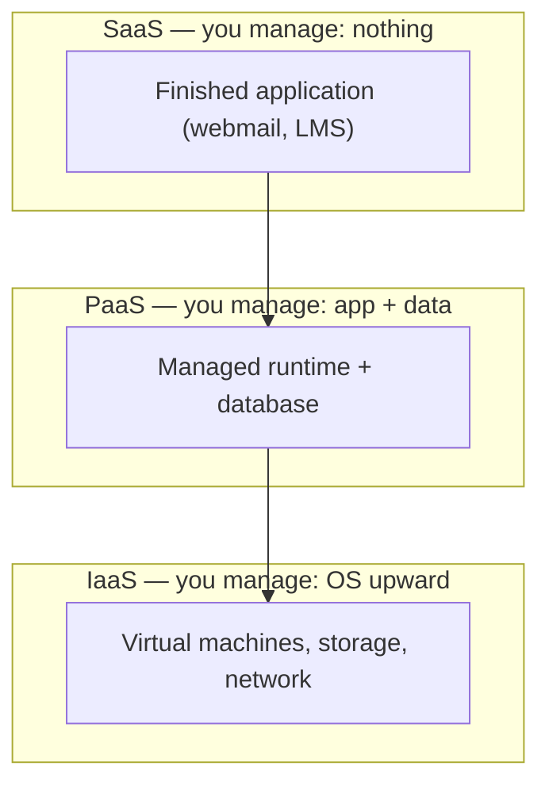

# L24 — Cloud Computing and Virtualization

> **Module 6** · Stage 3 · 2 hours

## Learning objectives

By the end of this lecture, you will be able to:

1. **Define** cloud computing's essential characteristics (on-demand, elastic, measured service). (CLO-7)
2. **Compare** IaaS, PaaS, and SaaS and assign scenarios to the right model. (CLO-7)
3. **Explain** virtual machines and containers as virtualization layers. (CLO-7)
4. **Weigh** cloud vs on-premises trade-offs for a given organization. (CLO-7)

## Key terms

cloud computing · IaaS · PaaS · SaaS · virtual machine (VM) · hypervisor · container · elasticity · capex/opex

## 24.0 Before we start — prerequisites and motivation

**You need from earlier lectures:** the L21–L22 network machinery (cloud is a *business model on top of it*); L09's licensing models (cloud subscription is licensing's next evolutionary step); L11's backups (cloud sync ≠ backup — the distinction recurs as a case-study trap).

**Why this matters:** the CS-02 case study runs today and the DS track lives in this lecture: cloud notebooks, managed databases, and rented compute are how data science is actually practised. Virtualization — one machine pretending to be many — is also the intellectual bridge between the hardware you met in Module 2 and the elastic fleets you will administer later.

## 24.1 What "cloud" actually means

**Cloud computing** delivers compute, storage, and software as on-demand services over the internet, with the provider operating the hardware [1]. The economic inversion matters more than the plumbing: capital expenditure (buy servers) becomes operational expenditure (rent by the hour), and capacity **elastic**-ly scales — a lab practical demo shows a VM resized from 1 to 8 GB of RAM in minutes, something physical hardware cannot do.

## 24.2 Service models

| Model | You manage | Provider manages | Example |
|---|---|---|---|
| **On-premises** | everything | nothing | Your own server room |
| **IaaS** (Infrastructure as a Service) | OS, runtime, apps | Virtualized hardware | Renting a cloud VM (Lab 7) |
| **PaaS** (Platform as a Service) | your app + data | OS, runtime, scaling | Web-app hosting platforms |
| **SaaS** (Software as a Service) | your data, settings | everything | Gmail, Microsoft 365, Google Docs |

The boundary is the *division of responsibility* — each model moves one more layer to the provider. Every email login is SaaS; Lab 7 walks IaaS hands-on; the semester project can deploy on either.

## 24.3 Virtualization: the enabling trick

A **hypervisor** slices one physical machine into isolated **virtual machines**, each with its own OS. This is what made cloud economics possible — one server hosts dozens of tenants safely. **Containers** go lighter: they share the host kernel and isolate applications only, starting in milliseconds instead of minutes. Mental model: VMs isolate *machines*, containers isolate *apps*. (You met VMs conceptually in L10; here they become the cloud's unit of rent.)

## 24.4 Cloud vs on-premises

Cloud wins on elasticity, upfront cost, global reach, and managed services; on-premises wins on data-control (some regulations require it), long-run predictable workloads, and offline operation. Case study [CS-02](../case-studies/case-study-02-university-cloud-migration.md) walks a university through exactly this decision — the trade-offs are organisational as much as technical. Security responsibilities are *shared* in the cloud: the provider secures the infrastructure; *you* secure your accounts and configuration — L29 returns to the misconfigurations behind most cloud breaches.

## Lecture activity

[CS-02 — A University Moves to the Cloud](../case-studies/case-study-02-university-cloud-migration.md): stakeholders, cost model, and migration plan debated in class; the case study handout carries the discussion structure.

## Visual explanation

*Figure: the service-model ladder. The provider's responsibility grows as you descend the stack; your control (and your patching burden) grows the other way.*

## Common misconceptions

1. **"The cloud is a place."** It is a delivery model; the "cloud" is someone else's data centre — physical machines, cooling, and cables (a factory tour video closes the abstraction gap).
2. **"SaaS means no responsibility."** You still own account security, access control, and your data's backups (L29–L30); the provider runs the plumbing, not your judgement.
3. **"VMs and containers are the same."** Different isolation levels at different costs: VMs virtualize hardware (heavy, strong isolation); containers share the kernel (light, fast, weaker isolation).

## Check your understanding

1. Classify: (a) renting a Linux VM hourly, (b) using Google Docs, (c) hosting your web app on a managed platform.
2. Which characteristics make workloads cloud-friendly? One workload that resists the cloud, and why.
3. What does the hypervisor do, and why does it matter for cloud economics?
4. VM vs container: two differences, one sentence each.
5. In SaaS, list one thing the provider secures and one thing you must secure.

## Lab link

[Lab 7 — Networking and Cloud Lab](../labs/lab-07-networking-cloud-lab.md) — §4 provisions a free-tier cloud VM and tears it down safely; due end of Week 13. **Project milestone 2 (design document) is due today.**

## References & further reading

1. Bourgeois, D. T. (2014). *Information Systems for Business and Beyond*. — Chapter 3 (Software) and Chapter 5 (Networking) cloud sections.
2. Mell, P., & Grance, T. (2011). *The NIST Definition of Cloud Computing* (SP 800-145). NIST. https://doi.org/10.6028/NIST.SP.800-145 — the standard definition.

## Summary
- **Cloud computing** = on-demand, self-service, elastic, measured service over the network — a business and architectural model, not a location.
- **IaaS / PaaS / SaaS** trade management burden against control: raw machines, managed platforms, finished applications.
- **Virtual machines** virtualize hardware (hypervisor, guest OS); **containers** share the host OS (light, fast, portable) — the enabling trick behind elasticity.
- Cloud vs on-premises is a **trade-off analysis** (elastic demand, capex→opex, control, data gravity), not a verdict.

## Homework

1. **Ladder placement:** list five digital services you used this week and place each on the IaaS/PaaS/SaaS ladder with one justification word (who manages the OS?). (15 min)
2. **CS-02 follow-up:** write your own five-sentence recommendation for the university case study, naming the stakeholder whose objection you found hardest to dismiss. (20 min)
3. **Elasticity maths:** a service needs 10 servers at noon and 1 at midnight. Compare owned-fleet vs cloud cost *shape* (no real prices needed) in four sentences. *(Advanced extension: name one workload class where owning wins even at low utilization, and why.)*

## Looking ahead

Module 7: data — where modern computing concentrates value. L25 introduces databases, the most reliable data machinery ever built.
