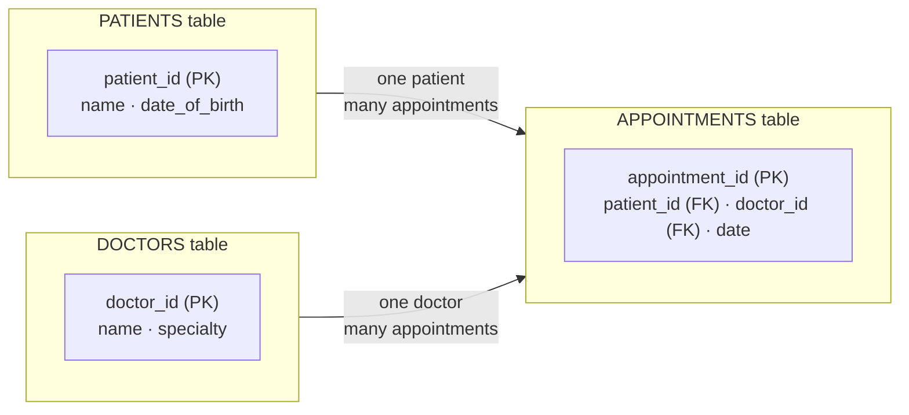

# L25 — Databases and Information Systems

> **Module 7** · Stage 4 · 2 hours

## Learning objectives

By the end of this lecture, you will be able to:

1. **Distinguish** data from information and databases from spreadsheets. (CLO-8)
2. **Design** a small relational schema: tables, primary keys, foreign keys, relationships. (CLO-8)
3. **Read** elementary SQL SELECT queries, including a join. (CLO-8)
4. **Explain** why integrity constraints matter. (CLO-8)

## Key terms

database · DBMS · table/relation · primary key · foreign key · relationship · SQL · query · integrity

## 25.0 Before we start — prerequisites and motivation

**You need from earlier lectures:** L19's spreadsheets (this lecture is the "where spreadsheets end" answer); L17's Boolean operators (they return as WHERE clauses); L01's data-vs-information distinction — databases are the machinery that makes that transformation reliable at scale.

**Why this matters:** every record about you — grades, health, library, banking — lives in a database whose constraints are why your transcript doesn't merge with a classmate's. CS students: schema design and SQL are semester-two's daily bread. DS students: the tidy tables you will analyse are someone's carefully constrained schema. This is Module 7's foundation lecture.

## 25.1 Why databases exist

A **database** is an organized collection of data managed by a **DBMS** (database management system — MySQL, PostgreSQL, SQLite, SQL Server) that guarantees what files and spreadsheets cannot: concurrent access by thousands of users, consistency rules, recovery from crashes, and fine-grained access control [1]. L01's distinction pays off: the DBMS's whole job is turning stored *data* into dependable *information*.

**Spreadsheets vs databases:** spreadsheets excel at one-person analysis over small data; databases excel at many-user, many-million-row, rule-enforced operation. University student records are a database; your lab grade analysis is a spreadsheet — and Module 5's "no merged cells" discipline was preparation for exactly this boundary.

## 25.2 The relational model

Data lives in **tables** (relations) of **rows** (records) and **columns** (fields) [1]:

```text
STUDENTS                                     ENROLMENTS
+----+--------+-----------+                  +----+------------+---------+
| id | name   | programme |                  | id | student_id | course  |
+----+--------+-----------+                  +----+------------+---------+
| 1  | Ayesha | BS CS     |                  | 1  | 1          | ICT     |
| 2  | Bilal  | BS DS     |                  | 2  | 2          | ICT     |
+----+--------+-----------+                  +----+------------+---------+
        primary key: id                          foreign key: student_id → STUDENTS.id
```

- **Primary key:** a column that uniquely identifies each row (`id`).
- **Foreign key:** a column referencing another table's key (`student_id`), creating the **relationship** — one student, many enrolments.
- **Integrity constraints** enforce reality: no enrolment for a non-existent student (referential integrity), no duplicate IDs, types and ranges respected. Constraints are boring until the day they save you from a billing bug — they are the reason the DBMS, not the app, is trusted with truth.

## 25.3 Reading SQL

**SQL** (structured query language) queries relational data [2]:

```sql
SELECT name, programme
FROM students
WHERE programme = 'BS DS';        -- filter rows

SELECT s.name, e.course
FROM students s
JOIN enrolments e ON s.id = e.student_id
WHERE e.course = 'ICT';           -- join tables via the foreign key
```

Reading order: FROM (which tables) → JOIN (how related) → WHERE (which rows) → SELECT (which columns). This course requires *reading* SQL fluently; writing comes in your database course.

## Lecture activity

In-class, no handout: schema design workshop — teams model a clinic (patients, doctors, appointments) as tables with keys, then trade schemas and try to "break" the other team's design with bad data; constraints catch or miss — discussion follows.

## Visual explanation


*Figure: a relational schema. Each table owns one kind of thing; keys anchor identity (PK) and relationships (FK) — the constraints are the design's promises about the data.*

## Common misconceptions

1. **"A database is a big spreadsheet."** Spreadsheets store numbers; databases enforce *relationships and rules* under concurrent use. The constraint machinery is the difference, not the grid.
2. **"Primary keys must be meaningful."** They must be *unique and unchanging*; that's why auto-numbered ids beat national-ID-style natural keys in practice.
3. **"SQL is a programming language for developers only."** Analysts, scientists, and auditors query databases daily; reading SQL is a data-literacy skill (L26 continues).

## Check your understanding

1. Why does a university enrolment system need a DBMS rather than shared spreadsheets? Two reasons.
2. In the schema above, which column is a foreign key and what does it guarantee?
3. Write (or dictate) the SQL that lists all courses taken by student id 2.
4. What would go wrong without referential integrity? Give one concrete bad row.
5. When is a spreadsheet still the right tool over a database?

## Lab link

[Lab 7 — Networking and Cloud Lab](../labs/lab-07-networking-cloud-lab.md) is due end of Week 13; Module 7 has no separate lab — the hands-on SQL glimpse happens in today's workshop and continues in [Lab 8](../labs/lab-08-security-habits-lab.md) preparation next week.

## References & further reading

1. Brookshear, J. G., & Brylow, D. (2019). *Computer Science: An Overview* (13th ed.). Pearson. — Chapter 11 (database systems) as available in edition.
2. Bourgeois, D. T. (2014). *Information Systems for Business and Beyond*. — Chapter 4 (Data and Databases).

## Summary
- **Databases** exist where spreadsheets fail: scale, concurrent multi-user editing, and *enforced* integrity.
- The **relational model**: tables (relations), **primary keys** for identity, **foreign keys** for relationships, constraints as promises the DBMS refuses to break.
- **SQL** SELECT reads data: project columns, filter rows with Boolean conditions, JOIN tables across key relationships.

## Homework

1. **Schema from your life:** model your weekly timetable as two or three tables with keys (e.g., COURSES, ROOMS, SESSIONS); draw the FK arrows. (20 min)
2. **Read SQL:** write in words what this returns: `SELECT name FROM patients WHERE date_of_birth < '2000-01-01'`; then add the JOIN you'd need to include each patient's doctor's name. (15 min)
3. **Break the design:** propose three bad records an *unconstrained* spreadsheet version of the clinic schema would accept and a constraint that stops each. *(Advanced extension: explain, in three sentences, why "delete duplicate rows" is not an integrity strategy.)*

## Looking ahead

Data collected; now data *worked with*. L26 follows the data-science lifecycle from messy raw data to honest visual insight.
