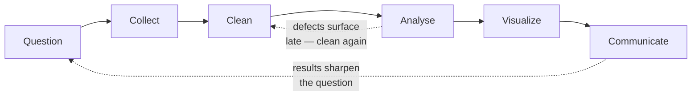

# L26 — Data Science Computing Foundations

> **Module 7** · Stage 4 · 2 hours

## Learning objectives

By the end of this lecture, you will be able to:

1. **Describe** the data-science lifecycle: question → collect → clean → analyse → visualize → communicate. (CLO-6, CLO-8)
2. **Apply** data-cleaning checks to a small dirty dataset. (CLO-6)
3. **Choose** honest chart types and identify misleading visualization tricks. (CLO-6, CLO-10)
4. **Explain** dataset privacy concerns (identifiability, consent). (CLO-10)

## Key terms

data lifecycle · data cleaning · tidy data · visualization · aggregate · identifiability

## 26.0 Before we start — prerequisites and motivation

**You need from earlier lectures:** L25's relational tables (clean data lives in them); L19's charts (honest visualization is chart choice with ethical stakes); L15's encoding (the CSV's mojibake *is* a cleaning defect); L20's communication habits for the lifecycle's last stage.

**Why this matters:** this is the data-science cohort's field map and every other student's data-defence course. The lifecycle organises what analysts actually do; the cleaning checklist is immediately applicable to the project's dataset; and the privacy segment (identifiability) is where your Module 8 citizenship begins in data form. CS-03 runs today — bring its handout.

## 26.1 The lifecycle

Data science is a *workflow*, not a tool [1]:

1. **Question:** what decision will this analysis inform? (Without this, everything downstream drifts.)
2. **Collect:** sources, formats, consent (L25's databases; L21's networks; web data).
3. **Clean:** the unglamorous 70% — missing values, duplicates, inconsistent spellings, impossible dates. *Garbage in, garbage out* is the field's first law.
4. **Analyse:** aggregates (means, counts, rates), comparisons, trends — your spreadsheet skills (L19) carry this stage at this course's scale.
5. **Visualize:** charts that match message (L19's rules).
6. **Communicate:** findings with limitations stated — honesty is a method step, not a courtesy.

**Tidy data** discipline: one variable per column, one observation per row, one table per subject — the reason Lab 6's grade book was built that way.

## 26.2 Cleaning in practice

A dirty dataset is the standard teaching artifact — Lab 6's second sheet has: `Karachi`, `Karachi `, `KHI` (one city, three spellings); ages of 250; duplicated rows; missing GPA cells. The cleaning pass: **standardize** (trim, recode to canonical values), **validate** (ranges, types — L14's overflow lesson recurs as "impossible values"), **deduplicate**, **document** every transformation so the analysis is reproducible. Cleaning is where analyses are won; the statistics are often the easy part.

## 26.3 Honest visualization

Misleading charts are a *threat model* of their own: truncated bar axes (exaggerating differences), dual axes implying causation, pie charts with 12 slices, 3-D effects distorting areas, cherry-picked time windows. The defence: match chart to message (L19), start bars at zero, label axes and sources, state the sample size. CS-03 applies this to real public-health decisions — where bad charts have real costs.

## 26.4 Data privacy in datasets

Even "anonymous" datasets can re-identify people by combining quasi-identifiers (postcode + birthdate famously re-identified a governor's hospital record in published research). Practical rules: collect the minimum; aggregate before sharing; respect consent and purpose limits; remember that L30's privacy principles apply to *you* as a future data professional, not only as a user.

## Lecture activity

[CS-03 — Data-Driven Public Health Decisions](../case-studies/case-study-03-data-driven-public-health.md): a vaccination-coverage dashboard shows a suspicious spike; teams decide what the chart hides, what data they'd demand, and what they'd recommend.

## Visual explanation

*Figure: the data-science lifecycle as the loop it really is. Two feedback edges matter most: communication sharpens questions, and analysis keeps exposing dirt that cleaning must re-catch.*

## Common misconceptions

1. **"Data science is machine learning."** ML is one downstream tool; most real value (and most real time) is question definition, cleaning, and communication — today's lifecycle.
2. **"Cleaning can be skipped when the dataset looks big."** Scale amplifies errors; big dirty data produces confidently wrong results faster.
3. **"Anonymized means safe to share."** Quasi-identifiers re-identify; aggregation and minimum-collection are the working defences.

## Check your understanding

1. Name the six lifecycle stages in order; which one consumes most practitioner time?
2. Your city column holds three spellings of one city. Which cleaning step fixes it, and why must the fix be *documented*?
3. Why is a truncated bar axis misleading? Sketch the effect.
4. Give two quasi-identifiers that, combined, raise re-identification risk.
5. Which earlier course module's spreadsheet discipline made today's cleaning tractable?

## Lab link

[Lab 6 — Spreadsheet Data Workshop](../labs/lab-06-spreadsheet-data-workshop.md) covered the cleaning/charting skills (Week 11); today's case study applies them. Next week: [Lab 8 — Security Habits Lab](../labs/lab-08-security-habits-lab.md) begins (spans Modules 7–8).

## References & further reading

1. Bourgeois, D. T. (2014). *Information Systems for Business and Beyond*. — Chapter 4 (Data and Databases).
2. Sweeney, L. (2000). Simple demographics often identify people uniquely. Carnegie Mellon University, Data Privacy Working Paper 3. — The re-identification study behind §26.4.

## Summary
- The lifecycle loops: **question → collect → clean → analyse → visualize → communicate** — with returns from analysis and communication to earlier stages.
- **Cleaning** is truth-defence: duplicates, sentinels, impossible values, inconsistencies, whitespace — each species has a standard check and fix; tidy structure (rows=observations, columns=variables) makes checks possible.
- **Honest visualization** inherits L19's craft and adds ethics: aggregation can hide subgroups; chart choice is an argument.
- **Identifiability**: "anonymous" datasets can re-identify people through rare value combinations — privacy is a property of combinations, not of names.

## Homework

1. **Clean a small set:** download the practice dataset from the course site (project page); run the five checks, fix three defect species, and log each fix in a cleaning notebook (what you found, what you did, what you kept). (30 min)
2. **Chart ethics:** take any chart from a news site or report; identify one subgroup it aggregates away and write the two-sentence caveat its caption should carry. (15 min)
3. **Re-identification thinking:** list three column combinations in the university's own course-survey data that together could single out a student. *(Advanced extension: explain why releasing "anonymized" data with postal code + birth date + gender failed in real public-data releases — describe the mechanism, not just the outcome.)*

## Looking ahead

Data informs decisions; some systems now make them. L27: what artificial intelligence really is — and what it isn't.
