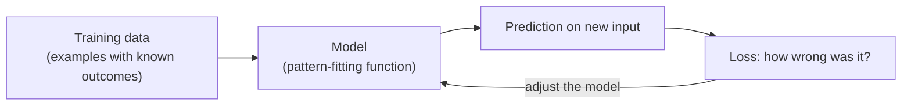

# L27 — Artificial Intelligence Fundamentals

> **Module 7** · Stage 4 · 2 hours

## Learning objectives

By the end of this lecture, you will be able to:

1. **Define** AI and machine learning and place them among computing approaches. (CLO-10)
2. **Distinguish** rule-based systems from systems that learn from data. (CLO-10)
3. **Explain** the training process (data, model, loss, adjustment) at an intuition level. (CLO-10)
4. **Classify** everyday systems as AI or non-AI with justification. (CLO-10)

## Key terms

artificial intelligence · machine learning · model · training data · features · supervised learning · generative AI · pattern recognition

## 27.0 Before we start — prerequisites and motivation

**You need from earlier lectures:** L17's Boolean rules (the "rule-based" pole of today's spectrum); L26's data lifecycle (training data is collected data — every lifecycle defect becomes a model defect); L23's search pipeline (recommenders and ranking share machinery). No mathematics beyond L13–L14's number sense.

**Why this matters:** AI systems now sit inside every tool this course has taught you to see. The training intuition you build today is the minimum vocabulary for L28's literacy work, the project's AI-usage disclosures, and every later ML course's first week. For DS students this is a doorway; for CS students it is the systems view that makes later ML courses legible.

## 27.1 What AI is (and is not)

**Artificial intelligence** is a broad family of techniques for performing tasks associated with intelligence — recognizing speech, spotting tumours, recommending films, translating [1]. **Machine learning (ML)** is the dominant modern approach: instead of hand-coding every rule, the system **learns patterns from data**. This is the dividing line worth mastering:

| Rule-based | Learned |
|---|---|
| "IF grade ≥ 50 THEN pass" | Model trained on thousands of labelled X-rays |
| Behaviour inspectable line by line | Behaviour emerges from data — inspected statistically |
| Fails when reality escapes the rules | Fails when reality escapes the *training data* |

Your spreadsheet `IF` (L19) is rule-based intelligence; a spam filter that adapts to new phishing patterns is learned intelligence.

## 27.2 How learning works — the intuition

Training a supervised model: **(1)** gather **training data** — examples with known answers (emails labelled spam/not-spam); **(2)** choose a model — a mathematical function with adjustable knobs (**parameters**); **(3)** measure error — the model's predictions vs the true labels (the **loss**); **(4)** adjust parameters to reduce error, over and over, automatically. The result is a **model**: not a program that *was told* the rule, but one whose behaviour was *shaped* by examples. Consequences worth internalising: models inherit their data's biases (L28), perform only within their data's coverage, and degrade silently when the world drifts.

## 27.3 Everyday AI and generative AI

You use learned systems daily: autocomplete, face unlock, translation, recommendations, navigation ETA. **Generative AI** — the chatbots and image tools of the 2020s — learned from vast text/image corpora to *produce* plausible new content rather than only classify. Two properties matter for every user: outputs are **plausible, not verified** (fluent falsehoods — "hallucinations" — are a known failure mode), and quality depends on **data provenance** (what the system learned from). Both drive next lecture's responsible-use rules [2].

## Lecture activity

In-class, no handout: "model or rules?" — twelve system cards (elevator controller, spam filter, spell-check, face unlock, calculator, recommender…); teams sort and defend the two hardest; boundary cases preview L28's evaluation habits.

## Visual explanation

*Figure: the training loop. Data flows through a model whose errors (loss) drive adjustment — repeat until the pattern is fitted. Nothing in the loop understands; the loop *performs*.*

## Common misconceptions

1. **"AI thinks like a human."** It computes statistical patterns over data; anthropomorphic verbs ("understands", "believes") mislead more than they explain. Precision of language is part of AI literacy.
2. **"More data automatically means better."** *Representative* data beats *more* data; a billion skewed examples teach skew efficiently (L28 makes this concrete).
3. **"AI outputs are answers."** They are *model outputs* — hypotheses to verify, like a clever colleague who never says "I don't know."

## Check your understanding

1. Sort as rule-based or learned: thermostat, YouTube recommendations, your IF-formula gradebook, face unlock.
2. Name the four training steps in order; what is "loss" measuring?
3. Why can a spam filter trained on 2024 mail miss 2026 phishing? Which property of ML explains it?
4. What makes generative AI's fluency *risky* for a first-year student writing an essay?
5. Give one question you should ask about any AI tool before trusting it with your coursework.

## Lab link

[Lab 8 — Security Habits Lab](../labs/lab-08-security-habits-lab.md) starts this week (spans Modules 7–8) — its final exercise audits AI-tool settings; today's concepts feed directly in.

## References & further reading

1. Brookshear, J. G., & Brylow, D. (2019). *Computer Science: An Overview* (13th ed.). Pearson. — Chapter 13 (artificial intelligence) as available in edition.
2. NIST. (2023). *Artificial Intelligence Risk Management Framework (AI RMF 1.0)*. National Institute of Standards and Technology. https://doi.org/10.6028/NIST.AI.100-1 — trustworthiness vocabulary used in L28.

## Summary
- **AI** names systems doing tasks that need intelligence when humans do them; **machine learning** is the dominant approach: behaviour *fitted from data* rather than authored rule-by-rule.
- The **training loop** — data, model, loss, adjustment — is the mechanism behind every "smart" feature; rule-based systems remain the right tool where rules are knowable and stable.
- **Generative AI** predicts plausible continuations from learned patterns — powerful, and precisely why its outputs need the verification habits of L28.

## Homework

1. **Sort your day:** list six systems you used today and classify each rule-based or learned, with one-line evidence for each. (15 min)
2. **Loop on paper:** pick one familiar predictor (spam filter, autocomplete) and write its training loop with real examples of what its data, model, and loss might be. (15 min)
3. **Data→model linkage:** describe in three sentences how L26's defect species (duplicates, sentinels, bias in sampling) would become *model* defects. *(Advanced extension: explain "garbage in, garbage out" as a training-loop statement — at which arrow does the garbage enter?)*

## Looking ahead

Powerful systems demand informed users. L28: bias, hallucination, provenance, and the rules for using AI with integrity.
