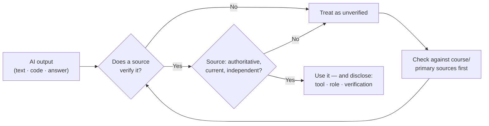

# L28 — Responsible AI Literacy

> **Module 7** · Stage 4 · 2 hours

## Learning objectives

By the end of this lecture, you will be able to:

1. **Explain** bias in ML systems with concrete mechanisms (data → model → outcome). (CLO-10)
2. **Identify** hallucination risks and apply verification habits to AI outputs. (CLO-10)
3. **Evaluate** AI tools for data provenance and privacy concerns before use. (CLO-10)
4. **Apply** the course's academic-integrity rules for AI-assisted work. (CLO-10)

## Key terms

algorithmic bias · hallucination · verification · provenance · disclosure · human-in-the-loop

## 28.0 Before we start — prerequisites and motivation

**You need from earlier lectures:** L27's training loop (today examines its failure modes); L23's credibility criteria (they transfer to AI outputs almost unchanged); L26's identifiability (AI privacy is dataset privacy amplified); the project's rubric — disclosure is graded, and today defines it.

**Why this matters:** you will use these tools this semester, with real grades attached. The bias mechanism, the hallucination hunt, and the disclosure habit form the professional practice this course asks of you — the same evidence-and-isolation discipline as L12 and L23, applied to probabilistic systems. This is the course's ethical centrepiece.

## 28.1 Bias: data → model → outcome

ML systems learn whatever their data encodes — including historical inequities. Mechanism to memorise: *skewed training data → skewed model → skewed decisions at scale*. Documented patterns include hiring tools penalising CVs from women's colleges (learned from male-dominated histories) and face-recognition error rates varying sharply across skin tones (skewed training sets) [1]. The engineering lesson: **representative data, evaluated by subgroup** — fairness is a measurable property, not a vibe. The human lesson: "the computer decided" is never an excuse; accountability stays with people and institutions (NIST's AI RMF frames exactly this governance) [1].

## 28.2 Hallucination and verification

Generative models optimize *plausibility*, not truth — so they can state falsehoods fluently: invented citations, wrong facts, confident nonsense. Working defences (the habit set this course grades):

- **Verify claims** against primary sources before repeating them — L23's credibility criteria, now applied to machine output.
- **Treat specifics as suspect:** quotes, citations, statistics, legal/medical specifics get checked first — hallucinations cluster there.
- **Ask for reasoning and sources, then check the sources exist.**
- **Use AI for strength tasks** (brainstorming, rephrasing, summarising drafts) and *not* for unverified fact delivery.

## 28.3 Provenance and privacy before you use a tool

Before using any AI tool — especially on coursework: **(1)** where did its training data come from (documented? licensed?); **(2)** what happens to *your* inputs (trained on? retained? — check the data-use settings); **(3)** does its use violate anyone's consent or your institution's rules? Pasting a person's data into a cloud chatbot can be a privacy incident — the minimum-collection principle from L26 applies to prompts.

## 28.4 Integrity rules in this course

The [Syllabus](../syllabus.md#7-course-policies) states the policy; this lecture supplies the reasoning. Rules:

1. **Disclosure:** state what tool you used and for what (a two-line statement suffices).
2. **Scope:** use AI where the task sheet permits — never for graded lab/exam work unless explicitly allowed.
3. **Ownership:** you must be able to explain every line/concept you submit; if you can't, you haven't learned it — and it shows in the oral check.
4. **Verification:** anything you repeat from an AI output becomes *yours* — including its errors.

Rationale in one sentence: the degree certifies *your* capability; undisclosed AI use is misrepresentation of that capability — the same reason copying a classmate is.

## Lecture activity

In-class, no handout: hallucination hunt — the instructor provides a short AI-generated paragraph on a course topic with planted subtle errors (one fake citation, one wrong date, one plausible-but-false claim); teams find, verify, and correct against course sources, then write the disclosure statement that would have made the paragraph acceptable.

## Visual explanation

*Figure: the verification habit as a loop. An unverified output is not "wrong" — it is *unassigned truth value*, and the loop assigns it before any use.*

## Common misconceptions

1. **"AI bias is intentional discrimination."** It is usually *inherited statistical artefact* — which is why it is widespread, subtle, and requires deliberate evaluation, not good intentions, to fix.
2. **"I can always tell AI text."** Studies show people cannot reliably; disclosure norms exist precisely because detection is unreliable.
3. **"Verification is distrust of technology."** It is standard professional practice — engineers review generated code, doctors check drug references; the skill scales your capability, it doesn't shrink it.

## Check your understanding

1. Trace one bias mechanism end-to-end: what property of training data produces a skewed hiring model?
2. List three output types most worth verifying before use.
3. What two settings must you check before pasting coursework text into a chatbot?
4. Write the disclosure statement for: "I used a chatbot to rephrase my lab report's introduction."
5. Why does the course require you to *explain* submissions orally rather than just banning AI?

## Lab link

[Lab 8 — Security Habits Lab](../labs/lab-08-security-habits-lab.md) — final exercise applies §28.3's checklist to your own tool settings; due end of Week 16.

## References & further reading

1. NIST. (2023). *Artificial Intelligence Risk Management Framework (AI RMF 1.0)*. https://doi.org/10.6028/NIST.AI.100-1 — bias, verifiability, and governance framing.
2. UNESCO. (2023). *Guidance for generative AI in education and research*. UNESCO. — Educational-use principles mirrored in §28.4.

## Summary
- **Bias** is a pipeline property: unrepresentative data → fitted model → skewed outcomes; the mechanism, not malice, is the usual cause — and data curation is where most fixes live.
- **Hallucination** is the mechanism working as designed: plausible continuation without truth-checking — so *verification before use* is structural, not optional.
- **Provenance and privacy** checks precede tool use: what trained it, what you submit to it, who sees the result.
- **Disclosure** (tool, role, verification, changes) is this course's graded integrity habit — provenance as quality assurance.

## Homework

1. **Verification log:** for one AI-assisted task you do this week (any tool), keep the verification log: claim → source checked → verdict → change you made. Three entries minimum. (20 min)
2. **Bias case:** find one reported case of algorithmic bias (reputable news or research source; cite it) and map it through the pipeline: data → model → outcome. (20 min)
3. **Personal disclosure template:** write the disclosure block you will attach to your project's AI-assisted parts; we workshop these in Milestone 2. *(Advanced extension: draft the three-sentence privacy rule for what may never be pasted into a third-party AI tool — justify each sentence with today's concepts.)*

## Looking ahead

Module 8: security, society, synthesis. L29 covers the threats and defences every ICT user owes themselves — phishing included, and by then you'll have audited your own habits.
