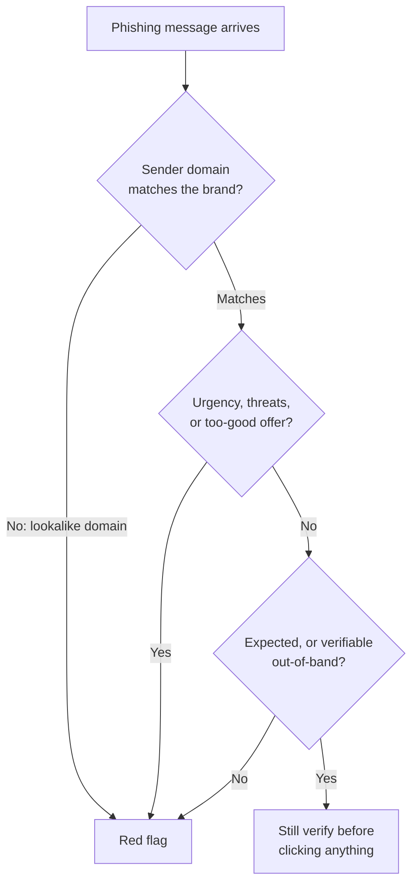

# L29 — Cybersecurity Fundamentals

> **Module 8** · Stage 4 · 2 hours

## Learning objectives

By the end of this lecture, you will be able to:

1. **Identify** common threats: malware classes, phishing, social engineering. (CLO-10)
2. **Apply** layered defences: updates, backups, least privilege, MFA. (CLO-10)
3. **Create** credentials per current guidance and manage them properly. (CLO-10)
4. **Distinguish** authorized educational security activity from misuse. (CLO-10)

## Key terms

malware · virus · worm · ransomware · phishing · social engineering · MFA · password manager · least privilege · attack surface

## 29.0 Before we start — prerequisites and motivation

**You need from earlier lectures:** L12's update discipline (patching is the first defence layer); L11's 3-2-1 rule (backups answer ransomware); L23's padlock-vs-trust distinction (returns with teeth); L21–L22's network picture (attack surface geography). Everything in this lecture is defensive and first-person: protecting *your own* accounts, devices, and data.

**Why this matters:** every principle here is a habit you can adopt tonight. The threat landscape is automated and indiscriminate — but its defence is equally learnable: layered habits that raise attacker cost. Module 8 begins by making you the hardest target in the room; Lab 8 turns today's principles into configured reality.

## 29.1 The threat landscape

**Malware** — malicious software — arrives in classes: **virus** (attaches to files), **worm** (spreads over networks unaided), **trojan** (disguised as legitimate), **ransomware** (encrypts your files, demands payment — CS-04 walks the incident), **spyware** (silently watches). The non-technical attacks are more common than any code exploit: **social engineering** manipulates *people*, and **phishing** — fake messages/sites harvesting credentials — is its workhorse. Modern phishing is *good*: correct logos, valid certificates (L23's HTTPS ≠ honesty), targeted details. A5 dissects real simulated examples so the reflexes form here, not at your expense [1].

## 29.2 Layered defences

Security is layers, each buying a different failure mode [1]:

| Layer | Control | Buys you |
|---|---|---|
| Prevention | Updates/patching (L12), official software sources | Known holes closed |
| Access | Strong unique passwords + **MFA**, least privilege | Stolen password ≠ stolen account |
| Recovery | 3-2-1 backups, tested restores (L11) | Ransomware becomes an inconvenience |
| Detection | Built-in antivirus/firewall, browser warnings | Early warning |
| Behaviour | Phishing reflexes, "verify out-of-band" | The human firewall |

**MFA** (multi-factor authentication) is the single highest-value habit: something you know (password) plus something you have (app code/key) — it defeats most credential-stuffing outright.

## 29.3 Credentials per current guidance

Outdated advice ("change passwords monthly", "complex with weekly expiry") is retired. Current guidance (NIST SP 800-63B family): **length over complexity gymnastics**, unique per account, screened against breach lists, changed when *compromised*, stored in a **password manager** [2]. Practical bar for this course: 14+ characters or a 4–5 word passphrase; manager-generated unique passwords everywhere; MFA on email and university accounts *first* — email resets everything else.

## 29.4 Authorized learning — the boundary

Learning security means understanding attacks — from the *inside of a lab*, ethically. The line this course and profession draw:

- ✅ **Authorized:** analysing simulated phishing samples in class, testing systems you own or have written permission to test (CTF exercises, lab sandboxes), reporting vulnerabilities responsibly to owners.
- ❌ **Unauthorized:** accessing accounts/systems/data without explicit permission — regardless of motive, curiosity, or "no harm done". In most jurisdictions this is a crime (unauthorized access laws), and in every one it's an integrity violation.

Rule of thumb: *permission first, always, in writing*; curiosity without authorization is the fastest way to end a computing career before it starts. (L30's ethics framework and the university's integrity policy codify this.)

## Lecture activity

[A5 — Phishing Red-Flag Audit](../activities/activity-5-phishing-red-flag-audit.md): simulated samples; teams flag and rank red flags — sender mismatch, urgency, lookalike domains, payload risk — and draft the verify-out-of-band reply.

## Visual explanation

*Figure: the three-question phishing triage. Each question attacks one red-flag class; the honest default is verification out-of-band — a real phone call or typed URL, never the message's own link.*

## Common misconceptions

1. **"I'm too small to be a target."** Attacks are automated and indiscriminate — your laptop is valuable as a stepping stone (botnet, crypto-miner) and your accounts as password-reuse dominoes.
2. **"Antivirus makes me safe."** It is one layer; unpatched software and reused passwords defeat well-protected machines daily. Layers, not shields.
3. **"Security is an IT department's job."** Most breaches start with a user action (a click, a reused password); personal practice is organizational security.

## Check your understanding

1. Classify: self-spreading network pest, fake login page, file-encrypting extortion, disguised useful tool.
2. Why does MFA defeat a phished password? Name the two factors.
3. State the current password guidance in three rules; what changed from old advice?
4. A friend asks you to "test" the university portal's login for weaknesses. What is missing, and what would you require?
5. Which single control turns CS-04's ransomware from disaster into bad afternoon?

## Lab link

[Lab 8 — Security Habits Lab](../labs/lab-08-security-habits-lab.md) — you audit *your own* posture: MFA on, password audit, backup test; due end of Week 16.

## References & further reading

1. CISA. (n.d.). *Secure Our World* guidance series (phishing, MFA, updates). Cybersecurity and Infrastructure Security Agency. https://www.cisa.gov/secure-our-world — retrieved 2026.
2. NIST. (2024). *Digital Identity Guidelines: Authentication and Authenticator Management* (SP 800-63B). https://doi.org/10.6028/NIST.SP.800-63b — password/MFA guidance basis.

## Summary
- Threats are **automated and economic**: malware (virus, worm, ransomware), phishing, and social engineering target *people plus machines* — everyone is in the sweep.
- Defence is **layered habits**: patching, unique generated passwords in a manager, **MFA**, least privilege, and 3-2-1 backups — each layer raises attacker cost.
- The learning boundary is explicit: **authorized, simulated, first-person defensive work only** — Lab 8 and A5 stay on this side of the line.

## Homework

1. **Habit stack audit:** check your OS and browser update status, password-manager adoption, and MFA coverage on your three most important accounts; write the gap list Lab 8 will close. (15 min)
2. **Red-flag hunt:** without clicking, screenshot (or describe) one suspicious message you've received and run the three-question triage on it. (10 min)
3. **3-2-1 for your semester's work:** verify your L11 backup plan covers a ransomware scenario (what exactly would you restore, from where?). *(Advanced extension: explain why backups alone don't answer exfiltration-only extortion, and which layer does.)*

## Looking ahead

Defending systems is half the duty; the other half is defending *people's data and dignity*. L30: privacy and digital citizenship.
