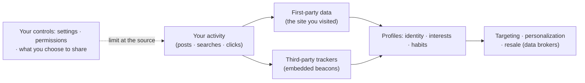

# L30 — Privacy and Digital Citizenship

> **Module 8** · Stage 4 · 2 hours

## Learning objectives

By the end of this lecture, you will be able to:

1. **Explain** digital footprint and its permanence with examples. (CLO-10)
2. **Describe** how online tracking works (cookies, fingerprinting) and apply privacy-protective settings. (CLO-10)
3. **Apply** data-protection principles (minimum collection, consent, purpose limitation) to scenarios. (CLO-10)
4. **Discuss** responsible digital citizenship: inclusion, accessibility, respectful conduct. (CLO-10)

## Key terms

digital footprint · tracking · cookie · fingerprinting · consent · purpose limitation · data minimization · digital citizenship

## 30.0 Before we start — prerequisites and motivation

**You need from earlier lectures:** L23's URL dissection (you will read *where* a link sends your data); L26's identifiability (dataset privacy is personal privacy in aggregate); L29's layered thinking (privacy controls are habits, like defences); L22's network picture (what "the sites still see" means mechanically).

**Why this matters:** the footprint self-audit runs today — this is the course's most personal lecture. The goal is *control literacy*: knowing what is collected, by whom, for what stated purpose, and how to limit it. Digital citizenship then widens the lens from protecting yourself to conducting yourself — the module's bridge from security to society.

## 30.1 Your digital footprint

Every post, search, purchase, and location ping leaves traces — the **digital footprint** — and it is effectively permanent: copies, screenshots, archives, and platform data-retention outlive deletes [1]. Two footprints exist: the one you publish and the one inferred about you (tracking, purchase histories, contacts). Future employers, admissions officers, and — more often — *algorithms* read both. The professional stance is neither panic nor indifference; it is *managed presence*: audit periodically (Lab 8 does), set retention and visibility deliberately, and apply L26's metadata lesson before sharing files (photos carry location).

## 30.2 How tracking works

- **Cookies:** site-remembering tokens; *third-party* cookies follow you across sites (the advertising backbone; browsers now restrict them).
- **Fingerprinting:** device characteristics (fonts, screen, timing) combined into a quasi-unique ID — harder to block than cookies.
- **App data:** permissions (contacts, location, microphone) and SDKs embedded in free apps.

Defences in order of value: permission review (L12), privacy-focused settings/browsers, opting out of ad personalisation, keeping primary identity accounts for primary identity — plus L29's layers underneath (MFA protects the identity that tracking attaches to).

## 30.3 Data protection principles

The principles running through the world's data-protection laws (e.g., GDPR-family regulation) [2]:

1. **Minimum collection** — collect only what the purpose needs (L26 applied this to datasets).
2. **Consent and purpose limitation** — data gathered for one purpose isn't silently reused for another.
3. **Accuracy and access** — people can see and correct their data.
4. **Security** — the holder protects it (L29's layers are their obligation, not your hobby).
5. **Retention limits** — data isn't kept forever "just in case."

Scenarios in class: a university app requesting contacts; a shop's loyalty card; a professor's spreadsheet of grades emailed unencrypted — each maps onto the five principles, and each has a defensible and indefensible version.

## 30.4 Digital citizenship

**Digital citizenship** is competent, ethical participation: **inclusion** (the accessibility practices of L20 are citizenship, not compliance), **respectful conduct** (the four-step ethics method from L04, applied to flame wars and harassment), **information responsibility** (don't amplify unverified claims — L23's criteria), and **constructive contribution** (publishing helpful content, crediting sources, reporting responsibly). The unifying professional habit: *treat others' data, attention, and dignity as you'd have yours treated* — then verify the systems around you do the same.

## Lecture activity

In-class, no handout: footprint self-audit — search yourself, review one platform's privacy settings live, list three changes you'll make; Lab 8 continues the audit formally.

## Visual explanation

*Figure: where the data goes. First parties and embedded third parties both profile; your controls act upstream — limiting what enters the flow beats scrubbing what leaves it.*

## Common misconceptions

1. **"I have nothing to hide, so privacy doesn't matter."** Privacy protects *context and autonomy*, not secrets — insurance pricing, job screening, and stalking all run on ordinary data; the harm is misuse of normal life.
2. **"Deleting a post deletes it."** Screenshots, caches, and archives persist; behave as if everything is permanent, and make deletion-friendliness a bonus, not a plan.
3. **"Private browsing makes me anonymous."** Incognito clears *local* history; the sites, networks, and providers see you exactly as before. It is tidiness, not anonymity.

## Check your understanding

1. Distinguish your published footprint from your inferred footprint, with one example each.
2. Why is fingerprinting harder to block than third-party cookies?
3. Map the loyalty-card scenario onto the five data-protection principles: which hold, which fail?
4. One concrete step per principle to make the professor's grades spreadsheet defensible.
5. Name two citizenship behaviours this course itself models on its website.

## Lab link

[Lab 8 — Security Habits Lab](../labs/lab-08-security-habits-lab.md) — the footprint audit is a graded exercise; due end of Week 16. **CS-04 debrief happens today.**

## References & further reading

1. CISA. (n.d.). *Cybersecurity and privacy guidance for individuals* (Secure Our World series). https://www.cisa.gov/secure-our-world — retrieved 2026.
2. European Union. (2016). *Regulation (EU) 2016/679 (General Data Protection Regulation)*. Official Journal of the European Union. — Article 5 principles cited in §30.3.

## Summary
- Your **digital footprint** is written by you *and about you*; tracking persists via **cookies, fingerprinting, and cross-site trackers** — three answers to one persistence question.
- Data protection rests on stated principles: **consent, purpose limitation, data minimization** — applicable to platforms, employers, and this university alike.
- **Digital citizenship** extends privacy into conduct: the norms of participation, respect, and accountability in shared digital spaces.

## Homework

1. **Finish the audit:** complete the three changes you listed in class (settings or permissions); record before/after states and one trade-off each entailed. (20 min)
2. **Minimization review:** pick one app you use daily; list the permissions it holds, mark each *necessary / convenient / unjustified* for its stated purpose. (15 min)
3. **Citizenship case:** draft the one-paragraph group norm you would want for any group chat or shared repository you work in — rights and duties both. *(Advanced extension: compare that norm against one published platform policy and name where yours is stricter — and why.)*

## Looking ahead

One module left. L31 turns the whole course into a *method*: computational thinking — the way professionals attack new problems.
