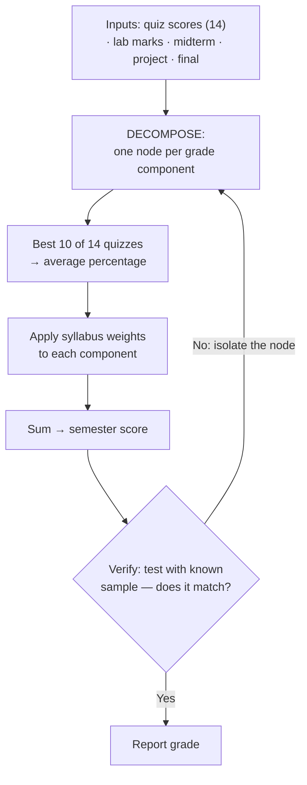

# L31 — Computational Thinking and Problem Solving

> **Module 8** · Stage 4 · 2 hours

## Learning objectives

By the end of this lecture, you will be able to:

1. **Apply** the four pillars — decomposition, pattern recognition, abstraction, algorithm design — to an unfamiliar problem. (CLO-9)
2. **Express** a solution as a flowchart and as structured pseudocode. (CLO-9)
3. **Evaluate** an algorithm informally: correctness first, then efficiency intuition. (CLO-9)

## Key terms

decomposition · pattern recognition · abstraction · algorithm · pseudocode · flowchart · linear search · binary search

## 31.0 Before we start — prerequisites and motivation

**You need from earlier lectures:** everything, by design — today *composes* the course: L05–L06's execution model (your flowchart executes like the CPU), L12's isolation (debugging the chart), L19's spreadsheet logic (the same formulas reappear as pseudocode), L28's verification (test until a bug surfaces). The project showcase is next lecture: this is its methods rehearsal.

**Why this matters:** the four pillars are the transferable core of the entire degree — the part that survives every language and tool change. The flowchart clinic computes a real transcript from the syllabus weights: the problem is familiar, the *method* is the lesson, and the bug-hunt is where thinking becomes visible.

## 31.1 The four pillars

**Computational thinking** is the method professionals use before coding exists — and it works on non-programming problems too [1]:

1. **Decomposition:** break the problem into sub-problems. "Organize the course showcase" → venue, schedule, project list, judging, equipment — each solvable.
2. **Pattern recognition:** what repeats or resembles something solved before? Judging resembles grading (L19's spreadsheet); scheduling resembles timetable constraints.
3. **Abstraction:** keep what matters for the goal, drop the rest. The judging model needs scores and projects, not students' names.
4. **Algorithm design:** finite, unambiguous steps anyone (or a machine) can follow.

## 31.2 From idea to flowchart to pseudocode

Worked example — "find the highest-scoring project":

```text
Flowchart (in words):                    Pseudocode:
Start                                      best ← -1
  ↓                                        FOR each project p IN list:
Read first score → best                       IF p.score > best THEN
  ↓                                               best ← p.score
For each remaining score:                         winner ← p
  score > best? ─yes→ best ← score            ENDIF
                └no─→                     ENDFOR
  ↓                                       OUTPUT winner
More scores? ─yes→ loop back
  ↓no
Output best
Stop
```

Flowchart shapes: **oval** start/end, **rectangle** process, **diamond** decision, **arrow** flow. Pseudocode rules: numbered/indented steps, one operation per line, variables named for meaning. The exam asks you to *draw the diamond honestly* — every branch, every loop-back, no shortcuts.

## 31.3 Correctness, then efficiency

An algorithm must be **correct** (right answer for *all* inputs — trace the edge cases: empty list, one item, duplicates) before it is clever. Then the efficiency intuition: **linear search** checks items one by one (fine for 30 projects, painful for 30 million); **binary search** halves the remaining range each step (sorted data required) — the same speed-versus-preparation trade-off as L07's memory hierarchy. *(Formal big-O analysis belongs to your programming courses; today you build the instinct.)*

## 31.4 The project connection

Decompose your own project today: inputs, outputs, the three hardest sub-problems, and a flowchart for one of them — milestone checklist for the [showcase](../assessments/project/milestones.md); the flowchart belongs in your final report.

## Lecture activity

In-class, no handout: flowchart clinic — pairs draw the flowchart for "compute the semester grade from quizzes (best 10 of 14), labs, midterm, project, final" using the syllabus weights; swap and trace each other's charts with sample data until one bug surfaces.

## Visual explanation


*Figure: the clinic's target chart in shape. Decomposition picks the nodes, the edges encode the algorithm, and the verify loop is where bugs surface — the same loop L12 taught for machines, applied to designs.*

## Common misconceptions

1. **"Computational thinking = programming."** It precedes programming — decomposition and abstraction solve problems *before* any language choice; the coding is downstream detail.
2. **"A flowchart is bureaucracy."** It is the cheapest bug-finder you own: unambiguous branches force decisions you'd otherwise hand-wave — trace-on-paper beats debug-in-app for finding logic errors.
3. **"Efficiency means clever tricks first."** Correctness first; simple and clear beats clever and broken — optimisation is measured, not assumed.

## Check your understanding

1. Decompose "plan the semester project showcase" into 4–6 sub-problems; mark one as needing an algorithm.
2. Write pseudocode for linear search (find item `x` in list `L`, return position or "not found").
3. Why does binary search demand sorted input? What breaks otherwise?
4. Trace your grade flowchart with: 12 quizzes where 2 are missing — does the best-10-of-14 branch handle it?
5. Which pillar did the abstraction "scores and projects, not names" use, and why was it wise?

## Lab link

[Lab 8 — Security Habits Lab](../labs/lab-08-security-habits-lab.md) concludes this week; your project flowchart is due with the final report — [milestones](../assessments/project/milestones.md).

## References & further reading

1. Wing, J. M. (2006). Computational thinking. *Communications of the ACM*, 49(3), 33–35.
2. Brookshear, J. G., & Brylow, D. (2019). *Computer Science: An Overview* (13th ed.). Pearson. — Chapter 5, §5.1 and Chapter 7 (algorithms and search) as available in edition.

## Summary
- The four pillars — **decomposition, pattern recognition, abstraction, algorithm design** — turn unfamiliar problems into executable plans.
- **Flowcharts** show control flow; **pseudocode** shapes it in language; both are design artefacts that precede and survive any programming language.
- Evaluate algorithms as **correctness first, then efficiency intuition**: linear search suffices for small n; binary search needs sorted input — the classic trade.

## Homework

1. **Finish the clinic:** complete your chart's best-10-of-14 node in pseudocode; trace it with three sample transcripts (one where quizzes are all high, one all low, one with exactly 10 scores) and record what each trace revealed. (30 min)
2. **Pillars on your project:** write four bullets — one per pillar — naming what each did in your project this semester. (15 min)
3. **Search trade:** state the smallest dataset size where you'd *bother* sorting for binary search, with a one-sentence justification. *(Advanced extension: express "best 10 of 14" twice — once sorting, once without sorting (keep a running top-10) — and compare the two algorithms' work.)*

## Looking ahead

The course ends where computing is heading. L32: emerging technologies — IoT, blockchain, quantum — plus your showcase and the semester's synthesis.
