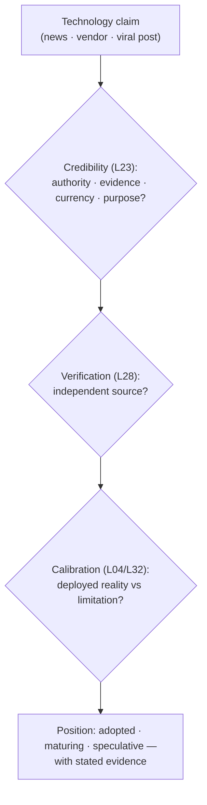

# L32 — Emerging Technologies and Course Synthesis

> **Module 8** · Stage 4 · 2 hours

## Learning objectives

By the end of this lecture, you will be able to:

1. **Describe** IoT, blockchain, and quantum computing at concept level and their realistic maturity. (CLO-1)
2. **Evaluate** a claim about an emerging technology using the credibility tools from L23 and L28. (CLO-10)
3. **Present** your integrated project, demonstrating synthesis of course concepts. (CLO-11)
4. **Reflect** on the course's connected picture — where each module feeds the next. (CLO-9, CLO-11)

## Key terms

IoT · blockchain (distributed ledger) · quantum computing (concept-level) · technology maturity · synthesis

## 32.0 Before we start — prerequisites and motivation

**You need from earlier lectures:** all of them — and the *toolkits* specifically: L23's credibility criteria, L28's verification loop, L31's decomposition (today applies all three to technology claims). Your showcase runs today; bring your deck through L20's accessibility standards one final time.

**Why this matters:** this lecture is the course in miniature: evaluate claims (Modules 6–8's tools), stay calibrated (Module 4's honesty about limits), and synthesize (the course map as one system). The showcase is where the synthesis becomes visible work — eight minutes per team of connected concepts, not topics.

## 32.1 Emerging technologies — with calibrated expectations

- **IoT (internet of things):** networks of physical devices with sensors/connectivity — smart meters, fleet trackers, wearables. Reality check: enormous deployment, uneven security; every IoT device is also an attack surface (L29 applies directly — default passwords on thermostats are today's botnets).
- **Blockchain / distributed ledgers:** tamper-evident shared records without a central authority; beyond cryptocurrency, proposed for credentials and supply chains. Reality check: valuable where *distrust among parties* is the actual problem; expensive overkill for a university's ordinary database needs (L25 remains the workhorse).
- **Quantum computing:** exploits quantum states for certain computations — promising for chemistry simulation and cryptography-breaking *eventually*; today's machines are experimental. Reality check: no quantum laptop is coming; post-quantum cryptography migration, however, is a live topic your security courses will meet.

The evaluation habit: for any emerging-tech claim, ask **what problem it solves, what it costs, what maturity it has, and who benefits** — L23's source criteria plus L28's verification discipline.

## 32.2 The course as one system

The synthesis map — every module feeds the next, and your project used all of them:

| From | To | Thread |
|---|---|---|
| L01–L04 definitions & history | L03/L24 classification | What runs where, and why |
| L05–L08 hardware | L13–L16 data representation | Bits need bodies; bodies need bits |
| L09–L12 software/OS/files | L19–L20 productivity, L24 cloud | The layers you operate daily |
| L13–L14 numbers | L21–L23 networking | Hex in colours, IPs, and dumps |
| L17–L18 logic | L06 CPU | Gates are the ALU's atoms |
| L19–L20 spreadsheets/docs | L26 data science, L25 databases | Tidy data is a *lifestyle* |
| L21–L24 networks/cloud | L27–L28 AI systems | Where learning systems live |
| L29–L31 security/privacy/CT | your project & career | The professional operating system |

## 32.3 Project showcase

Today's showcase: each project gets a timed presentation (rubric: [assessment](../assessments/project/rubric.md) — slide standards from L20, honest charts from L26, security habits from L29 where relevant). Demonstrations run live; design documents and flowcharts (L31) accompany. Final reports are due at the showcase; feedback returns before the final exam.

## Lecture activity

The showcase *is* the activity; audience members file peer-feedback slips (two strengths, one question) — peer feedback is part of the showcase rubric.

## Visual explanation

*Figure: the evaluation toolkit as one pipeline. The course's three method lectures compose into a single habit for every future technology claim you will meet.*

## Common misconceptions

1. **"Emerging means imminent."** Technology adoption runs on cost curves and trust, not headlines; blockchain and quantum have both spent decades "five years away" in some applications.
2. **"Synthesis means the course is over."** The threads above are the *prerequisites* of your next three years: programming assumes L17/L31; databases assumes L25/L26; networks assumes M6; security assumes M8. Keep this page.
3. **"Projects prove individual brilliance only."** The rubric rewards *integration* — a modest artifact that genuinely combines modules outscores an impressive demo that doesn't.

## Check your understanding

1. For each of IoT, blockchain, quantum: one sentence on what it is, one on its honest maturity.
2. A start-up claims "quantum-secured blockchain for student records." Apply the four evaluation questions.
3. Which three modules fed *your* project most, and how? (Answerable only after your showcase.)
4. Where did two's complement surface unexpectedly this semester? (Hint: L14 → two other lectures.)
5. State the course's definition of a computer — and now defend why your project *is or isn't* one, using it.

## Lab link

[Lab 8 — Security Habits Lab](../labs/lab-08-security-habits-lab.md) closed last week. **Final examination follows** — comprehensive, emphasis on Modules 5–8; see [Assessment](../assessment.md).

## References & further reading

1. Brookshear, J. G., & Brylow, D. (2019). *Computer Science: An Overview* (13th ed.). Pearson. — Chapter 13 closing sections (AI/ethics) and course-wide integration.
2. NIST. (2022–2024). *Post-Quantum Cryptography project* publications. https://www.nist.gov/quantum-computing — retrieved 2026.

## Summary
- **IoT, blockchain, quantum**: each has real deployments *and* honest limitations — calibrated positions (adopted / maturing / speculative) beat both hype and dismissal.
- The course's **toolkits compose**: credibility criteria, verification loops, decomposition, and disciplined habits (3-2-1, least privilege, honest charts) work as one system.
- **Synthesis** is the course's final learning outcome: the map from L01, now annotated by your own project's journey through it.

## Homework

1. **Post-showcase reflection:** write one page: which module's concept most changed how you work, and where specifically your project would have failed without it. (30 min)
2. **One claim evaluated:** run this week's technology headline through the three-stage pipeline (figure above); write the position sentence with its evidence. (15 min)
3. **Your next course:** list the two concepts from this course you expect to meet first in Programming Fundamentals / Data Science Introduction, and one sentence on how today's synthesis previews them. *(Advanced extension: sketch the five-beat boot sequence as a flowchart — L10 meets L31 — and swap with a classmate to trace each other's.)*

## Looking ahead

There is no next lecture — there is a next *course*. Programming fundamentals, data structures, and database systems all begin from the threads this page ties together. Keep your concept journal; you will be surprised how much of it returns.
