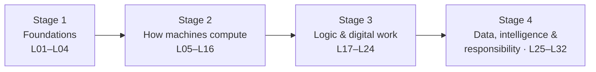

# Learning Pathway — Your Semester Route

This page is the *route map*: what you become able to do, stage by stage, and what each stage unlocks. The course is sequenced so that every new concept stands on named earlier ones — if you follow this pathway, no lecture will ever assume something you haven't met.

---

## The four stages

*Figure: the four-stage pathway — each stage's lectures build only on earlier stages.*

## Stage 1 — Foundations (L01–L04 · Module 1)

**You arrive able to use a computer; you leave able to explain what one *is*.**

- The four-part definition (input, processing, output, storage) and how every device classifies against it
- The history arc: why each part got automated, in order
- The social frame: the digital divide's three layers — the course's recurring ethical lens

**Unlocks:** everything — this is the vocabulary the other 28 lectures use.
**Graded checkpoints:** Lab 1 · quizzes Q01–Q02 · career mini-report (feed).
**Marks on the table:** the midterm samples this stage (≈25% via feeders on the final too).

## Stage 2 — How machines compute (L05–L16 · Modules 2–4)

**The inside of the machine, then the inside of data.**

- Von Neumann architecture → the CPU cycle → the memory hierarchy → storage and peripherals (why your laptop feels slow — you will be able to *diagnose*, not guess)
- Software stack → operating systems → files → safe troubleshooting and updates
- Number systems: binary and hex become readable; two's complement, text encodings, images, audio, video, compression

**Unlocks:** the logic stage (Stage 3) needs binary and gates; the data stage needs encodings and file literacy.
**Graded checkpoints:** Labs 2–4 · quizzes Q03–Q09 · **MIDTERM (after L16)** · project proposal milestone.
**This stage is where most students first struggle** — number systems reward daily practice; see [Help](help.md#1-how-to-study-for-this-course).

## Stage 3 — Logic and digital work (L17–L24 · Modules 5–6)

**From switches to spreadsheets to the web.**

- Boolean logic → truth tables → gates and simple circuits (the half adder: how machines add)
- Productivity tools used *professionally*: formulas with absolute references, honest charts, presentations that serve the audience
- Networks → the internet → the web (you will trace a page load end-to-end) → cloud models IaaS/PaaS/SaaS

**Unlocks:** data science and AI literacy (Stage 4) assume both the logic and the network picture.
**Graded checkpoints:** Labs 5–7 · quizzes Q10–Q12 · project design-document milestone.
**Marks on the table:** the final exam weights Modules 5–6 heavily.

## Stage 4 — Data, intelligence, and responsibility (L25–L32 · Modules 7–8)

**Where computing meets the world — and where you demonstrate the whole toolkit.**

- Databases and queries; data science foundations and honest measurement
- AI fundamentals and responsible AI literacy (verification, disclosure, bias mechanisms)
- Cybersecurity and privacy as *habits*; computational thinking as a method; emerging-tech claim evaluation; the project showcase

**Unlocks:** second-year programming, data science, and database courses all assume this stage.
**Graded checkpoints:** Lab 8 · quizzes Q13–Q14 · **project showcase + final report** · **final examination**.
**Marks on the table:** final exam (emphasis here) + the project's 65% final milestone.

## The project thread runs alongside

The [integrated project](assessments/project/brief.md) is assigned at L08 and culminates at L32, with milestones at L16, L24, and L28 — it deliberately crosses all four stages: pick a topic (Stage 1 literacy), build with real mechanisms (Stage 2), present professionally (Stage 3), and defend design choices (Stage 4).

## If you join late or fall behind

The stage diagram is also the *recovery map*: identify the last stage you genuinely completed, re-run its lecture pages and lab, and use each lecture's **"Before we start"** prerequisite note (every lecture names exactly what it assumes). The [quiz policy](assessment.md) (best 10 of 14) absorbs ordinary misses — see [Help](help.md) for the catch-up plan.
